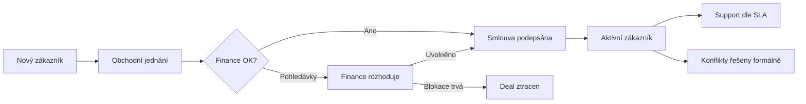
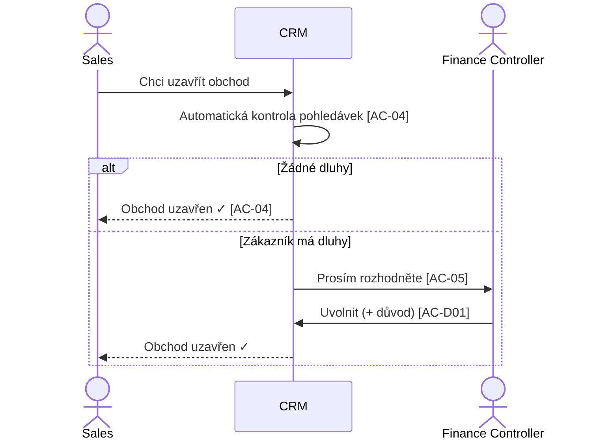
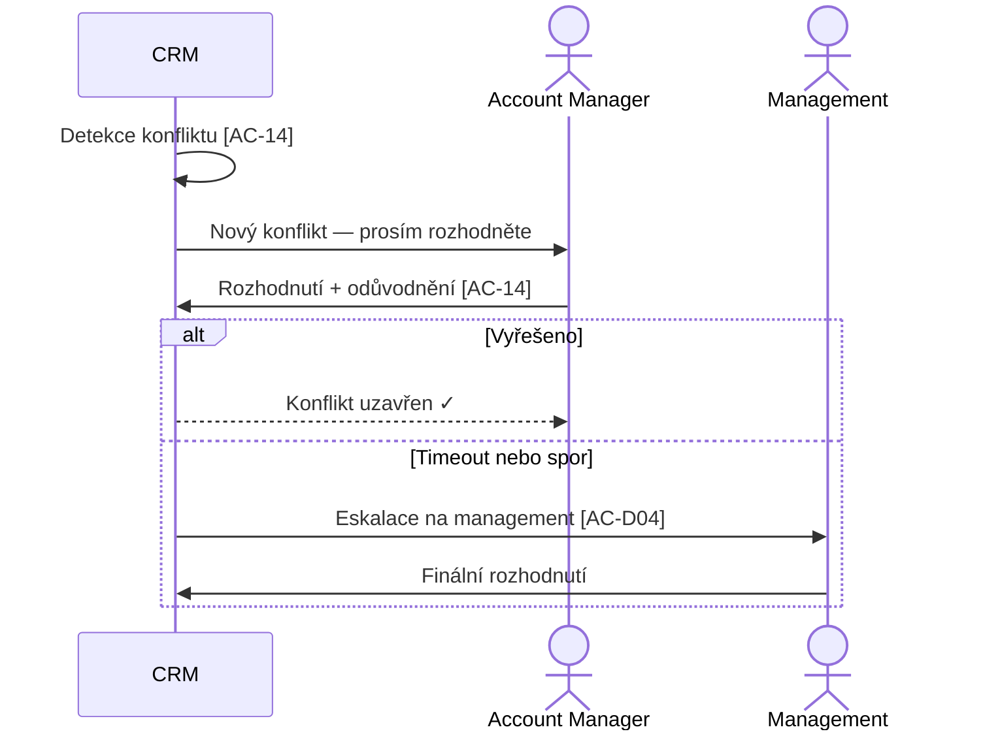

# Human-Centric View (HCV)
## CRM pro korporát — Byznys kontrakt pro Product Ownera

---

## Kapitola 1 — Byznys Kontext & Hodnota

### Problém

Vaše firma (2000+ zaměstnanců, 4 EU regiony) nemá jednotný pohled na zákazníka. Šest oddělení pracuje každé ve svém "ostrůvku" — Sales v Excelu, Finance v ERP, Support ve starém CRM, lokální týmy v regionálních nástrojích. Důsledek: **nikdo neví, jaký je aktuální stav zákazníka**.

Validace na 42 respondentech potvrdila 5 opakujících se konfliktů:

| Konflikt | Frekvence | Typický dopad |
|----------|-----------|---------------|
| Sales chce uzavřít obchod, Finance blokuje kvůli dluhu | 3.2×/měsíc | Ztracené obchody (180K EUR deal ohrožen 3 týdny) |
| Více oddělení mění zákaznická data současně | 4.6×/měsíc | Špatné nabídky, neprofesionální komunikace |
| Lokální tým chce podmínky, které globální pravidla neumožňují | 2.1×/měsíc | Ztráta zákazníka (6 týdnů čekání na HQ) |
| Zákazník tvrdí něco jiného než smlouva | 1.8×/měsíc | 120K EUR nefakturované období |
| Support nemůže splnit požadavek kvůli SLA omezením | 2.4×/měsíc | Nespokojenost strategických zákazníků |

**Každý zaměstnanec tráví průměrně 4.2 hodiny týdně obcházením systému.** Při 2000 zaměstnancích to je ~4000 ztrátových hodin týdně.

### Investice a sponzor

- **Budget:** 800K EUR (1. rok), schváleno board of directors
- **Sponzor:** VP Operations s CEO backing
- **Pilotní fáze:** Letter of Intent 200K EUR, 50 champion users v CZ+DE
- **Poučení:** Předchozí pokus se Salesforce selhal na chybějící datové strategii a odporu oddělení

### Hodnota řešení

Nový CRM systém poskytne:
1. **Jeden pohled na zákazníka** — kdokoliv otevře profil, vidí vše (smlouvy, obchody, support, finance)
2. **Automatickou kontrolu pohledávek** — Sales se dozví o problémech PŘED uzavřením obchodu, ne po
3. **Formalizované řešení konfliktů** — místo neformálních e-mailů strukturovaný proces s audit stopou
4. **100% auditovatelnost** — každé rozhodnutí zaznamenané, dohledatelné

---

## Kapitola 2 — Konceptuální Mapa

### Klíčové pojmy (jak o systému mluvíme)

| Pojem | Co to znamená pro byznys |
|-------|--------------------------|
| **Zákazník (Customer)** | Firma identifikovaná IČO — jedna firma, i když má pobočky ve více zemích |
| **Příležitost (Opportunity)** | Obchod v procesu — od prvního kontaktu po uzavření |
| **Smlouva (Contract)** | Právně platná dohoda — SLA, platební podmínky, rozsah služeb |
| **Support požadavek** | Žádost zákazníka o pomoc — měřeno SLA z jeho smlouvy |
| **Konflikt** | Formalizovaný spor mezi odděleními — musí být vyřešen s odůvodněním |

### Životní cyklus zákazníka (zjednodušeno)

### Kdo má přístup k čemu

| Role | Co vidí | Co může udělat |
|------|---------|----------------|
| Account Manager | Vše o zákazníkovi | Spravovat profil, koordinovat změny |
| Sales | Pipeline a základní info | Vytvářet obchody, žádat o uzavření |
| Finance | Finance queue + pohledávky | Blokovat/uvolnit obchody |
| Support | Zákaznický kontext + SLA | Řešit požadavky, eskalovat |
| Legal | Smlouvy + audit | Schvalovat smlouvy a výjimky |
| Management | Vše + reporting | Rozhodovat konflikty nejvyšší úrovně |

---

## Kapitola 3 — Klíčová Uživatelská Flow

### Flow 1: Sales uzavírá obchod (s automatickou kontrolou financí)

**Byznys hodnota:** Sales se dozví o problému AUTOMATICKY — ne telefonátem od Finance po 3 dnech.

### Flow 2: Řešení konfliktu mezi odděleními

**Byznys hodnota:** Každý konflikt má formální proces s audit stopou. Žádné neformální dohody přes e-mail.

---

## Kapitola 4 — Kritická Byznys Rizika & Service Levels

### Hlavní rizika

| Riziko | Pravděpodobnost | Dopad | Mitigace |
|--------|----------------|-------|----------|
| **Sales odmítne přejít z Excelu** | Vysoká | Kritický — systém bez Sales nemá smysl | UX musí být rychlejší než Excel; výkonnostní KPI navázané na používání |
| **Legal zablokuje adopci** | Střední | Vysoký | Zapojení Legal od začátku; demonstrace audit trail |
| **ERP data nejsou aktuální** | Střední | Vysoký — falešné blokace obchodů | Varování o stáří dat; manuální rozhodnutí Finance |
| **Migrace ze starého CRM** | Střední | Vysoký | Pouze aktivní data; paralelní provoz |

### Service Levels

| Metrika | Cíl |
|---------|-----|
| Dostupnost systému | 99.5 % pracovní doby |
| Rychlost načtení stránky | < 2 sekundy |
| Vyhledávání zákazníka | < 1 sekunda |
| Auditovatelnost | 100 % rozhodnutí zaznamenáno |
| Finance Gate rozhodnutí | Do 72 hodin |
| Řešení konfliktů L2 | Dle typu (4h — 7 dní) |

---

## Kapitola 5 — Akční Board pro Product Ownera

### Stav dokumentace: ✅ Kompletní

Enterprise audit prošel s verdiktem FINÁLNÍ. Všech 7 kritérií kompletnosti splněno. Žádné kritické byznys gaps.

### Drobné nálezy (backlog — neblokující)

| Nález | Doporučení |
|-------|------------|
| Co se stane s obchodem, pokud zákazníka deaktivujeme? | Doplnit edge case v dalším sprintu |
| Maximální počet kontaktů per zákazník? | Definovat limit (nebo neomezeno) |
| Legal neschválí smlouvu do 5 dnů — přesný postup? | Genericky pokryto eskalačním modelem |

### Rozhodnutí vyžadující Product Ownera

1. **Pilotní skupina:** Potvrdit 50 champion users v CZ+DE. Kdo konkrétně?
2. **SLA hodnoty:** Přesné SLA per priority level (závisí na konkrétních smlouvách).
3. **Business hours per region:** Konfigurace pracovní doby pro SLA výpočet.
4. **Přesné ERP API:** Ověřit s IT, zda ERP podporuje webhook (real-time) nebo pouze batch.

---

**Assumptions:**
- Sponzor (VP Operations) udržuje mandát po celou dobu implementace.
- Champion users jsou dostupní pro pilotní fázi.
- Legacy CRM zůstává provozní paralelně.

**Decision Log:**
- HCV vygenerován z finálních, oponentem schválených dokumentů.
- Všechny technické detaily (API, DB, RBAC) záměrně vynechány — viz PAB/PRD.

**Confidence & Gaps:**
- Vysoká: Byznys kontext a hodnota validovány na 42 respondentech.
- Střední: Časový rámec 18 měsíců (závisí na pilotní fázi a adopci).
- Gap: Přesné ERP API capabilities (ověřit s IT).
