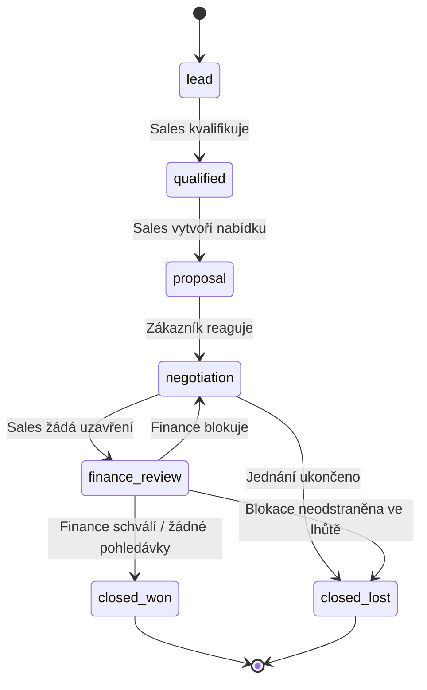
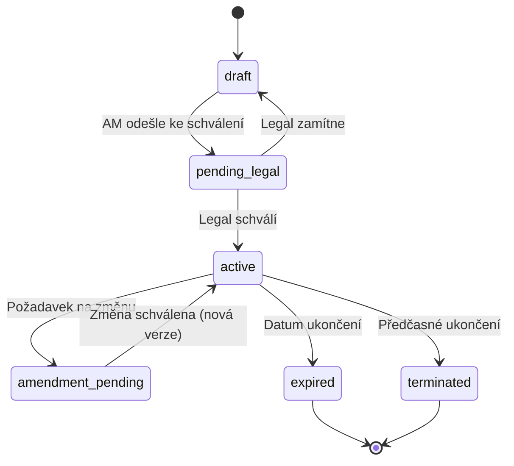
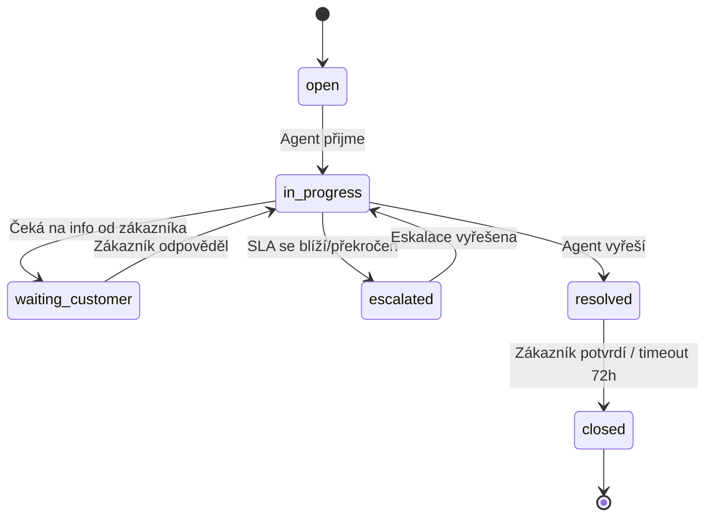
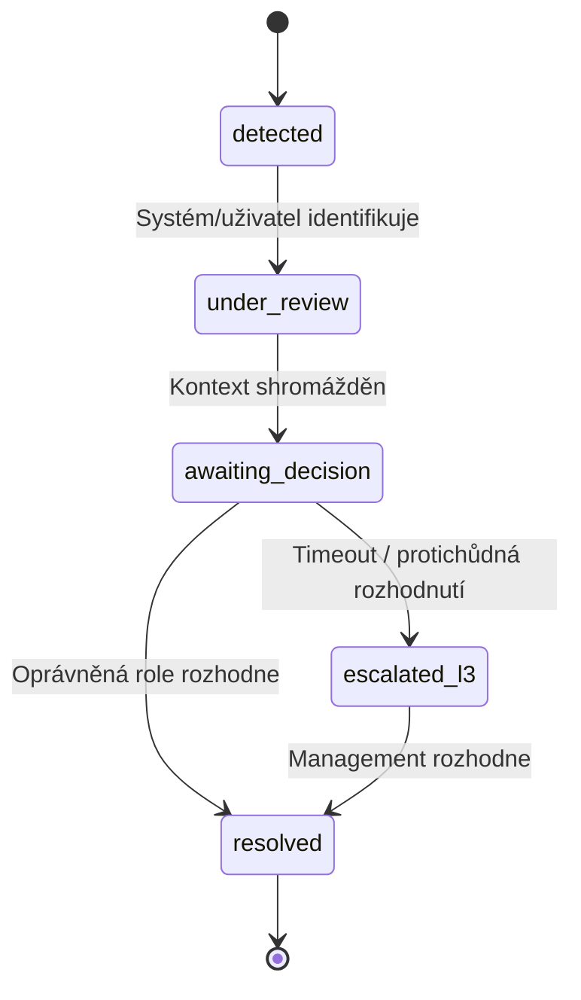
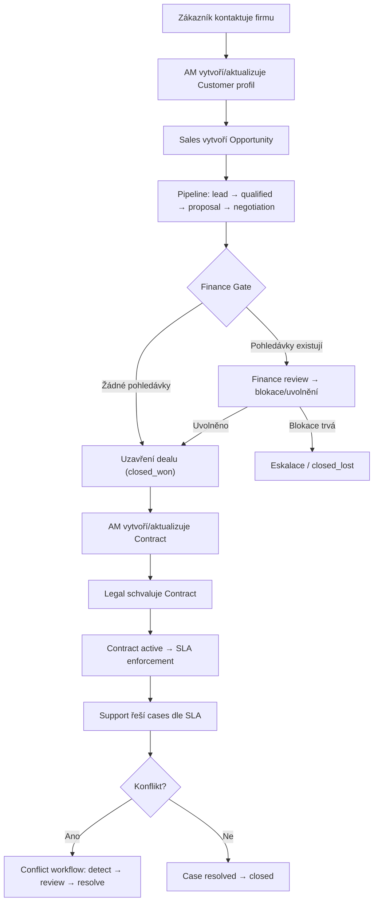
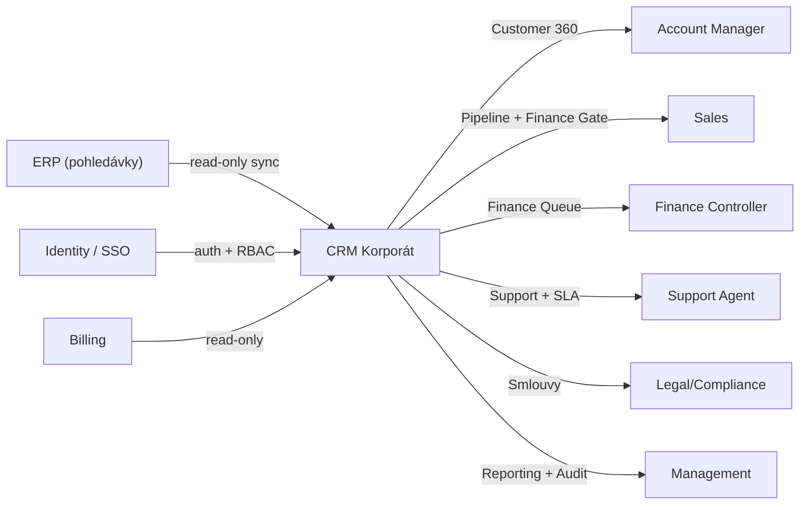
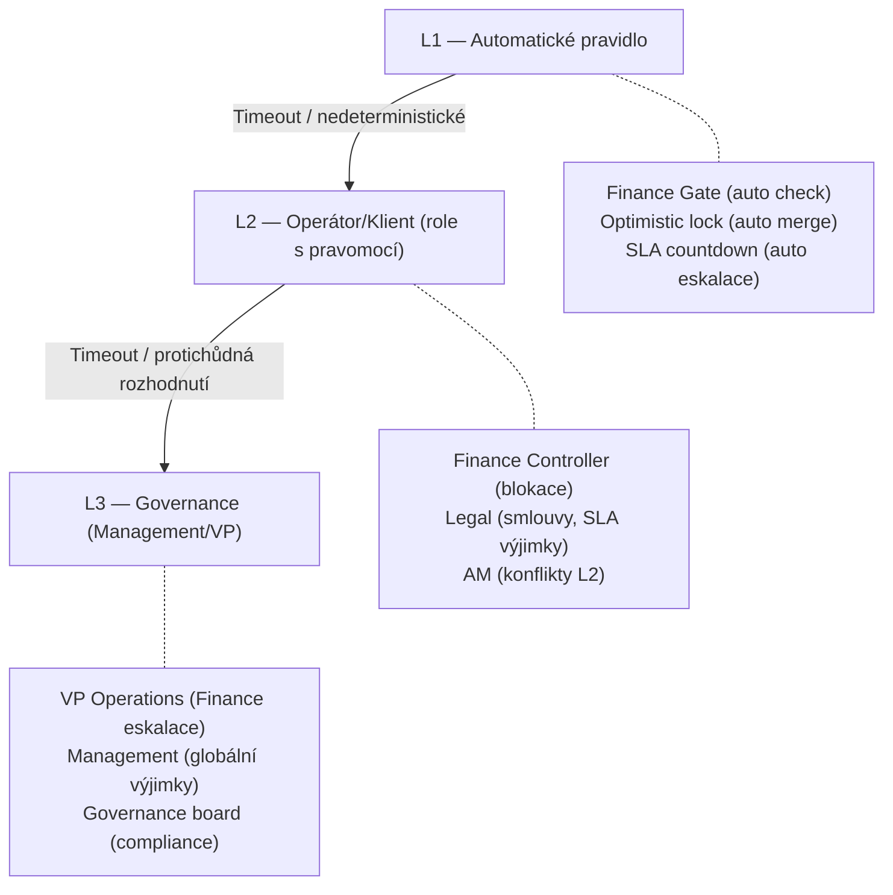
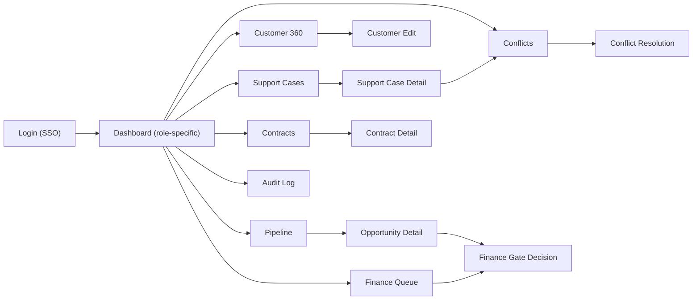
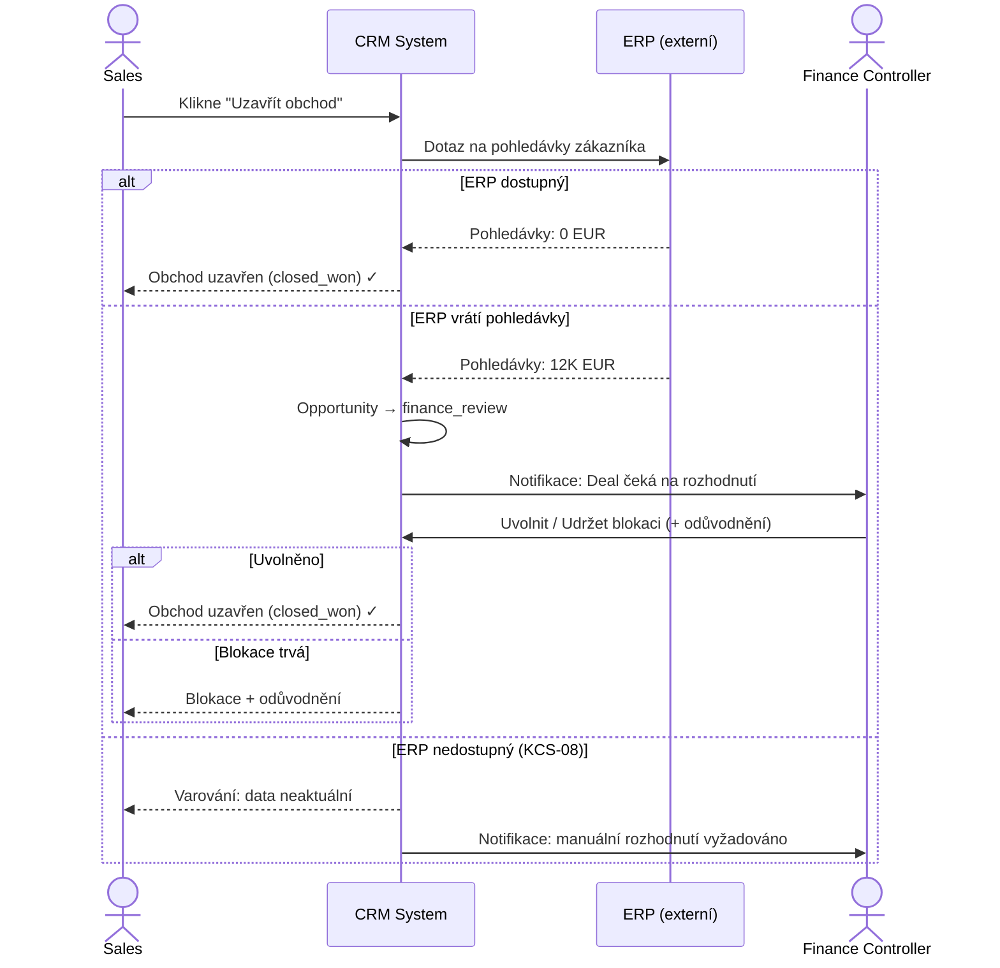
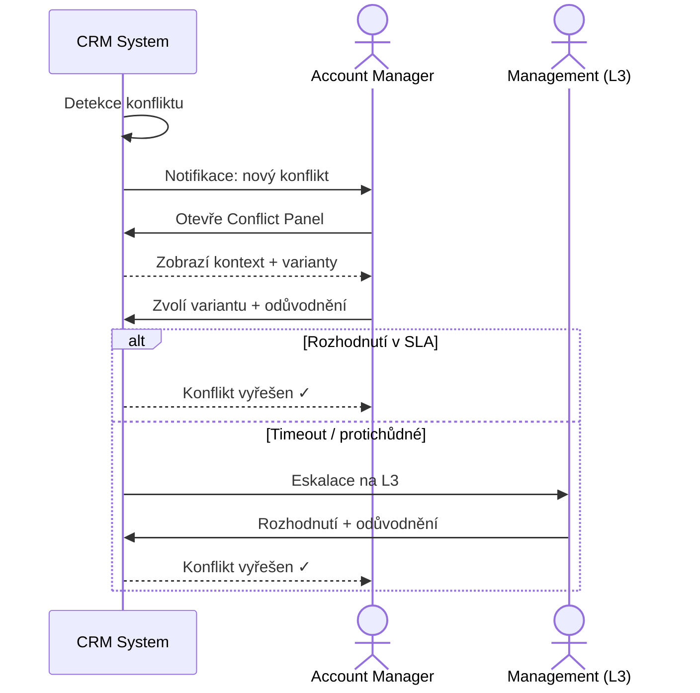

# PA — CRM pro korporát
## Produktová architektura v1

---

# ČÁST 1 — ARCHITEKTURA

## Kapitola 1 — Strategický rámec

### 1.1 Problém

Nadnárodní B2B společnost (2000+ zaměstnanců, multi-region EU) nemá jednotný pohled na zákazníka. Informace o zákazníkovi jsou fragmentovány mezi staré CRM, Excely, e-maily a lokální nástroje jednotlivých regionů a oddělení. Důsledkem je:

- **Neviditelnost stavu zákazníka:** Sales neví o otevřených pohledávkách (Finance), Support neví o probíhajících obchodech (Sales), Account Management neví o eskalacích (Support).
- **Konflikty mezi odděleními:** 5 identifikovaných konfliktních vzorců se opakují měsíčně s měřitelným dopadem (ztráta obchodů, nefakturované období, špatná komunikace se zákazníky).
- **Absence auditní stopy:** Rozhodnutí se dělají neformálně (e-mail, telefon), bez záznamu. Není možné zpětně dohledat, kdo co rozhodl a proč.

**Kořenový problém:** Chybí Single Source of Truth pro zákaznická data a chybí formalizovaný proces pro řešení mezioddělových konfliktů.

### 1.2 Primární aktéři

**End-Users (6 rolí):**
- **Account Manager** — centrální správce zákaznického vztahu, koordinátor změn (bolest 4.8/5).
- **Sales** — vytváří opportunity, uzavírá obchody (riziko adopce 3.1/5).
- **Finance Controller** — schvaluje/blokuje obchody na základě pohledávek.
- **Support Agent** — řeší incidenty dle SLA.
- **Legal/Compliance** — kontroluje smlouvy, compliance (skeptik 2.4/5).
- **Management** — reporting, strategické rozhodování.

**Economic Buyer:** VP Operations s CEO backing (budget 800K EUR, LoI 200K EUR pilotní fáze).

### 1.3 Hodnota vs. ztráta

| Bez systému (ztráta) | Se systémem (hodnota) |
|-----------------------|----------------------|
| 4.2h/týden/osoba na obcházení (~4000h/týden celkově) | Eliminace manuálního dohledávání |
| Ztracené obchody kvůli nesynchronizovaným blokacím | Real-time Finance gate |
| Chybné reporty pro board (3 nesynchronizované zdroje) | Single Source of Truth |
| Nefakturované období (120K EUR příklad) | Automatická detekce odchylek |
| Neformální rozhodování bez stopy | 100 % auditovatelnost |

### 1.4 Současný workaround

Kombinace starého CRM + Excely per oddělení/region + e-mailové řetězce + lokální nástroje. Průměr 4.2h/týden na obcházení, 78 % respondentů používá Excel jako primární nástroj.

### 1.5 Trigger ke změně

Předchozí selhání Salesforce → organizace poučena. VP Operations s mandátem CEO. Kumulativní ztráty eskalovaly.

### 1.6 Context of Use & Platforms

- **Fyzický kontext:** Desktop primary, Sales v terénu (mobilní readonly v MVP)
- **Psychický kontext:** Časový tlak, zvyk na flexibilitu Excelu — systém MUSÍ být rychlejší
- **Multi-region:** CZ, DE, AT, PL (validováno), potenciálně další EU

---

**Assumptions:**
- A-01: Staré CRM obsahuje strukturovaná data pro migraci.
- A-02: ERP má API/feed pro synchronizaci pohledávek.
- A-03: SSO/identity management je zajištěn paralelně.

**Decision Log:**
- DL-01: Deployment = interní nástroj (ne SaaS).
- DL-02: Desktop primary, mobilní readonly v MVP.
- DL-03: Multi-region konfigurace IN MVP (Region vs Global konflikt je klíčový).

**Confidence & Gaps:**
- Vysoká: Existence a frekvence konfliktů (42 respondentů).
- Střední: Rozsah datové migrace.
- Gap: Přesné requirements Legal/Compliance.

---

## Kapitola 2 — Architektura systému

### Ubiquitous Language

| Pojem | Definice |
|-------|---------|
| **Customer** | Právní entita (firma) identifikovaná IČO/VAT ID. Jedna firma = jeden Customer, i s více regionálními pobočkami. |
| **Opportunity** | Obchodní příležitost v pipeline — od kvalifikace po uzavření. Vždy patří jednomu Sales a jednomu Customer. |
| **Contract** | Platná smlouva definující SLA, rozsah služeb a platební podmínky. Verzovaná — každá změna vytváří novou verzi. |
| **SupportCase** | Požadavek zákazníka na podporu, vázaný na Contract (SLA). Má lifecycle s eskalačním mechanismem. |
| **FinanceBlock** | Blokace obchodu ze strany Finance kvůli pohledávkám. Synchronizován z ERP. Uvolnění vyžaduje explicitní rozhodnutí. |
| **Conflict** | Formalizovaný mezioddělový spor s lifecycle (detekce → review → rozhodnutí → uzavření) a povinným audit trail. |
| **AuditRecord** | Neměnný záznam o každé změně nebo rozhodnutí. Kdo, kdy, co, proč. Append-only. |

### Core Job systému

Systém existuje, aby:
1. Poskytl jednotný, důvěryhodný pohled na zákazníka napříč všemi odděleními (Customer 360).
2. Formalizoval mezioddělové konflikty a zajistil jejich deterministické řešení s auditní stopou.
3. Automatizoval Finance gate pro obchodní příležitosti (eliminace ztracených dealů kvůli nesynchronizovaným datům).

### Roles & Permissions

| Role | Typ | Hlavní oprávnění | Zakázáno |
|------|-----|-------------------|----------|
| Account Manager | end_user | Správa zákaznického profilu, Customer 360, koordinace změn, eskalace konfliktu | Schvalovat Finance blokaci, měnit SLA bez Legal |
| Sales | end_user | Vytvořit/posunout opportunity, požádat o uvolnění blokace | Uvolnit blokaci sám, měnit smlouvu, přistupovat k datům jiného regionu |
| Finance Controller | end_user | Blokovat/uvolnit deal, nastavit automatická pravidla | Měnit pipeline, měnit zákaznický profil |
| Support Agent | end_user | Vytvořit/eskalovat support case, zobrazit Customer 360 + smlouvy | Schvalovat SLA výjimku, měnit smlouvu |
| Legal/Compliance | end_user | Schválit/zamítnout změnu smlouvy, nastavit compliance pravidla, schválit SLA výjimku | Vytvářet opportunity, měnit profil |
| Management | economic_buyer | Reporting, dashboardy, L3 governance rozhodnutí, výjimky z globálních pravidel | Operativní záznamy, technická konfigurace |
| Regional Director | end_user | Požádat o regionální výjimku (KCS-03), spravovat regionální tým, eskalovat na VP | Schvalovat vlastní výjimky, měnit globální pravidla, přistupovat k datům jiných regionů |

> **PAB_CHANGE #1:** Přidána role Regional Director — je v eskalačním řetězci KCS-03, musí mít definovaná oprávnění.

**Matrix permissions:** Oprávnění jsou průnik ROLE × REGION. Sales CZ vidí pouze opportunity v regionu CZ, pokud nemá explicitní cross-region oprávnění.

### System Boundary

```
┌─────────────────────────────────────────┐
│              CRM Korporát               │
│                                         │
│  Customer 360 │ Pipeline │ Contracts    │
│  Support      │ Conflicts│ Audit Trail  │
│                                         │
└──────┬──────────┬──────────┬───────────┘
       │          │          │
   ┌───▼───┐ ┌───▼───┐ ┌───▼───┐
   │  ERP  │ │Billing│ │  SSO  │
   │(read) │ │(read) │ │(auth) │
   └───────┘ └───────┘ └───────┘
```

Systém ŘÍDÍ: zákaznické profily, pipeline, smlouvy, support cases, konflikty, audit trail.
Systém NEŘÍDÍ: fakturaci (ERP), billing, identitu (SSO). Pouze ČTETE data z těchto systémů.

### Source of Truth (SoT)

| Doména | SoT | Důvod |
|--------|-----|-------|
| Zákaznický profil (kontakty, adresy, ownership) | CRM Korporát | Jediný centrální zdroj |
| Pohledávky a platební historie | ERP | Finance systém zůstává autoritou pro finance |
| Smlouvy a SLA podmínky | CRM Korporát | Verzované, se schválením Legal |
| Identita uživatele a role | Identity Management / SSO | Centrální auth |
| Billing a fakturace | Billing systém | Mimo scope CRM |

### Non-Functional Requirements

(Převzato z Validátora — nepřidáno žádné nové.)

1. **Auditovatelnost:** 100 % rozhodnutí musí mít audit trail (kdo, kdy, co, proč).
2. **RBAC:** Role-based access per oddělení A per region (matrix permissions).
3. **GDPR:** Compliance per EU region — data retention, consent, PII handling per lokální legislativu.
4. **Performance:** Page load < 2s, search < 1s (rychlejší než Excel pro denní operace).
5. **Integrace:** Real-time synchronizace s ERP (finance), billing, support nástroje, SSO.
6. **Multi-region:** Lokální obchodní zvyklosti a podmínky per region bez porušení globálních pravidel.
7. **Škálovatelnost:** 2000+ concurrent users, multi-region deployment.

### Integrace

| Systém | Směr | Frekvence | Data |
|--------|------|-----------|------|
| ERP | CRM ← ERP (read) | Real-time nebo min. denní | Pohledávky, platební historie, stav zákazníka |
| Billing | CRM ← Billing (read) | Denní | Fakturační stav |
| Identity Mgmt / SSO | CRM ↔ SSO | Real-time | Autentizace, role, oprávnění |
| Support nástroje | CRM ← Support (read) | Real-time | Historie tiketů (pokud existuje legacy) |

### Core Entities

#### Customer
Centrální zákaznická entita — Single Source of Truth.
- **Klíčové atributy:** id, legal_name, vat_id, status, primary_region, regions[], owning_account_manager, contacts[], created_at, last_modified_at, last_modified_by
- **Vazby:** has_many Contacts, has_many Opportunities, has_many Contracts, has_many SupportCases, has_many AuditRecords

#### Opportunity
Obchodní příležitost v pipeline.
- **Klíčové atributy:** id, customer_id, status, value_eur, probability, owner_sales, region, finance_block_status, expected_close_date, created_at
- **Vazby:** belongs_to Customer, has_one FinanceBlock (optional), has_many AuditRecords

#### Contract
Verzovaná smlouva se SLA.
- **Klíčové atributy:** id, customer_id, version, status, sla_response_hours, sla_resolution_hours, start_date, end_date, region, approved_by_legal, terms_hash
- **Vazby:** belongs_to Customer, has_many SupportCases, has_many AuditRecords

#### SupportCase
Požadavek zákazníka na podporu.
- **Klíčové atributy:** id, customer_id, contract_id, status, priority, sla_deadline, assigned_agent, escalation_level, created_at
- **Vazby:** belongs_to Customer, belongs_to Contract, has_many AuditRecords

#### Conflict
Formalizovaný mezioddělový spor.
- **Klíčové atributy:** id, type (enum: deal_vs_finance, contract_vs_reality, region_vs_global, support_vs_sla, data_ownership), status, parties[], customer_id, trigger_source, resolution, resolved_by, resolved_at, justification, sla_deadline
- **Vazby:** belongs_to Customer, references Opportunity/Contract/SupportCase, has_many AuditRecords

#### AuditRecord
Neměnný záznam.
- **Klíčové atributy:** id, entity_type, entity_id, action, actor, actor_role, timestamp, old_value, new_value, justification
- **Vazby:** belongs_to any entity (polymorphic). Append-only — nelze mazat ani upravovat.

### Stavový model

#### Opportunity Lifecycle



**Tranzientní stav:** `finance_review` — Opportunity čeká na rozhodnutí Finance. Nesmí být v tomto stavu déle než 72h (viz KCS-02).

**Neplatné přechody:**
- closed_won → lead (uzavřený obchod se nevrací na začátek)
- closed_lost → closed_won (ztracený obchod nelze přeměnit bez nové opportunity)

#### Contract Lifecycle



**Tranzientní stavy:** `pending_legal`, `amendment_pending`

**Neplatné přechody:**
- expired → active (expirovanou smlouvu nelze reaktivovat)
- terminated → active (ukončenou smlouvu nelze obnovit)

#### SupportCase Lifecycle



**Tranzientní stav:** `waiting_customer`

**Neplatné přechody:**
- closed → open (uzavřený case nelze znovu otevřít — nový case s referencí)

#### Conflict Lifecycle



**Tranzientní stavy:** `under_review`, `awaiting_decision`

### Rozhodovací body

| Rozhodovací bod | Kdo rozhoduje | Kdy | Fallback |
|-----------------|---------------|-----|----------|
| Finance blokace uvolnění | Finance Controller | Opportunity vstoupí do finance_review | Po 72h bez rozhodnutí → eskalace na Management |
| Smlouva schválení | Legal/Compliance | Contract přechází do pending_legal | Po 120h → eskalace na Management |
| SLA výjimka | Legal/Compliance | Support požádá o výjimku | Po 48h → eskalace na Management |
| Regionální výjimka z globálních pravidel | Management | Regionální tým požádá | Žádost zamítnuta po 168h bez rozhodnutí |
| Mezioddělový konflikt L2 | Account Manager / dotčená role | Systém detekuje konflikt | Po SLA timeout → eskalace na L3 (Management) |

### Known Critical Situations

#### KCS-01: Souběžná editace zákaznických dat více odděleními

**Situace:** Dva uživatelé z různých oddělení (např. AM a Support) mění stejný zákaznický profil současně. Není jasné, čí změna má přednost.

**Analýza:** Customer je SoT — každá změna musí být atomická a auditovaná. Konflikt vzniká, když dva uživatelé editují překrývající se pole.

**Decision Strategy:**
- **Resolution type:** `preventive_guard`
- **Mechanismus:** Optimistic locking — při uložení systém ověří, že data nebyla mezitím změněna. Pokud ano, zobrazí diff a vyžaduje manuální merge.
- **Fallback:** Pokud uživatel merge odmítne, jeho změny se uloží jako draft (ne jako commit) a vytvoří se Conflict typu `data_ownership`.
- **Guarding invariant:** INV-01 (Zákaznický profil má vždy konzistentní stav — žádná tichá přepisování)
- **Transient state:** `merge_required` (Customer entity — nový tranzientní stav)
- **Audit required:** true

#### KCS-02: Finance blokace na základě nesynchronizovaných pohledávek

**Situace:** Sales chce uzavřít deal, Finance blokuje kvůli pohledávce, která již byla uhrazena, ale data z ERP nejsou aktuální.

**Analýza:** Hlavní příčina — latence synchronizace ERP → CRM. Opportunity je ve stavu `finance_review` a čeká na rozhodnutí Finance, které je založeno na potenciálně zastaralých datech.

**Decision Strategy:**
- **Resolution type:** `manual_escalation`
- **Escalation path:** Finance Controller → Finance Manager → VP Operations
- **Escalation SLA:** 240 minut (4 hodiny) pro Finance Controller
- **Fallback if timeout:** Po 72h bez rozhodnutí → automatická eskalace na VP Operations. VP Operations má 24h na rozhodnutí. Pokud ani VP nerozhodne → Opportunity zůstává ve `finance_review` s notifikací oběma stranám (nikdy automatické uvolnění).
- **Guarding invariant:** INV-02 (Opportunity v finance_review nesmí být uzavřena bez explicitního rozhodnutí Finance nebo eskalace)
- **Transient state:** `finance_review` (existující v Opportunity state machine)
- **Audit required:** true

#### KCS-03: Lokální obchodní podmínky vs. globální pravidla

**Situace:** Regionální tým chce nabídnout zákazníkovi podmínky, které globální policy neumožňuje. Není formalizovaný výjimkový proces.

**Analýza:** Konflikt mezi lokální obchodní potřebou a centrální governance. Bez formalizace se řeší neformálně (e-mail HQ), což trvá týdny a vede ke ztrátě zákazníků.

**Decision Strategy:**
- **Resolution type:** `manual_escalation`
- **Escalation path:** Regional Director → VP Operations (L3 Governance)
- **Escalation SLA:** 2880 minut (48 hodin) pro Regional Director, 10080 minut (7 dní) pro VP Operations
- **Fallback if timeout:** Po 7 dnech bez rozhodnutí VP Operations → žádost automaticky zamítnuta s odůvodněním "timeout". Regional Director obdrží notifikaci a může podat novou žádost s doplněným zdůvodněním.
- **Guarding invariant:** INV-03 (Globální pravidla nelze obejít bez explicitního schválení L3 Governance s auditní stopou)
- **Transient state:** `exception_pending` (nový tranzientní stav na Opportunity nebo Contract)
- **Audit required:** true

#### KCS-04: Ústní příslib Sales vs. písemná smlouva

**Situace:** Zákazník se odvolává na příslib Sales, který není v systému evidován. Support nemá jak ověřit.

**Analýza:** Asymetrie informací mezi Sales (co slíbil) a Support (co má v systému). Contract je SoT — ale ústní přísliby existují mimo systém.

**Decision Strategy:**
- **Resolution type:** `manual_escalation`
- **Escalation path:** Account Manager → Sales Manager → VP Operations
- **Escalation SLA:** 480 minut (8 hodin) pro Account Manager
- **Fallback if timeout:** Po 48h → systém vytvoří Conflict typu `contract_vs_reality` a eskaluje na VP Operations. Mezitím platí podmínky dle písemné smlouvy (Contract je SoT).
- **Guarding invariant:** INV-04 (Platné jsou pouze podmínky evidované v systému — ústní přísliby nemají právní váhu v systémovém kontextu)
- **Transient state:** `dispute_pending` (nový tranzientní stav na SupportCase)
- **Audit required:** true

#### KCS-05: Zákazník požaduje SLA výjimku

**Situace:** Standardní SLA neumožňuje požadovanou službu, ale zákazník je strategicky důležitý.

**Decision Strategy:**
- **Resolution type:** `manual_escalation`
- **Escalation path:** Support Lead → Legal/Compliance → VP Operations
- **Escalation SLA:** 2880 minut (48 hodin) pro Support Lead
- **Fallback if timeout:** Po 48h → SLA výjimka zamítnuta. Support pokračuje dle standardního SLA. Zákazník i interní tým obdrží notifikaci.
- **Guarding invariant:** INV-05 (SLA výjimka vyžaduje explicitní schválení Legal/Compliance s odůvodněním a časovým omezením)
- **Transient state:** `sla_exception_pending` (nový tranzientní stav na SupportCase)
- **Audit required:** true

#### KCS-06: Data finality — Contract a finanční reporting (Systematic Check #1)

**Situace:** Smlouva přechází do stavu `active` a její podmínky jsou použity pro fakturaci a reporting. Pokud se podmínky změní po exportu dat do ERP/billing, vzniká nesoulad mezi systémy.

**Analýza:** Contract entity podléhá pravidlu datové hranice — po exportu dat do externího kontextu (ERP, billing, reporting) se data stávají finalizovanými a změny jsou možné pouze jako korekce s audit trail.

**Lifecycle:**
- **Draft:** Volně editovatelná, žádná právní platnost.
- **Active:** Právně platná, exportovaná do ERP/billing. Změny pouze přes `amendment_pending` se schválením Legal.
- **Finalized (pro reporting):** Data uzavřená pro reporting období. Změny pouze jako korekce s povinným zdůvodněním a notifikací Finance.

**Decision Strategy:**
- **Resolution type:** `correction_record`
- **Mechanismus:** Změna po finalizaci vytvoří korekcní záznam (append-only) s povinným zdůvodněním, referencí na původní hodnotu a notifikací Finance.
- **Guarding invariant:** INV-06 (Data exportovaná do externího kontextu nelze tiše přepsat — pouze korekce s audit trail)
- **Transient state:** `correction_pending` (nový tranzientní stav na Contract)
- **Audit required:** true

#### KCS-07: Částečné selhání vícekrokové operace Finance Gate (Systematic Check #4)

**Situace:** Finance Gate kontroluje pohledávky (krok 1: dotaz ERP) a poté blokuje/uvolňuje deal (krok 2: změna stavu Opportunity). Pokud krok 1 uspěje ale krok 2 selže (např. network error při zápisu), systém je v nekonzistentním stavu.

**Decision Strategy:**
- **Resolution type:** `automatic`
- **Mechanismus:** Celá operace Finance Gate je atomická. Pokud krok 2 selže, krok 1 se rollbackne (Opportunity zůstává v předchozím stavu). Systém zaznamená selhání a pokusí se o retry (max 3×, interval 30s). Po 3 neúspěšných pokusech → Conflict typu `system_failure` s notifikací Finance Controller.
- **Guarding invariant:** INV-07 (Finance Gate je atomická operace — buď projde celá, nebo se vrátí do předchozího stavu)
- **Transient state:** `finance_review` (existující)
- **Audit required:** true (zaznamenat selhání i retry)

#### KCS-08: Nedostupnost ERP (Systematic Check #5)

**Situace:** ERP systém je nedostupný — CRM nemůže ověřit pohledávky pro Finance Gate.

**Decision Strategy:**
- **Resolution type:** `manual_escalation`
- **Escalation path:** Finance Controller (informován o nedostupnosti)
- **Escalation SLA:** 0 (okamžitá notifikace)
- **Fallback if timeout:** Systém zobrazí varování "Data pohledávek nemusí být aktuální — poslední synchronizace: [timestamp]". Finance Controller může: (a) ručně rozhodnout na základě posledních známých dat, (b) počkat na obnovení ERP. Opportunity NEZAMÍTAT automaticky kvůli nedostupnosti ERP.
- **Guarding invariant:** INV-08 (Nedostupnost externího systému nesmí automaticky blokovat obchodní operace — vždy umožnit manuální rozhodnutí s varováním)
- **Transient state:** `finance_review` (existující, s příznakem `erp_stale: true`)
- **Audit required:** true

### Invariants

| ID | Invariant | Důsledek porušení |
|----|-----------|-------------------|
| INV-01 | Zákaznický profil má vždy konzistentní stav — žádná tichá přepisování. Každá změna musí projít auditním záznamem. | Systém odmítne uložení a vyžádá merge. |
| INV-02 | Opportunity v `finance_review` nesmí být uzavřena bez explicitního rozhodnutí Finance nebo eskalace. | Systém blokuje přechod do `closed_won` bez Finance clearance. |
| INV-03 | Globální pravidla nelze obejít bez explicitního schválení L3 Governance s auditní stopou. | Systém neumožní lokální výjimku bez governance workflow. |
| INV-04 | Platné jsou pouze podmínky evidované v systému — ústní přísliby nemají právní váhu v systémovém kontextu. | Support se řídí Contract, ne neformálními sliby. |
| INV-05 | SLA výjimka vyžaduje explicitní schválení Legal/Compliance s odůvodněním a časovým omezením. | Systém neumožní SLA mimo rozsah smlouvy bez schválení. |
| INV-06 | Data exportovaná do externího kontextu nelze tiše přepsat — pouze korekce s audit trail. | Systém vyžaduje korekcní workflow pro změny po finalizaci. |
| INV-07 | Finance Gate je atomická operace — buď projde celá, nebo se vrátí do předchozího stavu. | Systém provede rollback při částečném selhání. |
| INV-08 | Nedostupnost externího systému nesmí automaticky blokovat obchodní operace. | Systém umožní manuální rozhodnutí s varováním o stáří dat. |

### Hlavní workflow



### Co systém nikdy nebude dělat

1. Nikdy automaticky neuvolní Finance blokaci bez explicitního rozhodnutí.
2. Nikdy nepřepíše zákaznická data bez auditního záznamu.
3. Nikdy nepovolí SLA výjimku bez schválení Legal/Compliance.
4. Nikdy nesmaže AuditRecord.
5. Nikdy automaticky nezamítne obchod kvůli nedostupnosti ERP.
6. Nikdy neumožní obejít globální pravidla bez L3 Governance.
7. Nikdy neuzavře Conflict bez odůvodnění.

### System Rules

**Session & Access:**
- SR-01: Autentizace výhradně přes SSO. Žádné lokální účty.
- SR-02: Session timeout: 30 minut nečinnosti. Automatický logout s uložením rozpracovaných změn jako draft.
- SR-03: Oprávnění = průnik ROLE × REGION. Cross-region přístup pouze s explicitním oprávněním.

**Default behavior:**
- SR-04: Při nesouladu mezi systémy systém vždy upřednostní SoT (viz tabulka SoT) a zobrazí varování o nesouladu. Nikdy tiše neřeší.
- SR-05: Každý proces musí skončit definovaným stavem — i při selhání. Žádný "limbo" stav.
- SR-06: Výchozí jazyk UI = jazyk regionu uživatele. Data (jména zákazníků, smlouvy) se nezpřekládají.

**Retry & Timeout:**
- SR-07: Retry pro externí systémy (ERP, billing): max 3 pokusy, interval 30s, exponential backoff.
- SR-08: Po 3 neúspěšných pokusech: záznam selhání + notifikace zodpovědné role + fallback na manuální rozhodnutí.

**Consistency:**
- SR-09: Všechny zápisy do Customer entity jsou atomické s optimistic locking.
- SR-10: AuditRecord se zapisuje SOUČASNĚ se změnou entity (ne asynchronně). Pokud AuditRecord selže, změna se neprojeví.

---

**Assumptions (Kap. 2):**
- A-04: ERP API latence < 5s pro dotaz na pohledávky.
- A-05: SSO provider podporuje RBAC claims (role + region).
- A-06: Uživatelé mají stabilní internetové připojení (ne offline-first).

**Decision Log (Kap. 2):**
- DL-04: Optimistic locking pro Customer (ne pesimistický lock). Důvod: při 2000+ uživatelích by pesimistický lock způsobil zbytečné čekání.
- DL-05: Contract je verzovaný (ne editovatelný). Důvod: audit trail vyžaduje kompletní historii verzí.
- DL-06: AuditRecord synchronní (ne asynchronní). Důvod: garantuje, že žádná změna není bez audit záznamu. Daň: mírně pomalejší zápisy.
- DL-07: Systematic Check přidal KCS-06, KCS-07, KCS-08. Důvod: Data finality (Contract export), atomicita Finance Gate, ERP dependency.

**Confidence & Gaps (Kap. 2):**
- Vysoká: Entity model pokrývá všech 5 domén ze zadání.
- Vysoká: 8 KCS pokrývá všechny identifikované konfliktní vzory + systémové hrany.
- Střední: ERP API capabilities (A-04 je předpoklad).
- Gap: Přesný formát dat v legacy CRM pro migraci.

---

## Kapitola 2.5 — Interakční kontrakty

### UC-01: Správa zákaznického profilu (Customer 360)

**Aktér & Trigger:** Account Manager otevře zákaznický profil.

**Preconditions:** Uživatel je autentizován, má roli AM, má oprávnění pro daný region.

**Vstup (Data Payload):**
- customer_id (při editaci existujícího) NEBO vat_id + legal_name + primary_region (při vytváření nového)
- contacts[]: {name, email, phone, role, is_primary}
- regions[]: {region_code, local_name, local_address}
- owning_account_manager_id
- notes (volitelný text)

**Výstup (Data Payload):**
- customer_id, legal_name, vat_id, status, primary_region
- regions[] s lokálními detaily
- contacts[] s rolemi
- owning_account_manager (jméno + oddělení)
- active_opportunities[] (id, name, status, value, owner_sales)
- active_contracts[] (id, version, status, sla_summary, end_date)
- open_support_cases[] (id, status, priority, sla_deadline)
- open_conflicts[] (id, type, status, parties)
- finance_summary: {total_receivables, overdue_amount, last_payment_date} (z ERP)
- recent_audit_trail[] (posledních 20 záznamů)

**Main flow:**
1. AM otevře zákaznický profil zadáním jména nebo VAT ID.
2. Systém zobrazí Customer 360 — kompletní pohled na zákazníka (viz výstupní payload).
3. AM klikne na "Editovat profil".
4. Systém ověří, zda nikdo jiný aktuálně needituje stejný profil (optimistic lock check).
5. AM upraví požadovaná pole (kontakty, regiony, poznámky).
6. AM klikne "Uložit".
7. Systém ověří validaci (VAT ID formát, povinná pole).
8. Systém ověří, zda se data nezměnila od otevření (optimistic lock).
9. Systém uloží změny + AuditRecord (kdo, co, staré/nové hodnoty).
10. Systém zobrazí aktualizovaný profil s potvrzením.

**Error flows:**
- E-4a: Jiný uživatel edituje stejný profil → systém zobrazí varování "Uživatel [jméno] právě edituje tento profil. Vaše změny budou uloženy jako draft." (navázáno na krok 4)
- E-7a: VAT ID neplatný formát → systém zobrazí chybu u pole, neumožní uložení. (krok 7)
- E-8a: Optimistic lock konflikt — data se změnila → systém zobrazí diff, vyžaduje merge (KCS-01). (krok 8)
- E-9a: AuditRecord zápis selže → systém zamítne uložení změn (SR-10). (krok 9)

**Validace & Chybové stavy:**
- VAT ID: formát dle regionu (CZ: 8-10 číslic, DE: 9 číslic prefixed "DE", AT: 9 číslic prefixed "ATU")
- legal_name: povinné, min 2 znaky
- primary_region: povinné, validní region code
- owning_account_manager: povinné, existující AM v systému

**Side effects & Postconditions:**
- AuditRecord vytvořen pro každou změnu
- Pokud se změní owning_account_manager → notifikace starému i novému AM
- Pokud se změní region → ověření, že nový region je v scope oprávnění AM

---

### UC-02: Řízení obchodní příležitosti (Pipeline) — Skin in the Game

**Aktér & Trigger:** Sales vytvoří novou opportunity nebo posune existující v pipeline.

**Preconditions:** Uživatel je autentizován, má roli Sales, má oprávnění pro daný region. Customer existuje v systému.

**Vstup (Data Payload):**
- customer_id
- opportunity_name
- value_eur (odhadovaná hodnota)
- probability (% pravděpodobnost uzavření)
- expected_close_date
- region
- product_lines[] (volitelné)
- notes (volitelné)

**Výstup (Data Payload):**
- opportunity_id, status, value_eur, probability
- customer_summary (jméno, region, finance_status)
- finance_block_status: {is_blocked, reason, blocking_amount, last_sync}
- pipeline_stage_history[] (timestamp, from_stage, to_stage, actor)
- related_contracts[] (aktivní smlouvy se zákazníkem)

**Main flow:**
1. Sales otevře modul Pipeline a klikne "Nová příležitost".
2. Sales vyplní povinná pole (customer, název, hodnota, pravděpodobnost, datum).
3. Systém validuje vstup (customer existuje, hodnota > 0, datum v budoucnosti).
4. Systém uloží Opportunity ve stavu `lead`.
5. Sales kvalifikuje příležitost — posune do `qualified` (kliknutím + krátkým zdůvodněním).
6. Sales vytvoří nabídku → `proposal`.
7. Zákazník reaguje → Sales posune do `negotiation`.
8. Sales klikne "Uzavřít obchod" → systém automaticky spustí Finance Gate.
9. Finance Gate: systém dotáže ERP na pohledávky zákazníka.
10. Pokud žádné pohledávky → Opportunity přechází do `closed_won`. Systém notifikuje AM.
11. Pokud pohledávky existují → Opportunity přechází do `finance_review`. Systém notifikuje Finance Controller + Sales.

**Error flows:**
- E-3a: Customer neexistuje → systém nabídne vytvoření nového Customer (redirect na UC-01). (krok 3)
- E-9a: ERP nedostupný → KCS-08 fallback: systém zobrazí varování "Pohledávky nelze ověřit — poslední data z [timestamp]". Finance Controller notifikován. (krok 9)
- E-9b: Finance Gate částečné selhání → KCS-07: retry 3× → Conflict. (krok 9)
- E-11a: Finance review timeout (72h) → automatická eskalace dle KCS-02. (krok 11)

**Validace & Chybové stavy:**
- value_eur: povinné, > 0
- probability: 0–100 %
- expected_close_date: musí být v budoucnosti
- customer_id: musí existovat v systému

**Side effects & Postconditions:**
- AuditRecord pro každý přechod v pipeline
- Notifikace AM při vytvoření opportunity pro jeho zákazníka
- Finance Controller notifikován při finance_review
- Při closed_won: trigger pro vytvoření Contract (UC-04)

---

### UC-03: Finance Gate — Blokace a uvolnění dealů

**Aktér & Trigger:** Finance Controller obdrží notifikaci o Opportunity ve stavu `finance_review`.

**Preconditions:** Opportunity je ve stavu `finance_review`. Finance Controller má oprávnění.

**Vstup (Data Payload):**
- opportunity_id
- decision: "release" | "maintain_block"
- justification (povinný text)

**Výstup (Data Payload):**
- opportunity_id, new_status
- finance_block_details: {decision, decided_by, decided_at, justification}
- customer_finance_summary: {total_receivables, overdue_amount, overdue_days, payment_history_last_12m}
- erp_sync_status: {last_sync, is_stale}

**Main flow:**
1. Finance Controller otevře queue "Finance Review" — seznam Opportunities čekajících na rozhodnutí.
2. Systém zobrazí detail Opportunity + Customer finance summary z ERP + stáří dat.
3. Finance Controller prostuduje pohledávky a kontext (kdo, kolik, jak dlouho).
4. Finance Controller rozhodne: "Uvolnit" nebo "Udržet blokaci".
5. Finance Controller zadá povinné odůvodnění.
6. Systém uloží rozhodnutí + AuditRecord.
7. Pokud "Uvolnit" → Opportunity přechází do `closed_won`. Sales a AM notifikováni.
8. Pokud "Udržet blokaci" → Opportunity zůstává v `finance_review`. Sales notifikován s odůvodněním.

**Error flows:**
- E-2a: ERP data starší než 24h → systém zobrazí varování "Data pohledávek nemusí být aktuální" (KCS-08). (krok 2)
- E-6a: Justification prázdné → systém neumožní uložení. (krok 6)
- E-8a: SLA timeout (72h od vstupu do finance_review) → automatická eskalace na Finance Manager (KCS-02). (po kroku 8)

**Validace & Chybové stavy:**
- justification: povinné, min 10 znaků
- decision: enum "release" | "maintain_block"

**Side effects & Postconditions:**
- AuditRecord s rozhodnutím, odůvodněním, timestamp
- Notifikace Sales (vždy) a AM (při uvolnění)
- Pokud maintain_block: SLA timeout counter pokračuje

---

### UC-04: Správa smluv a SLA

**Aktér & Trigger:** Account Manager vytváří novou smlouvu po uzavření dealu, nebo Legal schvaluje smlouvu.

**Preconditions:** Customer existuje. Opportunity je closed_won (pro novou smlouvu).

**Vstup (Data Payload):**
- customer_id
- contract_type: "master" | "amendment" | "addendum"
- sla_response_hours, sla_resolution_hours
- start_date, end_date
- terms_description
- region
- services[] (rozsah služeb)
- special_conditions (volitelné)
- parent_contract_id (pro amendment/addendum)

**Výstup (Data Payload):**
- contract_id, version, status
- approval_status: {approved_by, approved_at} | {pending_legal: true}
- sla_summary
- linked_support_cases[] (pokud aktivní)
- version_history[] (id, version, changed_by, changed_at, change_summary)

**Main flow:**
1. AM otevře modul Smlouvy a klikne "Nová smlouva" (nebo "Změna smlouvy" pro amendment).
2. AM vyplní detaily smlouvy (typ, SLA, platnost, rozsah, podmínky).
3. Systém validuje vstup (povinná pole, datum konzistence).
4. Systém uloží smlouvu ve stavu `draft`.
5. AM klikne "Odeslat ke schválení" → smlouva přechází do `pending_legal`.
6. Legal obdrží notifikaci.
7. Legal prostuduje smlouvu a rozhodne: "Schválit" nebo "Zamítnout" (s komentářem).
8. Pokud schváleno → smlouva přechází do `active`. AM a zákazník notifikováni.
9. Pokud zamítnuto → smlouva se vrací do `draft` s komentářem Legal. AM notifikován.

**Error flows:**
- E-3a: end_date < start_date → validační chyba. (krok 3)
- E-5a: Smlouva již existuje pro customer + region + překrývající se období → varování (ne blokace — může jít o amendment). (krok 5)
- E-7a: Legal timeout (120h) → eskalace na Management. (krok 7)

**Validace & Chybové stavy:**
- start_date < end_date
- sla_response_hours > 0
- region: validní region code
- parent_contract_id: musí existovat a být active (pro amendment)

**Side effects & Postconditions:**
- AuditRecord pro každý přechod stavu
- Při active: SLA podmínky se stávají závazné pro Support (UC-05)
- Verzování: každá změna vytváří novou verzi, stará verze zůstává v historii

---

### UC-05: Řízení support požadavku

**Aktér & Trigger:** Support Agent přijme požadavek od zákazníka.

**Preconditions:** Customer existuje. Contract je active (pro SLA enforcement).

**Vstup (Data Payload):**
- customer_id
- contract_id (pro SLA lookup)
- subject, description
- priority: "critical" | "high" | "medium" | "low"
- contact_person (kdo nahlásil)
- category (volitelný)

**Výstup (Data Payload):**
- case_id, status, priority
- sla_deadline (vypočteno z Contract SLA + priority)
- assigned_agent
- customer_context: {name, region, active_contracts_count, open_cases_count, recent_interactions[]}
- contract_sla: {response_hours, resolution_hours, special_conditions}
- escalation_status: {level, escalated_at, reason}

**Main flow:**
1. Support Agent otevře modul Support a klikne "Nový požadavek".
2. Agent vyplní zákazníka, popis problému a prioritu.
3. Systém automaticky vyhledá aktivní Contract a SLA podmínky.
4. Systém vypočte SLA deadline (start_time + contract.sla_response_hours pro první reakci).
5. Systém uloží case ve stavu `open` a přidělí agentovi.
6. Agent zahájí práci → case přechází do `in_progress`.
7. Agent řeší problém. Pokud potřebuje info od zákazníka → `waiting_customer`.
8. Po vyřešení agent označí case jako `resolved`.
9. Zákazník potvrdí (nebo po 72h timeout) → `closed`.

**Error flows:**
- E-3a: Žádný aktivní Contract pro zákazníka → systém upozorní "Zákazník nemá aktivní smlouvu. SLA bude aplikováno dle default podmínek." (krok 3)
- E-4a: SLA deadline se blíží (80 % času uplynulo) → automatická eskalace na Support Lead. (krok 4+průběžně)
- E-4b: SLA deadline překročen → case přechází do `escalated` + notifikace Management. (krok 4+průběžně)
- E-7a: Zákazník požaduje SLA výjimku → KCS-05: eskalace na Legal. (krok 7)

**Validace & Chybové stavy:**
- customer_id: musí existovat
- priority: enum validace
- description: povinné, min 20 znaků

**Side effects & Postconditions:**
- AuditRecord pro každý přechod
- SLA countdown ticker od vytvoření
- Notifikace AM při eskalaci case jeho zákazníka

---

### UC-06: Řešení mezioddělového konfliktu

**Aktér & Trigger:** Systém automaticky detekuje konflikt (např. Finance blokace + Sales eskalace) NEBO AM/Management manuálně vytvoří Conflict.

**Preconditions:** Identifikovaný spor mezi 2+ odděleními/rolemi.

**Vstup (Data Payload):**
- conflict_type: "deal_vs_finance" | "contract_vs_reality" | "region_vs_global" | "support_vs_sla" | "data_ownership"
- customer_id
- trigger_source_id (reference na Opportunity/Contract/SupportCase)
- parties[]: [{role, user_id, position}]
- description

**Výstup (Data Payload):**
- conflict_id, type, status
- context: {customer_name, trigger_description, parties[], timeline[]}
- decision_options[]: {option_id, description, impact, recommended_by}
- sla_deadline (dle conflict type a decision strategy)
- resolution: {decision, decided_by, decided_at, justification}
- audit_trail[] (kompletní historie konfliktu)

**Main flow:**
1. Systém detekuje konfliktní situaci (nebo AM/Management manuálně vytvoří).
2. Systém klasifikuje typ konfliktu a určí decision strategy (z KCS).
3. Systém vytvoří Conflict entitu ve stavu `detected`.
4. Systém shromáždí kontext (zákaznické data, historie, dotčené entity) → `under_review`.
5. Systém připraví rozhodovací varianty a zobrazí je oprávněné roli → `awaiting_decision`.
6. Oprávněná role prostuduje kontext a zvolí variantu s povinným odůvodněním.
7. Systém aplikuje rozhodnutí (změní stav dotčené entity) + AuditRecord.
8. Conflict přechází do `resolved`. Všechny strany notifikovány.

**Error flows:**
- E-5a: SLA timeout → automatická eskalace na vyšší úroveň (L2 → L3). (krok 5)
- E-5b: Protichůdná rozhodnutí od dvou stran → eskalace na L3 (Management). (krok 5)
- E-6a: Justification prázdné → systém neumožní rozhodnutí. (krok 6)

**Validace & Chybové stavy:**
- conflict_type: enum
- parties[]: min 2 strany
- justification (při resolution): povinné, min 20 znaků

**Side effects & Postconditions:**
- AuditRecord pro celý lifecycle konfliktu
- Dotčená entita (Opportunity/Contract/SupportCase) aktualizována dle rozhodnutí
- Všechny strany notifikovány o výsledku
- Pattern tracking: systém zaznamenává frekvenci typů konfliktů (pro budoucí Decision Layer Level 2)

---

### UC-07: Auditní stopa a compliance reporting

**Aktér & Trigger:** Management nebo Legal/Compliance otevře audit modul.

**Preconditions:** Uživatel má roli Management nebo Legal.

**Vstup (Data Payload):**
- filter_entity_type: "customer" | "opportunity" | "contract" | "support_case" | "conflict" | "all"
- filter_entity_id (volitelné — konkrétní entita)
- filter_actor (volitelné — konkrétní uživatel)
- filter_date_from, filter_date_to
- filter_action (volitelné — typ akce)

**Výstup (Data Payload):**
- audit_records[]: {id, entity_type, entity_id, entity_name, action, actor, actor_role, timestamp, old_value, new_value, justification}
- summary: {total_records, records_by_entity_type, records_by_action, records_by_actor}
- compliance_flags[]: {record_id, flag_type, description} (pokud detekován nesoulad)
- export_format: "csv" | "pdf" (na vyžádání)

**Main flow:**
1. Management/Legal otevře modul Audit.
2. Uživatel nastaví filtry (období, entita, aktér, akce).
3. Systém zobrazí filtrovaný seznam auditních záznamů.
4. Uživatel může kliknout na záznam pro detail (old_value ↔ new_value diff).
5. Uživatel může exportovat data jako CSV nebo PDF.

**Error flows:**
- E-2a: Příliš široký filtr (> 10000 záznamů) → systém požaduje zúžení. (krok 2)
- E-5a: Export selže → retry s notifikací. (krok 5)

**Validace & Chybové stavy:**
- date_from < date_to
- Min. jeden filtr musí být nastaven (ne "zobraz vše za celou historii")

**Side effects & Postconditions:**
- Export je zaznamenán v AuditRecord (kdo exportoval, jaký rozsah dat)
- Žádné změny dat — čistě read-only operace

---

**Assumptions (Kap. 2.5):**
- A-07: Finance Gate odpověď z ERP přijde do 5s (pokud ERP dostupné).
- A-08: SLA deadline je vypočtena na úrovni business hours regionu zákazníka.
- A-09: Notifikace probíhají v reálném čase (in-app + e-mail fallback).

**Decision Log (Kap. 2.5):**
- DL-08: UC-02 (Pipeline) je Skin in the Game flow — je to primární flow, kde Sales aktivně pracuje a kde systém přináší nejvyšší hodnotu (eliminace ztracených dealů).
- DL-09: UC-06 (Conflict Resolution) má 5 podtypů odpovídajících 5 konfliktům ze zadání. Jeden generický UC místo 5 specifických — důvod: stejný lifecycle, různý kontext.
- DL-10: UC-07 (Audit) je read-only — žádné zápisy kromě záznamu o exportu. Důvod: audit trail nesmí být modifikovatelný.

**Confidence & Gaps (Kap. 2.5):**
- Vysoká: Data Payloady odpovídají entity modelu.
- Střední: Error flows pokrývají hlavní scénáře, ale ne všechny edge cases (doplní UAT).
- Gap: Přesné SLA hodnoty per priority level (závisí na konkrétních smlouvách).

---

## Kapitola 3 — Rozsah a priority

### 3.1 IN MVP (Core)

| ID | Use Case | Priorita | Aktér |
|----|----------|----------|-------|
| UC-01 | Správa zákaznického profilu (Customer 360) | Core | Account Manager |
| UC-02 | Řízení obchodní příležitosti (Pipeline) | Core | Sales |
| UC-03 | Finance Gate — blokace a uvolnění | Core | Finance Controller |
| UC-04 | Správa smluv a SLA | Core | Legal, Account Manager |
| UC-05 | Řízení support požadavku | Core | Support Agent |
| UC-06 | Řešení mezioddělového konfliktu | Core | AM, Management |
| UC-07 | Auditní stopa a compliance reporting | Core | Management, Legal |

### 3.2 OUT of MVP (Fáze 2+)

- Pokročilý BI/reporting (dashboardy, predikce)
- Full ERP integrace (v MVP pouze read-only synchronizace pohledávek)
- Multi-region konfigurační engine (v MVP pouze per-region flagy)
- Automatická detekce odchylek smlouva vs. realita
- Mobilní aplikace s plným UX (v MVP readonly responsive)
- E-mail integrace (automatické logování)
- Workflow automation (v MVP manuální triggery)

### 3.3 Zjednodušení v MVP

- Měna: EUR primární, lokální jako zobrazení (konverze v ERP).
- Fakturace: systém nezajišťuje — zobrazuje stav z ERP.
- Migrace: pouze zákaznické profily a aktivní smlouvy.

---

**Assumptions (Kap. 3):**
- A-01: Staré CRM má strukturovaná data pro migraci.
- A-02: ERP má API pro pohledávky.
- A-03: SSO zajištěn paralelně.

**Decision Log (Kap. 3):**
- DL-04: UC-06 IN MVP (5 konfliktů = jádro problému).
- DL-05: Fakturace v ERP (single responsibility).
- DL-06: Migrace pouze aktivních dat.

**Confidence & Gaps (Kap. 3):**
- Vysoká: Scope odpovídá 5 klíčovým konfliktům.
- Gap: ERP API capabilities.

---

## Kapitola 4 — Mapa toků

Systém je dostatečně komplexní pro vizualizaci — 6 rolí, 5 typů konfliktů, cross-department workflow.

### Tok informací



### Tok rozhodnutí (Eskalační model)



### Bottlenecky

1. **Finance Gate:** Jednobodový bottleneck — Finance Controller je single point of decision pro všechny deals. Mitigace: SLA 72h + eskalace.
2. **Legal schvalování:** Legal oddělení (skeptické 2.4/5) může zpomalovat smlouvy. Mitigace: SLA 120h + eskalace.
3. **ERP synchronizace:** Latence ERP dat může způsobit falešné blokace. Mitigace: KCS-08 fallback.

---

**Assumptions (Kap. 4):**
- A-10: Eskalační model je akceptovatelný pro organizaci (3 úrovně).

**Decision Log (Kap. 4):**
- DL-11: 3-úrovňový eskalační model (L1/L2/L3). Důvod: odpovídá organizační struktuře korporátu.

**Confidence & Gaps (Kap. 4):**
- Vysoká: Tok informací odpovídá integrační architektuře.
- Gap: Přesné SLA per eskalační úroveň (vyžaduje validaci s management).

---

## Kapitola 5 — MVP logistika

### Pilotní skupina

| Fáze | Rozsah | Oddělení | Region |
|------|--------|----------|--------|
| Pilotní (3 měsíce) | 50 uživatelů (champion users) | AM, Finance, Sales (po 3 per region) | CZ, DE |
| Rollout 1 (3 měsíce) | 500 uživatelů | AM, Finance, Sales, Support | CZ, DE, AT |
| Rollout 2 (3 měsíce) | 2000+ uživatelů | Všechna oddělení | Všechny regiony |

### Rozsah dat pro pilot

- 100 zákazníků (top 100 dle obratu)
- Aktivní smlouvy těchto zákazníků
- Pipeline posledních 6 měsíců
- Open support cases

### KPI (navázané na validaci)

| KPI | Baseline (před) | Cíl (po 12 měsících) |
|-----|-----------------|----------------------|
| Čas workaround per osoba per týden | 4.2h | < 1h |
| Adoption rate | 0 % | 80 % aktivních uživatelů |
| Conflict resolution time | ? (neměřeno) | < 48h |
| Finance Gate false block rate | ~30 % (odhad R03) | < 5 % |
| Audit trail coverage | 0 % | 100 % |

### Časový rámec

| Milestone | Čas |
|-----------|-----|
| Architektura + Design | Měsíc 1-2 |
| Vývoj MVP (Pilot scope) | Měsíc 3-8 |
| Pilot (50 users, CZ+DE) | Měsíc 9-11 |
| Rollout 1 | Měsíc 12-14 |
| Rollout 2 | Měsíc 15-18 |

---

**Assumptions (Kap. 5):**
- A-11: 50 champion users jsou identifikováni a dostupní pro pilot.
- A-12: Legacy CRM zůstává provozní paralelně s pilotem.

**Decision Log (Kap. 5):**
- DL-12: Pilot v CZ+DE (největší regiony, nejvyšší bolest). AT a PL v Rollout 1.
- DL-13: Paralelní provoz s legacy CRM v pilotní fázi. Důvod: snížení rizika.

**Confidence & Gaps (Kap. 5):**
- Střední: Časový rámec 18 měsíců (odpovídá sponzorovu odhadu).
- Gap: Dostupnost champion users v pilotní fázi.

---

## Kapitola 6 — Rizika

### Technická rizika

| Riziko | Pravděpodobnost | Dopad | Mitigace |
|--------|----------------|-------|----------|
| ERP API nedostupnost | Střední | Vysoký (blokace Finance Gate) | KCS-08: fallback na manuální rozhodnutí |
| Legacy CRM migrace selhání | Střední | Vysoký (chybějící data) | Migrace pouze aktivních dat + validační skripty |
| Performance při 2000+ uživatelích | Nízká | Vysoký | Load testing v pilotní fázi |

### Behaviorální rizika

| Riziko | Pravděpodobnost | Dopad | Mitigace |
|--------|----------------|-------|----------|
| Sales odmítne přejít z Excelu | Vysoká | Kritický (systém bez Sales nemá smysl) | UX rychlejší než Excel + performance KPI |
| Legal blokuje adopci (compliance obavy) | Střední | Vysoký | Zapojení Legal od začátku designu, audit trail demonstrace |
| Management vnímá jako IT projekt, ne biznis transformaci | Nízká | Vysoký | VP Operations jako sponzor, KPI navázané na biznis metriky |

### Concurrency rizika

- Optimistic lock na Customer entity → KCS-01 (merge required)
- Finance Gate atomicita → KCS-07 (retry + rollback)
- SLA countdown nezávislý na session → SR-05 (každý proces končí definovaným stavem)

### Integrita dat

- AuditRecord je append-only (INV-01, SR-10)
- Contract verzování (INV-06)
- SoT definováno per doménu (tabulka Source of Truth)

### Existenční závislosti

- ERP musí být dostupné pro Finance Gate → KCS-08 fallback
- SSO musí být funkční pro autentizaci → žádný offline mode v MVP

### Failure scénáře

| Scénář | Co se stane | Recovery |
|--------|------------|---------|
| ERP výpadek | Finance Gate nemůže ověřit → varování + manuální rozhodnutí | ERP obnoví → automatická resynchronizace |
| SSO výpadek | Nikdo se nepřihlásí | Čekání na obnovení (žádný fallback — security) |
| Databáze výpadek | Systém nedostupný | Automatický failover na repliku |
| Uživatel odejde uprostřed editace | Draft uložen (session timeout 30 min) | Uživatel se vrátí, pokračuje z draftu |

### DODATEK — Behaviorální selhání & Edge cases

1. **Sales zadá nerealistickou hodnotu Opportunity** (např. 999M EUR): Systém nemá horní limit na hodnotu — edge case pro UAT. Doporučení: varování při hodnotě > 2× nejvyšší existující deal.
2. **AM převede Customer na jiného AM bez vědomí Sales**: Notifikace Sales je povinná, ale Sales nemá veto — edge case pro Conflict typu data_ownership.
3. **Legal schválí smlouvu, ale podmínky se změní den poté**: Amendment workflow (UC-04). Ale co pokud zákazník již obdržel potvrzení? → KCS-06 (data finality).
4. **Zákazník má pobočky ve 3 regionech — každý region ho vede jinak**: Customer je jedna entita (VAT ID), ale regions[] umožňují lokální data. Edge case: různé kontaktní osoby per region. Řeší contacts[] s region tagging.
5. **Finance Controller a Sales Manager jsou tatáž osoba** (malý region): Role separation — systém NEUMOŽNÍ release Finance blokace na vlastní deal (four-eyes principle). Edge case pro UAT.

---

**Assumptions (Kap. 6):**
- A-13: Database failover existuje (standard enterprise infrastruktura).
- A-14: E-mail notifikace fungují jako fallback pro in-app notifikace.

**Decision Log (Kap. 6):**
- DL-14: Žádný offline mode v MVP. Důvod: kancelářské prostředí, stabilní konektivita.
- DL-15: Four-eyes principle na Finance Gate. Důvod: eliminace konfliktu zájmů.

**Confidence & Gaps (Kap. 6):**
- Vysoká: Hlavní rizika identifikována a mitigována.
- Gap: Přesné SLA pro ERP API (A-04 je předpoklad).
- Gap: Edge cases pro multi-region Customer management (bod 4 v dodatku).

---

## Self-check

- [x] Všech 6 kapitol (1, 2, 2.5, 3, 4, 5, 6) přítomno
- [x] Kap. 1 a 3 odpovídají Core Designeru
- [x] Kap. 2 obsahuje všechny podsekce (UL, Roles, NFRs, SM, KCS, INV, SR...)
- [x] Stavový model obsahuje tranzientní stavy a neplatné přechody (4 entity)
- [x] Kap. 2.5: 7 UC s Data Payloady a NUMBERED LISTS
- [x] UC-02 je Skin in the Game flow
- [x] Kap. 6 obsahuje DODATEK (behaviorální selhání + edge cases)
- [x] KAŽDÁ kapitola má Assumptions, Decision Log, Confidence & Gaps
- [x] Žádné implementační detaily
- [x] 8 KCS (5 z Core + 3 ze Systematic Check) — každá má Decision Strategy
- [x] 8 INV — každá KCS má guarding invariant
- [x] MACHINE_DATA JSON na konci

---

## MACHINE_DATA
```json
{
  "_meta": {
    "project_id": "CRM_Korporat",
    "agent": "pa_detail_expander",
    "version": "v1",
    "iteration": 1
  },
  "interaction_contracts": [
    {
      "use_case_id": "UC-01",
      "use_case_name": "Správa zákaznického profilu (Customer 360)",
      "actor": "Account Manager",
      "data_payloads": {
        "input": ["customer_id", "vat_id", "legal_name", "primary_region", "contacts[]", "regions[]", "owning_account_manager_id", "notes"],
        "output": ["customer_id", "legal_name", "vat_id", "status", "primary_region", "regions[]", "contacts[]", "owning_account_manager", "active_opportunities[]", "active_contracts[]", "open_support_cases[]", "open_conflicts[]", "finance_summary", "recent_audit_trail[]"]
      },
      "transient_states": ["Ukládám změny...", "Kontroluji konzistenci dat..."],
      "success_state": "Zákaznický profil aktualizován",
      "error_states": ["Konflikt editace — vyžadován merge (KCS-01)", "Neplatný formát VAT ID", "Audit záznam selhal — změna odmítnuta"],
      "critical_situations": ["Souběžná editace → optimistic lock → merge required (KCS-01)"],
      "is_skin_in_the_game": false
    },
    {
      "use_case_id": "UC-02",
      "use_case_name": "Řízení obchodní příležitosti (Pipeline)",
      "actor": "Sales",
      "data_payloads": {
        "input": ["customer_id", "opportunity_name", "value_eur", "probability", "expected_close_date", "region", "product_lines[]", "notes"],
        "output": ["opportunity_id", "status", "value_eur", "probability", "customer_summary", "finance_block_status", "pipeline_stage_history[]", "related_contracts[]"]
      },
      "transient_states": ["Kontroluji pohledávky v ERP...", "Zpracovávám Finance Gate..."],
      "success_state": "Obchod uzavřen (closed_won)",
      "error_states": ["Finance blokace — deal v finance_review (KCS-02)", "ERP nedostupný — varování o stáří dat (KCS-08)", "Finance Gate selhání — retry (KCS-07)"],
      "critical_situations": ["Finance blokace na zastaralých datech (KCS-02)", "ERP nedostupnost (KCS-08)", "Částečné selhání Finance Gate (KCS-07)"],
      "is_skin_in_the_game": true
    },
    {
      "use_case_id": "UC-03",
      "use_case_name": "Finance Gate — blokace a uvolnění dealů",
      "actor": "Finance Controller",
      "data_payloads": {
        "input": ["opportunity_id", "decision", "justification"],
        "output": ["opportunity_id", "new_status", "finance_block_details", "customer_finance_summary", "erp_sync_status"]
      },
      "transient_states": ["Ukládám rozhodnutí..."],
      "success_state": "Rozhodnutí uloženo — deal uvolněn/blokován",
      "error_states": ["Odůvodnění příliš krátké", "ERP data zastaralá — varování"],
      "critical_situations": ["Nesynchronizované pohledávky (KCS-02)", "ERP nedostupnost (KCS-08)"],
      "is_skin_in_the_game": false
    },
    {
      "use_case_id": "UC-04",
      "use_case_name": "Správa smluv a SLA",
      "actor": "Legal/Compliance, Account Manager",
      "data_payloads": {
        "input": ["customer_id", "contract_type", "sla_response_hours", "sla_resolution_hours", "start_date", "end_date", "terms_description", "region", "services[]", "special_conditions", "parent_contract_id"],
        "output": ["contract_id", "version", "status", "approval_status", "sla_summary", "linked_support_cases[]", "version_history[]"]
      },
      "transient_states": ["Čeká na schválení Legal..."],
      "success_state": "Smlouva aktivována",
      "error_states": ["Legal zamítl — vráceno do draft", "Datum nekonzistentní", "Legal timeout — eskalace"],
      "critical_situations": ["Data finality po exportu (KCS-06)", "Ústní příslib vs. smlouva (KCS-04)"],
      "is_skin_in_the_game": false
    },
    {
      "use_case_id": "UC-05",
      "use_case_name": "Řízení support požadavku",
      "actor": "Support Agent",
      "data_payloads": {
        "input": ["customer_id", "contract_id", "subject", "description", "priority", "contact_person", "category"],
        "output": ["case_id", "status", "priority", "sla_deadline", "assigned_agent", "customer_context", "contract_sla", "escalation_status"]
      },
      "transient_states": ["Čeká na odpověď zákazníka..."],
      "success_state": "Požadavek vyřešen a uzavřen",
      "error_states": ["Žádný aktivní Contract — default SLA", "SLA překročen — eskalace", "Zákazník požaduje SLA výjimku (KCS-05)"],
      "critical_situations": ["SLA výjimka (KCS-05)", "Ústní příslib vs. smlouva (KCS-04)"],
      "is_skin_in_the_game": false
    },
    {
      "use_case_id": "UC-06",
      "use_case_name": "Řešení mezioddělového konfliktu",
      "actor": "Account Manager, Management",
      "data_payloads": {
        "input": ["conflict_type", "customer_id", "trigger_source_id", "parties[]", "description"],
        "output": ["conflict_id", "type", "status", "context", "decision_options[]", "sla_deadline", "resolution", "audit_trail[]"]
      },
      "transient_states": ["Shromažďuji kontext...", "Čeká na rozhodnutí..."],
      "success_state": "Konflikt vyřešen s odůvodněním",
      "error_states": ["SLA timeout — eskalace na L3", "Protichůdná rozhodnutí — eskalace", "Odůvodnění prázdné"],
      "critical_situations": ["Všech 5 typů konfliktů (KCS-01 až KCS-05)"],
      "is_skin_in_the_game": false
    },
    {
      "use_case_id": "UC-07",
      "use_case_name": "Auditní stopa a compliance reporting",
      "actor": "Management, Legal/Compliance",
      "data_payloads": {
        "input": ["filter_entity_type", "filter_entity_id", "filter_actor", "filter_date_from", "filter_date_to", "filter_action"],
        "output": ["audit_records[]", "summary", "compliance_flags[]", "export_format"]
      },
      "transient_states": ["Načítám záznamy..."],
      "success_state": "Audit záznamy zobrazeny/exportovány",
      "error_states": ["Příliš široký filtr — zúžit", "Export selhal — retry"],
      "critical_situations": [],
      "is_skin_in_the_game": false
    }
  ],
  "system_rules": [
    "SR-01: Autentizace výhradně přes SSO. Žádné lokální účty.",
    "SR-02: Session timeout 30 minut nečinnosti. Rozpracované změny uloženy jako draft.",
    "SR-03: Oprávnění = průnik ROLE × REGION. Cross-region přístup pouze s explicitním oprávněním.",
    "SR-04: Při nesouladu mezi systémy upřednostnit SoT a zobrazit varování. Nikdy tiše neřešit.",
    "SR-05: Každý proces musí skončit definovaným stavem — i při selhání.",
    "SR-06: Výchozí jazyk UI = jazyk regionu uživatele. Data se nepřekládají.",
    "SR-07: Retry pro externí systémy: max 3 pokusy, interval 30s, exponential backoff.",
    "SR-08: Po 3 neúspěšných pokusech: záznam selhání + notifikace + fallback na manuální rozhodnutí.",
    "SR-09: Všechny zápisy do Customer entity jsou atomické s optimistic locking.",
    "SR-10: AuditRecord se zapisuje SOUČASNĚ se změnou entity. Pokud AuditRecord selže, změna se neprojeví."
  ],
  "invariants": [
    "INV-01: Zákaznický profil má vždy konzistentní stav — žádná tichá přepisování. Každá změna musí projít auditním záznamem.",
    "INV-02: Opportunity v finance_review nesmí být uzavřena bez explicitního rozhodnutí Finance nebo eskalace.",
    "INV-03: Globální pravidla nelze obejít bez explicitního schválení L3 Governance s auditní stopou.",
    "INV-04: Platné jsou pouze podmínky evidované v systému — ústní přísliby nemají právní váhu.",
    "INV-05: SLA výjimka vyžaduje explicitní schválení Legal/Compliance s odůvodněním a časovým omezením.",
    "INV-06: Data exportovaná do externího kontextu nelze tiše přepsat — pouze korekce s audit trail.",
    "INV-07: Finance Gate je atomická operace — buď projde celá, nebo rollback.",
    "INV-08: Nedostupnost externího systému nesmí automaticky blokovat obchodní operace."
  ],
  "ubiquitous_language": {
    "Customer": "Právní entita (firma) identifikovaná IČO/VAT ID, může mít zastoupení ve více regionech.",
    "Opportunity": "Obchodní příležitost v pipeline — od kvalifikace po uzavření.",
    "Contract": "Platná smlouva definující SLA, rozsah služeb a platební podmínky. Verzovaná.",
    "SupportCase": "Požadavek zákazníka na podporu, vázaný na Contract.",
    "FinanceBlock": "Blokace obchodu ze strany Finance kvůli pohledávkám.",
    "Conflict": "Formalizovaný mezioddělový spor s lifecycle a audit trail.",
    "AuditRecord": "Neměnný záznam o změně nebo rozhodnutí. Append-only."
  },
  "roles_and_permissions": [
    {"role": "Account Manager", "type": "end_user", "can_do": ["spravovat zákaznický profil", "zobrazit Customer 360", "koordinovat změny smlouvy", "eskalovat konflikt"], "cannot_do": ["schvalovat Finance blokaci", "měnit SLA bez Legal"]},
    {"role": "Sales", "type": "end_user", "can_do": ["vytvořit opportunity", "posunout pipeline", "požádat o uvolnění blokace"], "cannot_do": ["uvolnit blokaci sám", "měnit smlouvu"]},
    {"role": "Finance Controller", "type": "end_user", "can_do": ["blokovat/uvolnit deal", "nastavit pravidla blokace"], "cannot_do": ["měnit pipeline", "měnit profil"]},
    {"role": "Support Agent", "type": "end_user", "can_do": ["vytvořit/eskalovat case", "zobrazit Customer 360 + smlouvy"], "cannot_do": ["schvalovat SLA výjimku", "měnit smlouvu"]},
    {"role": "Legal/Compliance", "type": "end_user", "can_do": ["schválit/zamítnout smlouvu", "nastavit compliance pravidla", "schválit SLA výjimku"], "cannot_do": ["vytvářet opportunity"]},
    {"role": "Management", "type": "economic_buyer", "can_do": ["reporting", "L3 governance rozhodnutí", "výjimky z globálních pravidel"], "cannot_do": ["operativní záznamy"]}
  ],
  "state_machines": {
    "Opportunity": {
      "states": ["lead", "qualified", "proposal", "negotiation", "finance_review", "closed_won", "closed_lost"],
      "transient_states": ["finance_review"],
      "transitions": [
        {"from": "lead", "to": "qualified", "trigger": "Sales kvalifikuje příležitost"},
        {"from": "qualified", "to": "proposal", "trigger": "Sales vytvoří nabídku"},
        {"from": "proposal", "to": "negotiation", "trigger": "Zákazník reaguje na nabídku"},
        {"from": "negotiation", "to": "finance_review", "trigger": "Sales požádá o uzavření"},
        {"from": "finance_review", "to": "closed_won", "trigger": "Finance schválí"},
        {"from": "finance_review", "to": "negotiation", "trigger": "Finance blokuje"},
        {"from": "negotiation", "to": "closed_lost", "trigger": "Jednání ukončeno"},
        {"from": "finance_review", "to": "closed_lost", "trigger": "Blokace neodstraněna ve lhůtě"}
      ],
      "invalid_transitions": [
        {"from": "closed_won", "to": "lead", "reason": "Uzavřený obchod se nemůže vrátit na začátek"},
        {"from": "closed_lost", "to": "closed_won", "reason": "Ztracený obchod nelze přeměnit bez nové opportunity"}
      ]
    },
    "Contract": {
      "states": ["draft", "pending_legal", "active", "amendment_pending", "correction_pending", "expired", "terminated"],
      "transient_states": ["pending_legal", "amendment_pending", "correction_pending"],
      "transitions": [
        {"from": "draft", "to": "pending_legal", "trigger": "AM odešle ke schválení"},
        {"from": "pending_legal", "to": "active", "trigger": "Legal schválí"},
        {"from": "pending_legal", "to": "draft", "trigger": "Legal zamítne"},
        {"from": "active", "to": "amendment_pending", "trigger": "Požadavek na změnu"},
        {"from": "amendment_pending", "to": "active", "trigger": "Změna schválena Legal"},
        {"from": "active", "to": "correction_pending", "trigger": "Korekce po finalizaci (KCS-06)"},
        {"from": "correction_pending", "to": "active", "trigger": "Korekce schválena s audit trail"},
        {"from": "active", "to": "expired", "trigger": "Datum ukončení"},
        {"from": "active", "to": "terminated", "trigger": "Předčasné ukončení"}
      ],
      "invalid_transitions": [
        {"from": "expired", "to": "active", "reason": "Expirovanou smlouvu nelze reaktivovat"},
        {"from": "terminated", "to": "active", "reason": "Ukončenou smlouvu nelze obnovit"}
      ]
    },
    "SupportCase": {
      "states": ["open", "in_progress", "waiting_customer", "escalated", "dispute_pending", "sla_exception_pending", "resolved", "closed"],
      "transient_states": ["waiting_customer", "dispute_pending", "sla_exception_pending"],
      "transitions": [
        {"from": "open", "to": "in_progress", "trigger": "Agent přijme case"},
        {"from": "in_progress", "to": "waiting_customer", "trigger": "Čeká na info od zákazníka"},
        {"from": "waiting_customer", "to": "in_progress", "trigger": "Zákazník odpověděl"},
        {"from": "in_progress", "to": "escalated", "trigger": "SLA se blíží/překročen"},
        {"from": "escalated", "to": "in_progress", "trigger": "Eskalace vyřešena"},
        {"from": "in_progress", "to": "dispute_pending", "trigger": "Zákazník reklamuje ústní příslib (KCS-04)"},
        {"from": "dispute_pending", "to": "in_progress", "trigger": "AM/Sales Manager rozhodne"},
        {"from": "in_progress", "to": "sla_exception_pending", "trigger": "Zákazník žádá SLA výjimku (KCS-05)"},
        {"from": "sla_exception_pending", "to": "in_progress", "trigger": "Legal rozhodne"},
        {"from": "in_progress", "to": "resolved", "trigger": "Agent vyřeší"},
        {"from": "resolved", "to": "closed", "trigger": "Zákazník potvrdí / timeout 72h"}
      ],
      "invalid_transitions": [
        {"from": "closed", "to": "open", "reason": "Uzavřený case nelze znovu otevřít"}
      ]
    },
    "Conflict": {
      "states": ["detected", "under_review", "awaiting_decision", "resolved", "escalated_l3"],
      "transient_states": ["under_review", "awaiting_decision"],
      "transitions": [
        {"from": "detected", "to": "under_review", "trigger": "Systém/uživatel identifikuje"},
        {"from": "under_review", "to": "awaiting_decision", "trigger": "Kontext shromážděn"},
        {"from": "awaiting_decision", "to": "resolved", "trigger": "Oprávněná role rozhodne"},
        {"from": "awaiting_decision", "to": "escalated_l3", "trigger": "Timeout / protichůdná rozhodnutí"},
        {"from": "escalated_l3", "to": "resolved", "trigger": "Management rozhodne"}
      ],
      "invalid_transitions": [
        {"from": "resolved", "to": "detected", "reason": "Vyřešený konflikt nelze znovu otevřít"}
      ]
    },
    "Customer": {
      "states": ["active", "merge_required"],
      "transient_states": ["merge_required"],
      "transitions": [
        {"from": "active", "to": "merge_required", "trigger": "Optimistic lock konflikt (KCS-01)"},
        {"from": "merge_required", "to": "active", "trigger": "Uživatel provede merge"}
      ],
      "invalid_transitions": []
    }
  },
  "scope": {
    "in_mvp": ["UC-01", "UC-02", "UC-03", "UC-04", "UC-05", "UC-06", "UC-07"],
    "out_of_mvp": ["Pokročilý BI/reporting", "Full ERP integrace", "Multi-region konfigurační engine", "Automatická detekce odchylek", "Mobilní app plný UX", "E-mail integrace", "Workflow automation"],
    "simplifications": ["EUR primární měna", "Fakturace v ERP", "Migrace pouze aktivních dat", "Mobilní readonly responsive"]
  },
  "nfr_constraints": [
    "Auditovatelnost: 100 % rozhodnutí s audit trail",
    "RBAC: role × region matrix permissions",
    "GDPR: compliance per EU region",
    "Performance: page load < 2s, search < 1s",
    "Integrace: real-time sync s ERP, billing, SSO",
    "Multi-region: lokální pravidla bez porušení globálních",
    "Škálovatelnost: 2000+ concurrent users"
  ],
  "decision_strategies": [
    {
      "kcs_id": "KCS-01",
      "name": "Souběžná editace zákaznických dat více odděleními",
      "resolution_type": "preventive_guard",
      "escalation_path": [],
      "escalation_sla_minutes": null,
      "fallback_if_timeout": "Změny uloženy jako draft, vytvořen Conflict typu data_ownership",
      "guarding_invariant": "INV-01",
      "transient_state": "merge_required",
      "audit_required": true
    },
    {
      "kcs_id": "KCS-02",
      "name": "Finance blokace na nesynchronizovaných pohledávkách",
      "resolution_type": "manual_escalation",
      "escalation_path": ["Finance Controller", "Finance Manager", "VP Operations"],
      "escalation_sla_minutes": 240,
      "fallback_if_timeout": "Po 72h eskalace na VP Operations. Po dalších 24h zůstává ve finance_review s notifikací.",
      "guarding_invariant": "INV-02",
      "transient_state": "finance_review",
      "audit_required": true
    },
    {
      "kcs_id": "KCS-03",
      "name": "Lokální obchodní podmínky vs. globální pravidla",
      "resolution_type": "manual_escalation",
      "escalation_path": ["Regional Director", "VP Operations"],
      "escalation_sla_minutes": 2880,
      "fallback_if_timeout": "Po 7 dnech žádost automaticky zamítnuta s odůvodněním timeout.",
      "guarding_invariant": "INV-03",
      "transient_state": "exception_pending",
      "audit_required": true
    },
    {
      "kcs_id": "KCS-04",
      "name": "Ústní příslib Sales vs. písemná smlouva",
      "resolution_type": "manual_escalation",
      "escalation_path": ["Account Manager", "Sales Manager", "VP Operations"],
      "escalation_sla_minutes": 480,
      "fallback_if_timeout": "Po 48h platí podmínky dle písemné smlouvy (Contract je SoT). Conflict vytvořen.",
      "guarding_invariant": "INV-04",
      "transient_state": "dispute_pending",
      "audit_required": true
    },
    {
      "kcs_id": "KCS-05",
      "name": "Zákazník požaduje SLA výjimku",
      "resolution_type": "manual_escalation",
      "escalation_path": ["Support Lead", "Legal/Compliance", "VP Operations"],
      "escalation_sla_minutes": 2880,
      "fallback_if_timeout": "Po 48h SLA výjimka zamítnuta. Support pokračuje dle standardního SLA.",
      "guarding_invariant": "INV-05",
      "transient_state": "sla_exception_pending",
      "audit_required": true
    },
    {
      "kcs_id": "KCS-06",
      "name": "Data finality — Contract a finanční reporting",
      "resolution_type": "correction_record",
      "escalation_path": [],
      "escalation_sla_minutes": null,
      "fallback_if_timeout": null,
      "guarding_invariant": "INV-06",
      "transient_state": "correction_pending",
      "audit_required": true
    },
    {
      "kcs_id": "KCS-07",
      "name": "Částečné selhání vícekrokové operace Finance Gate",
      "resolution_type": "automatic",
      "escalation_path": [],
      "escalation_sla_minutes": null,
      "fallback_if_timeout": "Po 3 neúspěšných retry → Conflict typu system_failure s notifikací Finance Controller.",
      "guarding_invariant": "INV-07",
      "transient_state": "finance_review",
      "audit_required": true
    },
    {
      "kcs_id": "KCS-08",
      "name": "Nedostupnost ERP",
      "resolution_type": "manual_escalation",
      "escalation_path": ["Finance Controller"],
      "escalation_sla_minutes": 0,
      "fallback_if_timeout": "Zobrazit varování o stáří dat. Finance Controller může ručně rozhodnout nebo počkat.",
      "guarding_invariant": "INV-08",
      "transient_state": "finance_review",
      "audit_required": true
    }
  ],
  "conflict_patterns": [
    {
      "pattern_id": "CP-01",
      "name": "Souběžná editace sdílené entity",
      "kcs_ids": ["KCS-01"],
      "detection_point": "customer_save",
      "resolution_strategy_ref": "KCS-01"
    },
    {
      "pattern_id": "CP-02",
      "name": "Finance gate na zastaralých datech",
      "kcs_ids": ["KCS-02", "KCS-08"],
      "detection_point": "opportunity_close_request",
      "resolution_strategy_ref": "KCS-02"
    },
    {
      "pattern_id": "CP-03",
      "name": "Lokální vs. globální pravidla",
      "kcs_ids": ["KCS-03"],
      "detection_point": "exception_request",
      "resolution_strategy_ref": "KCS-03"
    },
    {
      "pattern_id": "CP-04",
      "name": "Neformální vs. formální závazek",
      "kcs_ids": ["KCS-04"],
      "detection_point": "support_case_dispute",
      "resolution_strategy_ref": "KCS-04"
    },
    {
      "pattern_id": "CP-05",
      "name": "SLA limit vs. strategická důležitost zákazníka",
      "kcs_ids": ["KCS-05"],
      "detection_point": "sla_exception_request",
      "resolution_strategy_ref": "KCS-05"
    }
  ]
}
```

---

# ČÁST 2 — PROJECT DESIGN

## Kapitola 7 — Design Decisions & Technical Constraints

### 7.0 Design Strategy & Context of Use

PA Kap. 1.6 definuje: desktop primary, Sales v terénu (mobilní readonly), časový tlak, zvyk na Excel flexibilitu. Toto ovlivňuje design:

1. **Desktop-first, data-dense layout:** Uživatelé jsou profesionálové zvyklí na komplexní rozhraní (staré CRM, Excel). Systém musí zobrazit maximum informací na jedné obrazovce bez nutnosti proklikávání. Customer 360 = jedna obrazovka se vším.
2. **Rychlost nad estetikou:** Page load < 2s, search < 1s (NFR). Žádné animace, které zpomalují. Immediate feedback na každou akci.
3. **Keyboard-first pro Sales:** Pipeline management musí být ovladatelný klávesnicí (tab, enter, shortcuts) — Sales potřebují být rychlejší než v Excelu.
4. **Vizuální urgence pro konflikty:** Finance blokace, SLA breach, konflikty = výrazné vizuální indikátory (barvy, ikony, badge) na první pohled viditelné.
5. **Mobile responsive readonly:** Na mobilním zařízení pouze zobrazení Customer 360, pipeline status, notifikace. Žádné editace.

### 7.1 Critical Interactions

#### CI-01: Souběžná editace Customer profilu (KCS-01)
- **Trigger:** Uživatel A klikne "Uložit" na Customer profil, který mezitím změnil Uživatel B.
- **Konflikt:** Optimistic lock detekuje změnu — `version` entity se neshoduje.
- **Rozhodovací pravidlo:** Systém zobrazí diff (staré/nové hodnoty per pole) v merge modalu. Uživatel A zvolí: (a) převzít změny B a přepsat své, (b) zachovat své a přepsat B, (c) manuální merge per pole. Výsledek je deterministický — merge se zapíše s audit trail obou variant.
- **Deterministický výsledek:** Vždy jeden z tří výsledků. Žádný "tiché přepsání".

#### CI-02: Finance Gate — blokace na zastaralých datech (KCS-02)
- **Trigger:** Sales klikne "Uzavřít obchod" → systém dotáže ERP.
- **Konflikt:** ERP vrátí pohledávku, ale Finance Controller ví, že byla uhrazena.
- **Rozhodovací pravidlo:** Finance Controller vidí: (a) aktuální ERP data + timestamp poslední synchronizace, (b) historii plateb, (c) může uvolnit s odůvodněním. SLA: 4h na rozhodnutí, 72h max. Po 72h → eskalace.
- **Deterministický výsledek:** Uvolnění s auditní stopou NEBO udržení blokace s odůvodněním NEBO timeout → eskalace na VP.

#### CI-03: Lokální výjimka z globálních pravidel (KCS-03)
- **Trigger:** Regional tým požádá o nestandardní podmínky pro zákazníka.
- **Konflikt:** Globální pravidla × lokální obchodní potřeba.
- **Rozhodovací pravidlo:** Žádost projde workflow: Regional Director → VP Operations. Formulář vyžaduje: důvod, dopad, časové omezení výjimky. VP schválí/zamítne.
- **Deterministický výsledek:** Schválení (časově omezené) NEBO zamítnutí NEBO timeout (7d) → automatické zamítnutí.

#### CI-04: Ústní příslib vs. smlouva (KCS-04)
- **Trigger:** Support narazí na rozpor mezi tím, co zákazník tvrdí (ústní příslib) a smlouvou v systému.
- **Konflikt:** Neformální závazek × formální Contract.
- **Rozhodovací pravidlo:** Contract je SoT. Support vytvoří dispute → AM/Sales Manager rozhodne do 8h. Pokud potvrdí příslib → amendment na Contract. Pokud ne → platí Contract.
- **Deterministický výsledek:** Amendment smlouvy NEBO potvrzení platnosti stávající smlouvy. Vždy s audit trail.

#### CI-05: SLA výjimka (KCS-05)
- **Trigger:** Support požádá o nadstandardní službu pro strategického zákazníka.
- **Rozhodovací pravidlo:** Žádost eskalována na Legal → schválení/zamítnutí do 48h. Výjimka je časově omezená.
- **Deterministický výsledek:** Časově omezená výjimka NEBO zamítnutí NEBO timeout → zamítnutí.

#### CI-06: ERP nedostupnost během Finance Gate (KCS-08)
- **Trigger:** Sales klikne "Uzavřít obchod", ERP neodpovídá.
- **Rozhodovací pravidlo:** Systém zobrazí varování s timestamp poslední synchronizace. Finance Controller může: ručně rozhodnout na základě posledních známých dat NEBO počkat.
- **Deterministický výsledek:** Manuální rozhodnutí s varováním NEBO čekání na ERP obnovení. Nikdy automatické zamítnutí.

### 7.2 Time Semantics

| Časový aspekt | Zdroj | Přesnost | Hraniční podmínka | Vyhodnocení |
|---------------|-------|----------|--------------------|----|
| Finance Gate SLA (72h) | Server UTC | Hodiny | >= 72h od vstupu do finance_review | Cron job každou hodinu kontroluje |
| SLA Support deadline | Server UTC (business hours regionu) | Hodiny | >= sla_response_hours od created_at | Cron job každých 15 min |
| Session timeout (30 min) | Server | Minuty | > 30 min od poslední aktivity | Server-side check při každém requestu |
| Conflict SLA | Server UTC | Hodiny | Dle decision_strategy.escalation_sla_minutes | Cron job každou hodinu |
| Contract expiry | Server UTC | Dny | >= end_date | Denní batch (00:00 UTC) |

**Pravidlo:** Všechny časy jsou UTC server-side. Zobrazení v UI = lokální čas regionu uživatele. Business hours = dle konfigurace regionu (CZ: Mon-Fri 8:00-17:00 CET).

### 7.3 Atomic Operations

| Operace | Atomická? | Co se stane při selhání | Idempotentní? |
|---------|-----------|------------------------|---------------|
| Customer save (optimistic lock) | ANO | Rollback, žádná změna | ANO (stejný výsledek při retry) |
| Finance Gate check | ANO (KCS-07) | Rollback, retry 3×, pak Conflict | ANO |
| Contract schválení Legal | ANO | Zůstává v pending_legal | ANO |
| SupportCase eskalace | ANO | Zůstává v původním stavu | ANO |
| Conflict resolution | ANO | Zůstává v awaiting_decision | ANO |
| AuditRecord zápis | Synchronní s hlavní operací (SR-10) | Hlavní operace se neprojeví | ANO |
| ERP synchronizace | NE (async) | Varování o stáří dat (KCS-08) | ANO |

---

**Assumptions (Kap. 7):**
- A-15: Business hours per region jsou konfigurovatelné (ne hardcoded).
- A-16: Optimistic lock funguje na úrovni jednotlivých polí (ne celé entity) pro minimalizaci merge konfliktů.

**Decision Log (Kap. 7):**
- DL-16: Desktop-first design s mobile readonly. Důvod: PA Context of Use.
- DL-17: Keyboard-first pro Pipeline. Důvod: Sales musí být rychlejší než Excel.
- DL-18: Všechny časy server-side UTC. Důvod: multi-region konzistence.

**Confidence & Gaps (Kap. 7):**
- Vysoká: Critical Interactions pokrývají všech 8 KCS.
- Gap: Přesné business hours per region (konfigurovatelné).

---

## Kapitola 8 — Architektura UI a User Flow

### 8.0 Global UI Components (Design System Base)

| Komponenta | Účel | Použití |
|------------|------|---------|
| **PrimaryButton** | Hlavní akce (Uložit, Odeslat, Schválit) | Každá obrazovka |
| **SecondaryButton** | Vedlejší akce (Zrušit, Zpět) | Každá obrazovka |
| **TextInput** | Textový vstup s label, validací a chybovou hláškou | Formuláře |
| **SelectInput** | Výběr z předdefinovaných hodnot | Filtry, formuláře |
| **DataTable** | Tabulka s řazením, filtrováním a stránkováním | Seznamy (pipeline, cases, audit) |
| **StatusBadge** | Vizuální indikátor stavu entity (barva + text) | Customer 360, Pipeline, Cases |
| **ConfirmationModal** | Potvrzovací dialog pro destruktivní/eskalační akce | Blokace, eskalace, merge |
| **ErrorToast** | Notifikace o chybě (zobrazení 5s, dismiss) | Globální |
| **SuccessToast** | Notifikace o úspěchu (zobrazení 3s, auto-dismiss) | Globální |
| **MergeDiffPanel** | Zobrazení rozdílů při optimistic lock konfliktu | Customer Edit (KCS-01) |
| **LoadingSpinner** | Indikátor načítání (blokuje double-submit) | API calls |
| **WarningBanner** | Trvalý varování banner (ERP stale data, SLA breach) | Finance Gate, Support |

### 8.1 Navigační architektura



### 8.2 Flow: Pipeline — Uzavření obchodu s Finance Gate (UC-02 + UC-03)



### 8.3 Flow: Conflict Resolution (UC-06)



---

## Kapitola 9 — Screen Contracts

### SCR-01: Dashboard
**Zdroj:** Všechny UC — role-specific landing page
**Účel:** Přehled klíčových metrik a urgentních položek pro přihlášenou roli.

**State Machine:**
- **Default:** Načtený dashboard s widgety dle role
- **Transient:** LoadingSpinner při načítání dat
- **Success:** N/A (readonly)
- **Error:** ErrorToast "Nepodařilo se načíst data. Zkuste obnovit stránku."
- **Empty:** "Žádné urgentní položky" (per widget)

**Data Bindings:**
| UI Element & Input Type | Entity.Field | Validace/Mask | PII |
|-------------------------|-------------|---------------|-----|
| StatusBadge (pipeline count) | Opportunity.status (aggregate) | — | Ne |
| StatusBadge (open cases) | SupportCase.status (aggregate) | — | Ne |
| StatusBadge (finance review) | Opportunity.finance_block_status (aggregate) | — | Ne |
| StatusBadge (open conflicts) | Conflict.status (aggregate) | — | Ne |

**Actions & Telemetry:**
| Trigger | Akce | Cíl | Telemetry Event |
|---------|------|-----|-----------------|
| Widget click (Pipeline) | Navigate | → SCR-04 | dashboard_nav_pipeline |
| Widget click (Finance Queue) | Navigate | → SCR-06 | dashboard_nav_finance |
| Widget click (Support) | Navigate | → SCR-10 | dashboard_nav_support |
| Widget click (Conflicts) | Navigate | → SCR-12 | dashboard_nav_conflicts |

**Responsive Hints:** Na mobilu widgety ve vertikálním stacku. Pouze čtení.

---

### SCR-02: Customer 360
**Zdroj:** UC-01
**Účel:** Kompletní pohled na zákazníka — všechna data na jedné obrazovce.

**State Machine:**
- **Default:** Zákaznický profil se všemi sekcemi (kontakty, smlouvy, pipeline, support, finance, audit)
- **Transient:** LoadingSpinner při načítání finance dat z ERP
- **Success:** N/A (readonly view)
- **Error:** WarningBanner "Finance data nemusí být aktuální — poslední synchronizace: [timestamp]" (pokud ERP stale)
- **Empty:** "Zákazník nemá žádné aktivní smlouvy / příležitosti / požadavky" (per sekce)

**Data Bindings:**
| UI Element & Input Type | Entity.Field | Validace/Mask | PII |
|-------------------------|-------------|---------------|-----|
| Text (název firmy) | Customer.legal_name | — | Ne |
| Text (IČO/VAT) | Customer.vat_id | — | Ne |
| StatusBadge (stav) | Customer.status | — | Ne |
| Text (AM) | Customer.owning_account_manager | — | Ne |
| DataTable (kontakty) | Customer.contacts[] | — | Ano (jméno, email, tel) |
| DataTable (příležitosti) | Opportunity[] | — | Ne |
| DataTable (smlouvy) | Contract[] | — | Ne |
| DataTable (support) | SupportCase[] | — | Ne |
| DataTable (konflikty) | Conflict[] | — | Ne |
| Text (pohledávky) | FinanceSummary (z ERP) | — | Ne |
| DataTable (audit trail) | AuditRecord[] (last 20) | — | Ne |

**Actions & Telemetry:**
| Trigger | Akce | Cíl | Telemetry Event |
|---------|------|-----|-----------------|
| PrimaryButton "Editovat profil" | Navigate | → SCR-03 | customer360_edit |
| Row click (příležitost) | Navigate | → SCR-05 | customer360_opp_detail |
| Row click (smlouva) | Navigate | → SCR-09 | customer360_contract_detail |
| Row click (case) | Navigate | → SCR-11 | customer360_case_detail |

**Responsive Hints:** Na mobilu sekce jako accordion (kolabovatelné). Finance data skryta.

---

### SCR-03: Customer Edit
**Zdroj:** UC-01
**Účel:** Editace zákaznického profilu s optimistic lock ochranou.

**State Machine:**
- **Default:** Formulář s předvyplněnými daty zákazníka
- **Transient:** LoadingSpinner "Ukládám změny..."
- **Success:** SuccessToast "Zákaznický profil aktualizován" → redirect na SCR-02
- **Error:** MergeDiffPanel při optimistic lock konfliktu (KCS-01); ErrorToast při validační chybě
- **Empty:** N/A (formulář má vždy data)

**Data Bindings:**
| UI Element & Input Type | Entity.Field | Validace/Mask | PII |
|-------------------------|-------------|---------------|-----|
| TextInput (název firmy) | Customer.legal_name | Povinné, min 2 znaky | Ne |
| TextInput (IČO/VAT) | Customer.vat_id | Regex dle regionu | Ne |
| SelectInput (primární region) | Customer.primary_region | Povinné, enum | Ne |
| SelectInput (AM) | Customer.owning_account_manager_id | Povinné, existující AM | Ne |
| TextInput (kontakt jméno) | Contact.name | Povinné | Ano |
| TextInput (kontakt email) | Contact.email | Email regex | Ano |
| TextInput (kontakt telefon) | Contact.phone | Phone regex | Ano |
| TextInput (poznámky) | Customer.notes | Max 2000 znaků | Ne |

**Actions & Telemetry:**
| Trigger | Akce | Cíl | Telemetry Event |
|---------|------|-----|-----------------|
| PrimaryButton "Uložit" | API call (save + audit) | → SCR-02 | customer_save |
| SecondaryButton "Zrušit" | Navigate back | → SCR-02 | customer_edit_cancel |
| MergeDiffPanel "Přijmout mé změny" | API call (force save) | → SCR-02 | customer_merge_mine |
| MergeDiffPanel "Přijmout cizí změny" | Navigate back | → SCR-02 | customer_merge_theirs |
| MergeDiffPanel "Sloučit ručně" | Per-field merge | → SCR-02 | customer_merge_manual |

**Microcopy:**
- **Error:** "Tento profil byl mezitím upraven uživatelem [jméno]. Prosím zkontrolujte rozdíly a zvolte, jak chcete pokračovat."
- **Error (validace):** "Neplatný formát IČO pro region [region]."
- **Success:** "Zákaznický profil byl úspěšně aktualizován."

**Responsive Hints:** Na mobilu editace nedostupná (readonly).

---

### SCR-04: Pipeline Overview
**Zdroj:** UC-02
**Účel:** Přehled všech příležitostí Sales uživatele s možností rychlého posunu v pipeline.

**State Machine:**
- **Default:** DataTable se všemi příležitostmi, filtrovaný dle role/regionu
- **Transient:** LoadingSpinner při načítání
- **Success:** N/A (readonly list)
- **Error:** ErrorToast "Nepodařilo se načíst pipeline."
- **Empty:** "Nemáte žádné aktivní příležitosti. Vytvořte novou." + PrimaryButton "Nová příležitost"

**Data Bindings:**
| UI Element & Input Type | Entity.Field | Validace/Mask | PII |
|-------------------------|-------------|---------------|-----|
| DataTable (příležitosti) | Opportunity[] | — | Ne |
| StatusBadge (stav pipeline) | Opportunity.status | Enum barvy | Ne |
| Text (zákazník) | Customer.legal_name | — | Ne |
| Text (hodnota) | Opportunity.value_eur | Formát EUR | Ne |
| StatusBadge (finance blokace) | Opportunity.finance_block_status | Červená pokud blokováno | Ne |
| SelectInput (filtr stav) | filter.status | Enum | Ne |
| SelectInput (filtr region) | filter.region | Enum | Ne |

**Actions & Telemetry:**
| Trigger | Akce | Cíl | Telemetry Event |
|---------|------|-----|-----------------|
| PrimaryButton "Nová příležitost" | Navigate | → SCR-05 (create mode) | pipeline_create |
| Row click | Navigate | → SCR-05 (detail) | pipeline_detail |
| Keyboard shortcut (Enter) | Navigate | → SCR-05 | pipeline_keyboard_nav |

**Responsive Hints:** Na mobilu jednosloupková tabulka (zákazník + stav + hodnota).

---

### SCR-05: Opportunity Detail
**Zdroj:** UC-02
**Účel:** Detail příležitosti s možností posunu v pipeline a spuštění Finance Gate.

**State Machine:**
- **Default:** Detail příležitosti se statusem, historií, zákaznickým kontextem
- **Transient:** LoadingSpinner "Kontroluji pohledávky..." (Finance Gate)
- **Success:** SuccessToast "Obchod uzavřen!" NEBO "Příležitost posunuta do [stav]"
- **Error:** WarningBanner "Finance blokace — deal čeká na rozhodnutí Finance" (KCS-02); ErrorToast "ERP nedostupný — data neaktuální" (KCS-08)
- **Empty:** N/A

**Data Bindings:**
| UI Element & Input Type | Entity.Field | Validace/Mask | PII |
|-------------------------|-------------|---------------|-----|
| TextInput (název) | Opportunity.opportunity_name | Povinné | Ne |
| TextInput (hodnota EUR) | Opportunity.value_eur | > 0, číslo | Ne |
| TextInput (pravděpodobnost %) | Opportunity.probability | 0-100 | Ne |
| TextInput (očekávané uzavření) | Opportunity.expected_close_date | Datum v budoucnosti | Ne |
| SelectInput (region) | Opportunity.region | Enum | Ne |
| StatusBadge (stav) | Opportunity.status | — | Ne |
| StatusBadge (finance) | Opportunity.finance_block_status | — | Ne |
| DataTable (historie) | Opportunity.pipeline_stage_history[] | — | Ne |
| Text (zákaznický kontext) | Customer.legal_name + finance_summary | — | Ne |

**Actions & Telemetry:**
| Trigger | Akce | Cíl | Telemetry Event |
|---------|------|-----|-----------------|
| PrimaryButton "Posunout v pipeline" | API call (transition) | Refresh | opp_stage_advance |
| PrimaryButton "Uzavřít obchod" | API call (Finance Gate) | → finance_review nebo closed_won | opp_close_attempt |
| SecondaryButton "Ztraceno" | ConfirmationModal → API call | closed_lost | opp_close_lost |

**Microcopy:**
- **Error (Finance blokace):** "Tento obchod je blokován Finance kvůli otevřeným pohledávkám zákazníka ([částka] EUR). Finance Controller byl notifikován."
- **Error (ERP stale):** "Upozornění: Data o pohledávkách nemusí být aktuální. Poslední synchronizace: [timestamp]."
- **Success:** "Obchod [název] byl úspěšně uzavřen."

---

### SCR-06: Finance Review Queue
**Zdroj:** UC-03
**Účel:** Seznam příležitostí čekajících na rozhodnutí Finance.

**State Machine:**
- **Default:** DataTable s dealami ve stavu finance_review, seřazeno dle SLA urgence
- **Transient:** LoadingSpinner
- **Success:** N/A (seznam)
- **Error:** ErrorToast
- **Empty:** "Žádné dealy nečekají na vaše rozhodnutí." ✓

**Data Bindings:**
| UI Element & Input Type | Entity.Field | Validace/Mask | PII |
|-------------------------|-------------|---------------|-----|
| DataTable | Opportunity[] where status=finance_review | — | Ne |
| StatusBadge (SLA urgence) | Calculated: hodiny do SLA timeout | Červená > 80% | Ne |
| Text (zákazník) | Customer.legal_name | — | Ne |
| Text (hodnota) | Opportunity.value_eur | EUR formát | Ne |
| Text (pohledávky) | FinanceSummary.overdue_amount | EUR formát | Ne |

**Actions & Telemetry:**
| Trigger | Akce | Cíl | Telemetry Event |
|---------|------|-----|-----------------|
| Row click | Navigate | → SCR-07 | finance_queue_detail |

---

### SCR-07: Finance Gate Decision
**Zdroj:** UC-03
**Účel:** Rozhodnutí Finance Controller o blokaci/uvolnění dealu.

**State Machine:**
- **Default:** Detail dealu + zákaznické finance + ERP data + formulář pro rozhodnutí
- **Transient:** LoadingSpinner "Ukládám rozhodnutí..."
- **Success:** SuccessToast "Rozhodnutí uloženo." → redirect na SCR-06
- **Error:** ErrorToast "Odůvodnění je povinné (min. 10 znaků)."
- **Empty:** N/A

**Data Bindings:**
| UI Element & Input Type | Entity.Field | Validace/Mask | PII |
|-------------------------|-------------|---------------|-----|
| Text (zákazník) | Customer.legal_name | — | Ne |
| Text (deal) | Opportunity.opportunity_name + value_eur | — | Ne |
| Text (pohledávky) | FinanceSummary.total_receivables | EUR | Ne |
| Text (po splatnosti) | FinanceSummary.overdue_amount + overdue_days | EUR + dny | Ne |
| WarningBanner (ERP stale) | erp_sync_status.is_stale | Zobrazit pokud true | Ne |
| SelectInput (rozhodnutí) | decision: "release" / "maintain_block" | Povinné, enum | Ne |
| TextInput (odůvodnění) | justification | Povinné, min 10 znaků | Ne |

**Actions & Telemetry:**
| Trigger | Akce | Cíl | Telemetry Event |
|---------|------|-----|-----------------|
| PrimaryButton "Potvrdit rozhodnutí" | API call (decision + audit) | → SCR-06 | finance_decision |

**Microcopy:**
- **Error:** "Odůvodnění je povinné a musí obsahovat alespoň 10 znaků."
- **Success (release):** "Deal [název] byl uvolněn. Sales a Account Manager byli notifikováni."
- **Success (block):** "Blokace dealu [název] potvrzena. Sales byl notifikován."

---

### SCR-08: Contracts List
**Zdroj:** UC-04
**Účel:** Seznam smluv filtrovaný dle role/regionu.

**State Machine:**
- **Default:** DataTable smluv s filtrováním
- **Transient:** LoadingSpinner
- **Success:** N/A
- **Error:** ErrorToast
- **Empty:** "Žádné smlouvy k zobrazení."

**Data Bindings:**
| UI Element & Input Type | Entity.Field | Validace/Mask | PII |
|-------------------------|-------------|---------------|-----|
| DataTable | Contract[] | — | Ne |
| StatusBadge (stav) | Contract.status | Enum barvy | Ne |
| Text (zákazník) | Customer.legal_name | — | Ne |
| Text (SLA) | Contract.sla_response_hours + sla_resolution_hours | — | Ne |
| Text (platnost) | Contract.start_date + end_date | Datum formát | Ne |

**Actions & Telemetry:**
| Trigger | Akce | Cíl | Telemetry Event |
|---------|------|-----|-----------------|
| PrimaryButton "Nová smlouva" | Navigate | → SCR-09 (create mode) | contract_create |
| Row click | Navigate | → SCR-09 (detail) | contract_detail |

---

### SCR-09: Contract Detail
**Zdroj:** UC-04
**Účel:** Detail/editace smlouvy s workflow schválení Legal.

**State Machine:**
- **Default:** Detail smlouvy s historií verzí
- **Transient:** LoadingSpinner "Ukládám..." / "Odesílám ke schválení..."
- **Success:** SuccessToast "Smlouva uložena" / "Odeslána ke schválení Legal"
- **Error:** ErrorToast "Datum ukončení musí být po datu zahájení"
- **Empty:** N/A

**Data Bindings:**
| UI Element & Input Type | Entity.Field | Validace/Mask | PII |
|-------------------------|-------------|---------------|-----|
| SelectInput (typ) | Contract.contract_type | Enum: master/amendment/addendum | Ne |
| TextInput (SLA response h) | Contract.sla_response_hours | > 0 | Ne |
| TextInput (SLA resolution h) | Contract.sla_resolution_hours | > 0 | Ne |
| TextInput (datum zahájení) | Contract.start_date | Datum | Ne |
| TextInput (datum ukončení) | Contract.end_date | Datum, > start_date | Ne |
| TextInput (popis podmínek) | Contract.terms_description | Povinné | Ne |
| SelectInput (region) | Contract.region | Enum | Ne |
| StatusBadge (stav) | Contract.status | — | Ne |
| DataTable (historie verzí) | Contract.version_history[] | — | Ne |

**Actions & Telemetry:**
| Trigger | Akce | Cíl | Telemetry Event |
|---------|------|-----|-----------------|
| PrimaryButton "Uložit draft" | API call | Refresh | contract_save_draft |
| PrimaryButton "Odeslat ke schválení" | API call (→ pending_legal) | Refresh | contract_submit_legal |
| PrimaryButton "Schválit" (Legal role) | API call (→ active) | Refresh | contract_approve |
| SecondaryButton "Zamítnout" (Legal role) | API call (→ draft + komentář) | Refresh | contract_reject |

---

### SCR-10: Support Cases List
**Zdroj:** UC-05
**Účel:** Seznam support požadavků s SLA indikátory.

**State Machine:**
- **Default:** DataTable cases filtrovaný dle role (agent vidí své, AM vidí zákaznické)
- **Transient:** LoadingSpinner
- **Success:** N/A
- **Error:** ErrorToast
- **Empty:** "Žádné otevřené požadavky."

**Data Bindings:**
| UI Element & Input Type | Entity.Field | Validace/Mask | PII |
|-------------------------|-------------|---------------|-----|
| DataTable | SupportCase[] | — | Ne |
| StatusBadge (stav) | SupportCase.status | Enum barvy | Ne |
| StatusBadge (SLA) | Calculated: čas do SLA deadline | Červená pokud < 20% | Ne |
| Text (zákazník) | Customer.legal_name | — | Ne |
| Text (priorita) | SupportCase.priority | Enum | Ne |

**Actions & Telemetry:**
| Trigger | Akce | Cíl | Telemetry Event |
|---------|------|-----|-----------------|
| PrimaryButton "Nový požadavek" | Navigate | → SCR-11 (create mode) | case_create |
| Row click | Navigate | → SCR-11 (detail) | case_detail |

---

### SCR-11: Support Case Detail
**Zdroj:** UC-05
**Účel:** Detail support požadavku s SLA countdown a eskalačním workflow.

**State Machine:**
- **Default:** Detail case s SLA countdown, zákaznickým kontextem, smlouvou
- **Transient:** LoadingSpinner
- **Success:** SuccessToast "Požadavek vyřešen" / "Požadavek eskalován"
- **Error:** ErrorToast "Popis musí obsahovat alespoň 20 znaků"; WarningBanner "SLA deadline se blíží — zbývá [X] hodin"
- **Empty:** N/A

**Data Bindings:**
| UI Element & Input Type | Entity.Field | Validace/Mask | PII |
|-------------------------|-------------|---------------|-----|
| TextInput (předmět) | SupportCase.subject | Povinné | Ne |
| TextInput (popis) | SupportCase.description | Povinné, min 20 znaků | Ne |
| SelectInput (priorita) | SupportCase.priority | Enum | Ne |
| Text (zákazník) | Customer.legal_name | — | Ne |
| Text (SLA) | Contract.sla_response_hours | — | Ne |
| StatusBadge (SLA countdown) | Calculated: deadline - now | Barva dle urgence | Ne |
| StatusBadge (stav) | SupportCase.status | — | Ne |
| TextInput (kontakt) | SupportCase.contact_person | — | Ano |

**Actions & Telemetry:**
| Trigger | Akce | Cíl | Telemetry Event |
|---------|------|-----|-----------------|
| PrimaryButton "Vyřešeno" | API call (→ resolved) | Refresh | case_resolve |
| SecondaryButton "Eskalovat" | API call (→ escalated) | Refresh | case_escalate |
| SecondaryButton "Čeká na zákazníka" | API call (→ waiting_customer) | Refresh | case_wait_customer |
| SecondaryButton "Požádat o SLA výjimku" | API call (→ sla_exception_pending) | Refresh | case_sla_exception |
| SecondaryButton "Nahlásit ústní příslib" | API call (→ dispute_pending) | Refresh | case_dispute |

**Microcopy:**
- **Error (SLA blíží):** "Upozornění: SLA deadline se blíží. Zbývá [X] hodin do překročení."
- **Error (SLA překročen):** "SLA deadline překročen! Case eskalován na Support Lead."
- **Success:** "Požadavek #[id] byl vyřešen. Zákazník bude notifikován."

---

### SCR-12: Conflict Panel
**Zdroj:** UC-06
**Účel:** Seznam a řešení mezioddělových konfliktů.

**State Machine:**
- **Default:** DataTable konfliktů s filtrem dle typu a stavu
- **Transient:** LoadingSpinner
- **Success:** N/A (seznam)
- **Error:** ErrorToast
- **Empty:** "Žádné otevřené konflikty." ✓

**Data Bindings:**
| UI Element & Input Type | Entity.Field | Validace/Mask | PII |
|-------------------------|-------------|---------------|-----|
| DataTable | Conflict[] | — | Ne |
| StatusBadge (typ) | Conflict.type | Enum barvy | Ne |
| StatusBadge (stav) | Conflict.status | Enum barvy | Ne |
| Text (zákazník) | Customer.legal_name | — | Ne |
| Text (strany) | Conflict.parties[] | — | Ne |
| StatusBadge (SLA) | Calculated: čas do SLA | Červená pokud blízko | Ne |

**Actions & Telemetry:**
| Trigger | Akce | Cíl | Telemetry Event |
|---------|------|-----|-----------------|
| Row click | Navigate | → SCR-12a (detail) | conflict_detail |
| PrimaryButton "Nový konflikt" | Navigate | → SCR-12a (create mode) | conflict_create |

---

### SCR-12a: Conflict Resolution Detail
**Zdroj:** UC-06
**Účel:** Řešení konkrétního konfliktu — kontext, varianty, rozhodnutí.

**State Machine:**
- **Default:** Detail konfliktu s kontextem, historií, variantami rozhodnutí
- **Transient:** LoadingSpinner "Ukládám rozhodnutí..."
- **Success:** SuccessToast "Konflikt vyřešen." → redirect na SCR-12
- **Error:** ErrorToast "Odůvodnění je povinné (min. 20 znaků)"
- **Empty:** N/A

**Data Bindings:**
| UI Element & Input Type | Entity.Field | Validace/Mask | PII |
|-------------------------|-------------|---------------|-----|
| SelectInput (typ) | Conflict.type | Enum | Ne |
| Text (zákazník) | Customer.legal_name | — | Ne |
| Text (strany) | Conflict.parties[] | — | Ne |
| Text (kontext) | Conflict.trigger_source + popis | — | Ne |
| Text (varianty) | decision_options[] | — | Ne |
| SelectInput (rozhodnutí) | resolution.decision | Povinné, z variant | Ne |
| TextInput (odůvodnění) | resolution.justification | Povinné, min 20 znaků | Ne |
| DataTable (audit trail) | AuditRecord[] (per conflict) | — | Ne |

**Actions & Telemetry:**
| Trigger | Akce | Cíl | Telemetry Event |
|---------|------|-----|-----------------|
| PrimaryButton "Rozhodnout" | API call (resolve + audit) | → SCR-12 | conflict_resolve |
| SecondaryButton "Eskalovat na L3" | API call (→ escalated_l3) | Refresh | conflict_escalate_l3 |

---

### SCR-13: Audit Log
**Zdroj:** UC-07
**Účel:** Prohlížení a export auditních záznamů.

**State Machine:**
- **Default:** DataTable auditních záznamů s filtry
- **Transient:** LoadingSpinner
- **Success:** SuccessToast "Export připraven ke stažení"
- **Error:** ErrorToast "Nastavte alespoň jeden filtr"; ErrorToast "Export selhal, zkuste znovu"
- **Empty:** "Žádné záznamy odpovídající filtru."

**Data Bindings:**
| UI Element & Input Type | Entity.Field | Validace/Mask | PII |
|-------------------------|-------------|---------------|-----|
| SelectInput (typ entity) | filter.entity_type | Enum | Ne |
| TextInput (ID entity) | filter.entity_id | Volitelné | Ne |
| TextInput (aktér) | filter.actor | Volitelné | Ne |
| TextInput (datum od) | filter.date_from | Datum | Ne |
| TextInput (datum do) | filter.date_to | Datum, >= date_from | Ne |
| DataTable | AuditRecord[] | — | Ne |

**Actions & Telemetry:**
| Trigger | Akce | Cíl | Telemetry Event |
|---------|------|-----|-----------------|
| PrimaryButton "Filtrovat" | API call (query) | Refresh | audit_filter |
| SecondaryButton "Export CSV" | API call (export) | Download | audit_export_csv |
| Row click (detail) | Modal s diff | N/A | audit_record_detail |

---

## Kapitola 10 — Navigace podle rolí

| Role | Přístupné obrazovky | Primární landing |
|------|---------------------|-----------------|
| **Account Manager** | SCR-01, SCR-02, SCR-03, SCR-04, SCR-05, SCR-08, SCR-09, SCR-10, SCR-11, SCR-12, SCR-12a | SCR-01 (Dashboard: zákazníci + konflikty) |
| **Sales** | SCR-01, SCR-02 (readonly), SCR-04, SCR-05, SCR-10 (readonly) | SCR-01 (Dashboard: pipeline) |
| **Finance Controller** | SCR-01, SCR-02 (readonly), SCR-06, SCR-07, SCR-13 | SCR-01 (Dashboard: finance queue) |
| **Support Agent** | SCR-01, SCR-02 (readonly), SCR-10, SCR-11, SCR-12 | SCR-01 (Dashboard: support cases) |
| **Legal/Compliance** | SCR-01, SCR-02 (readonly), SCR-08, SCR-09, SCR-13 | SCR-01 (Dashboard: pending contracts) |
| **Management** | SCR-01, SCR-02, SCR-04 (readonly), SCR-06 (readonly), SCR-12, SCR-12a, SCR-13 | SCR-01 (Dashboard: KPI + konflikty) |

---

## Kapitola 11 — Trasovatelnost

### Matice UC → SCR

| Use Case | Obrazovky |
|----------|-----------|
| UC-01: Customer 360 | SCR-02 (view), SCR-03 (edit) |
| UC-02: Pipeline | SCR-04 (list), SCR-05 (detail/create) |
| UC-03: Finance Gate | SCR-06 (queue), SCR-07 (decision) |
| UC-04: Smlouvy | SCR-08 (list), SCR-09 (detail/create/approve) |
| UC-05: Support | SCR-10 (list), SCR-11 (detail/create) |
| UC-06: Konflikty | SCR-12 (list), SCR-12a (detail/resolve) |
| UC-07: Audit | SCR-13 (view/export) |

### Nepokryté PA prvky

| PA prvek | Důvod |
|----------|-------|
| Customer.regions[] management | Řešeno v SCR-03 (Customer Edit) — regiony jako pole ve formuláři |
| ERP synchronizace monitoring | OUT of MVP — řešeno varováním v SCR-05, SCR-07 při stale data |
| Mobile plný UX | OUT of MVP — responsive readonly |

---

**Assumptions (ČÁST 2):**
- A-17: Global UI Components jsou implementovány jako sdílená knihovna.
- A-18: Telemetry events jsou zpracovány asynchronně (neblokují UI).

**Decision Log (ČÁST 2):**
- DL-19: 13 screen contracts (14 s SCR-12a) pro 7 UC. Důvod: některé UC vyžadují list + detail view.
- DL-20: Dashboard je role-specific (widgety dle role). Důvod: každá role má jiné priority.

**Confidence & Gaps (ČÁST 2):**
- Vysoká: Každý UC je pokryt minimálně 1 obrazovkou.
- Gap: Přesné microcopy texty pro všechny error stavy (doplní UAT).
- Gap: Responsive breakpoints (závisí na implementaci).

---

## MACHINE_DATA
```json
{
  "_meta": {
    "project_id": "CRM_Korporat",
    "agent": "ux_state_engineer",
    "version": "v1",
    "iteration": 1
  },
  "screens": [
    {
      "screen_id": "SCR-01",
      "source_use_case": "UC-01",
      "purpose": "Role-specific dashboard s urgentními položkami",
      "state_machine": {"default": "Načtený dashboard s widgety dle role", "transient": "LoadingSpinner při načítání dat", "error": "ErrorToast: Nepodařilo se načíst data", "success": null, "empty": "Žádné urgentní položky (per widget)"},
      "data_bindings": [
        {"ui_element": "StatusBadge (pipeline)", "input_type": "readonly", "entity_field": "Opportunity.status (aggregate)", "validation_mask": null, "is_pii": false},
        {"ui_element": "StatusBadge (cases)", "input_type": "readonly", "entity_field": "SupportCase.status (aggregate)", "validation_mask": null, "is_pii": false},
        {"ui_element": "StatusBadge (finance)", "input_type": "readonly", "entity_field": "Opportunity.finance_block_status (aggregate)", "validation_mask": null, "is_pii": false},
        {"ui_element": "StatusBadge (conflicts)", "input_type": "readonly", "entity_field": "Conflict.status (aggregate)", "validation_mask": null, "is_pii": false}
      ],
      "actions": [
        {"trigger": "Widget click Pipeline", "action_type": "navigate", "target": "SCR-04", "telemetry_event": "dashboard_nav_pipeline", "destination_screen": "SCR-04"},
        {"trigger": "Widget click Finance", "action_type": "navigate", "target": "SCR-06", "telemetry_event": "dashboard_nav_finance", "destination_screen": "SCR-06"},
        {"trigger": "Widget click Support", "action_type": "navigate", "target": "SCR-10", "telemetry_event": "dashboard_nav_support", "destination_screen": "SCR-10"},
        {"trigger": "Widget click Conflicts", "action_type": "navigate", "target": "SCR-12", "telemetry_event": "dashboard_nav_conflicts", "destination_screen": "SCR-12"}
      ],
      "microcopy": {"error_messages": ["Nepodařilo se načíst data. Zkuste obnovit stránku."], "success_message": null, "empty_state": "Žádné urgentní položky", "recovery_actions": ["Obnovit stránku"]}
    },
    {
      "screen_id": "SCR-02",
      "source_use_case": "UC-01",
      "purpose": "Customer 360 — kompletní pohled na zákazníka",
      "state_machine": {"default": "Zákaznický profil se všemi sekcemi", "transient": "LoadingSpinner při načítání finance dat z ERP", "error": "WarningBanner: Finance data nemusí být aktuální", "success": null, "empty": "Zákazník nemá žádné aktivní smlouvy/příležitosti/požadavky (per sekce)"},
      "data_bindings": [
        {"ui_element": "Text (název)", "input_type": "readonly", "entity_field": "Customer.legal_name", "validation_mask": null, "is_pii": false},
        {"ui_element": "Text (VAT)", "input_type": "readonly", "entity_field": "Customer.vat_id", "validation_mask": null, "is_pii": false},
        {"ui_element": "DataTable (kontakty)", "input_type": "readonly", "entity_field": "Customer.contacts[]", "validation_mask": null, "is_pii": true},
        {"ui_element": "DataTable (příležitosti)", "input_type": "readonly", "entity_field": "Opportunity[]", "validation_mask": null, "is_pii": false},
        {"ui_element": "DataTable (smlouvy)", "input_type": "readonly", "entity_field": "Contract[]", "validation_mask": null, "is_pii": false},
        {"ui_element": "DataTable (support)", "input_type": "readonly", "entity_field": "SupportCase[]", "validation_mask": null, "is_pii": false},
        {"ui_element": "Text (pohledávky)", "input_type": "readonly", "entity_field": "FinanceSummary", "validation_mask": null, "is_pii": false}
      ],
      "actions": [
        {"trigger": "PrimaryButton Editovat", "action_type": "navigate", "target": "SCR-03", "telemetry_event": "customer360_edit", "destination_screen": "SCR-03"}
      ],
      "microcopy": {"error_messages": ["Finance data nemusí být aktuální — poslední synchronizace: [timestamp]"], "success_message": null, "empty_state": "Zákazník nemá žádné aktivní smlouvy", "recovery_actions": []}
    },
    {
      "screen_id": "SCR-03",
      "source_use_case": "UC-01",
      "purpose": "Editace zákaznického profilu s optimistic lock ochranou",
      "state_machine": {"default": "Formulář s předvyplněnými daty", "transient": "LoadingSpinner: Ukládám změny...", "error": "MergeDiffPanel při optimistic lock konfliktu; ErrorToast při validační chybě", "success": "SuccessToast: Zákaznický profil aktualizován → SCR-02", "empty": null},
      "data_bindings": [
        {"ui_element": "TextInput (název firmy)", "input_type": "text", "entity_field": "Customer.legal_name", "validation_mask": "Povinné, min 2 znaky", "is_pii": false},
        {"ui_element": "TextInput (VAT)", "input_type": "text", "entity_field": "Customer.vat_id", "validation_mask": "Regex dle regionu", "is_pii": false},
        {"ui_element": "SelectInput (region)", "input_type": "select", "entity_field": "Customer.primary_region", "validation_mask": "Povinné, enum", "is_pii": false},
        {"ui_element": "SelectInput (AM)", "input_type": "select", "entity_field": "Customer.owning_account_manager_id", "validation_mask": "Povinné, existující AM", "is_pii": false},
        {"ui_element": "TextInput (kontakt jméno)", "input_type": "text", "entity_field": "Contact.name", "validation_mask": "Povinné", "is_pii": true},
        {"ui_element": "TextInput (kontakt email)", "input_type": "email", "entity_field": "Contact.email", "validation_mask": "Email regex", "is_pii": true},
        {"ui_element": "TextInput (kontakt tel)", "input_type": "tel", "entity_field": "Contact.phone", "validation_mask": "Phone regex", "is_pii": true}
      ],
      "actions": [
        {"trigger": "PrimaryButton Uložit", "action_type": "api_call", "target": "customer_save", "telemetry_event": "customer_save", "destination_screen": "SCR-02"},
        {"trigger": "SecondaryButton Zrušit", "action_type": "navigate", "target": "SCR-02", "telemetry_event": "customer_edit_cancel", "destination_screen": "SCR-02"},
        {"trigger": "MergeDiffPanel Přijmout mé", "action_type": "api_call", "target": "customer_force_save", "telemetry_event": "customer_merge_mine", "destination_screen": "SCR-02"}
      ],
      "microcopy": {"error_messages": ["Tento profil byl mezitím upraven uživatelem [jméno]. Prosím zkontrolujte rozdíly.", "Neplatný formát IČO pro region [region]."], "success_message": "Zákaznický profil byl úspěšně aktualizován.", "empty_state": null, "recovery_actions": ["Přijmout mé změny", "Přijmout cizí změny", "Sloučit ručně"]}
    },
    {
      "screen_id": "SCR-04",
      "source_use_case": "UC-02",
      "purpose": "Pipeline přehled všech příležitostí",
      "state_machine": {"default": "DataTable se všemi příležitostmi", "transient": "LoadingSpinner", "error": "ErrorToast: Nepodařilo se načíst pipeline", "success": null, "empty": "Nemáte žádné aktivní příležitosti. Vytvořte novou."},
      "data_bindings": [
        {"ui_element": "DataTable (příležitosti)", "input_type": "readonly", "entity_field": "Opportunity[]", "validation_mask": null, "is_pii": false},
        {"ui_element": "StatusBadge (finance)", "input_type": "readonly", "entity_field": "Opportunity.finance_block_status", "validation_mask": null, "is_pii": false}
      ],
      "actions": [
        {"trigger": "PrimaryButton Nová příležitost", "action_type": "navigate", "target": "SCR-05", "telemetry_event": "pipeline_create", "destination_screen": "SCR-05"},
        {"trigger": "Row click", "action_type": "navigate", "target": "SCR-05", "telemetry_event": "pipeline_detail", "destination_screen": "SCR-05"}
      ],
      "microcopy": {"error_messages": ["Nepodařilo se načíst pipeline."], "success_message": null, "empty_state": "Nemáte žádné aktivní příležitosti. Vytvořte novou.", "recovery_actions": ["Vytvořit příležitost"]}
    },
    {
      "screen_id": "SCR-05",
      "source_use_case": "UC-02",
      "purpose": "Detail příležitosti s pipeline management a Finance Gate",
      "state_machine": {"default": "Detail příležitosti se statusem a kontextem", "transient": "LoadingSpinner: Kontroluji pohledávky...", "error": "WarningBanner: Finance blokace; ErrorToast: ERP nedostupný", "success": "SuccessToast: Obchod uzavřen!", "empty": null},
      "data_bindings": [
        {"ui_element": "TextInput (název)", "input_type": "text", "entity_field": "Opportunity.opportunity_name", "validation_mask": "Povinné", "is_pii": false},
        {"ui_element": "TextInput (hodnota)", "input_type": "number", "entity_field": "Opportunity.value_eur", "validation_mask": "> 0", "is_pii": false},
        {"ui_element": "TextInput (pravděpodobnost)", "input_type": "number", "entity_field": "Opportunity.probability", "validation_mask": "0-100", "is_pii": false},
        {"ui_element": "TextInput (datum uzavření)", "input_type": "date", "entity_field": "Opportunity.expected_close_date", "validation_mask": "Datum v budoucnosti", "is_pii": false},
        {"ui_element": "StatusBadge (finance)", "input_type": "readonly", "entity_field": "Opportunity.finance_block_status", "validation_mask": null, "is_pii": false}
      ],
      "actions": [
        {"trigger": "PrimaryButton Posunout v pipeline", "action_type": "api_call", "target": "opp_transition", "telemetry_event": "opp_stage_advance", "destination_screen": "SCR-05"},
        {"trigger": "PrimaryButton Uzavřít obchod", "action_type": "api_call", "target": "finance_gate", "telemetry_event": "opp_close_attempt", "destination_screen": "SCR-05"},
        {"trigger": "SecondaryButton Ztraceno", "action_type": "modal", "target": "confirm_close_lost", "telemetry_event": "opp_close_lost", "destination_screen": "SCR-05"}
      ],
      "microcopy": {"error_messages": ["Tento obchod je blokován Finance kvůli otevřeným pohledávkám zákazníka ([částka] EUR).", "Upozornění: Data o pohledávkách nemusí být aktuální. Poslední synchronizace: [timestamp]."], "success_message": "Obchod [název] byl úspěšně uzavřen.", "empty_state": null, "recovery_actions": ["Kontaktovat Finance Controller"]}
    },
    {
      "screen_id": "SCR-06",
      "source_use_case": "UC-03",
      "purpose": "Finance Review Queue — dealyčekající na rozhodnutí",
      "state_machine": {"default": "DataTable dealů ve finance_review", "transient": "LoadingSpinner", "error": "ErrorToast", "success": null, "empty": "Žádné dealy nečekají na vaše rozhodnutí."},
      "data_bindings": [
        {"ui_element": "DataTable", "input_type": "readonly", "entity_field": "Opportunity[] where status=finance_review", "validation_mask": null, "is_pii": false},
        {"ui_element": "StatusBadge (SLA)", "input_type": "readonly", "entity_field": "Calculated: hodiny do SLA timeout", "validation_mask": null, "is_pii": false}
      ],
      "actions": [
        {"trigger": "Row click", "action_type": "navigate", "target": "SCR-07", "telemetry_event": "finance_queue_detail", "destination_screen": "SCR-07"}
      ],
      "microcopy": {"error_messages": [], "success_message": null, "empty_state": "Žádné dealy nečekají na vaše rozhodnutí.", "recovery_actions": []}
    },
    {
      "screen_id": "SCR-07",
      "source_use_case": "UC-03",
      "purpose": "Finance Gate rozhodnutí — uvolnění nebo udržení blokace",
      "state_machine": {"default": "Detail dealu + finance data + formulář", "transient": "LoadingSpinner: Ukládám rozhodnutí...", "error": "ErrorToast: Odůvodnění je povinné (min. 10 znaků)", "success": "SuccessToast: Rozhodnutí uloženo → SCR-06", "empty": null},
      "data_bindings": [
        {"ui_element": "Text (zákazník)", "input_type": "readonly", "entity_field": "Customer.legal_name", "validation_mask": null, "is_pii": false},
        {"ui_element": "Text (pohledávky)", "input_type": "readonly", "entity_field": "FinanceSummary.total_receivables", "validation_mask": null, "is_pii": false},
        {"ui_element": "WarningBanner (ERP stale)", "input_type": "readonly", "entity_field": "erp_sync_status.is_stale", "validation_mask": null, "is_pii": false},
        {"ui_element": "SelectInput (rozhodnutí)", "input_type": "select", "entity_field": "decision", "validation_mask": "Povinné, enum: release/maintain_block", "is_pii": false},
        {"ui_element": "TextInput (odůvodnění)", "input_type": "textarea", "entity_field": "justification", "validation_mask": "Povinné, min 10 znaků", "is_pii": false}
      ],
      "actions": [
        {"trigger": "PrimaryButton Potvrdit", "action_type": "api_call", "target": "finance_decision", "telemetry_event": "finance_decision", "destination_screen": "SCR-06"}
      ],
      "microcopy": {"error_messages": ["Odůvodnění je povinné a musí obsahovat alespoň 10 znaků."], "success_message": "Rozhodnutí uloženo. Sales a Account Manager byli notifikováni.", "empty_state": null, "recovery_actions": []}
    },
    {
      "screen_id": "SCR-08",
      "source_use_case": "UC-04",
      "purpose": "Seznam smluv",
      "state_machine": {"default": "DataTable smluv", "transient": "LoadingSpinner", "error": "ErrorToast", "success": null, "empty": "Žádné smlouvy k zobrazení."},
      "data_bindings": [{"ui_element": "DataTable", "input_type": "readonly", "entity_field": "Contract[]", "validation_mask": null, "is_pii": false}],
      "actions": [
        {"trigger": "PrimaryButton Nová smlouva", "action_type": "navigate", "target": "SCR-09", "telemetry_event": "contract_create", "destination_screen": "SCR-09"},
        {"trigger": "Row click", "action_type": "navigate", "target": "SCR-09", "telemetry_event": "contract_detail", "destination_screen": "SCR-09"}
      ],
      "microcopy": {"error_messages": [], "success_message": null, "empty_state": "Žádné smlouvy k zobrazení.", "recovery_actions": ["Vytvořit smlouvu"]}
    },
    {
      "screen_id": "SCR-09",
      "source_use_case": "UC-04",
      "purpose": "Detail/editace smlouvy s Legal workflow",
      "state_machine": {"default": "Detail smlouvy s historií verzí", "transient": "LoadingSpinner: Ukládám / Odesílám ke schválení", "error": "ErrorToast: Datum ukončení musí být po datu zahájení", "success": "SuccessToast: Smlouva uložena / Odeslána Legal", "empty": null},
      "data_bindings": [
        {"ui_element": "SelectInput (typ)", "input_type": "select", "entity_field": "Contract.contract_type", "validation_mask": "Enum: master/amendment/addendum", "is_pii": false},
        {"ui_element": "TextInput (SLA response)", "input_type": "number", "entity_field": "Contract.sla_response_hours", "validation_mask": "> 0", "is_pii": false},
        {"ui_element": "TextInput (SLA resolution)", "input_type": "number", "entity_field": "Contract.sla_resolution_hours", "validation_mask": "> 0", "is_pii": false},
        {"ui_element": "TextInput (datum zahájení)", "input_type": "date", "entity_field": "Contract.start_date", "validation_mask": "Datum", "is_pii": false},
        {"ui_element": "TextInput (datum ukončení)", "input_type": "date", "entity_field": "Contract.end_date", "validation_mask": "> start_date", "is_pii": false},
        {"ui_element": "TextInput (podmínky)", "input_type": "textarea", "entity_field": "Contract.terms_description", "validation_mask": "Povinné", "is_pii": false}
      ],
      "actions": [
        {"trigger": "PrimaryButton Uložit draft", "action_type": "api_call", "target": "contract_save", "telemetry_event": "contract_save_draft", "destination_screen": "SCR-09"},
        {"trigger": "PrimaryButton Odeslat Legal", "action_type": "api_call", "target": "contract_submit", "telemetry_event": "contract_submit_legal", "destination_screen": "SCR-09"},
        {"trigger": "PrimaryButton Schválit (Legal)", "action_type": "api_call", "target": "contract_approve", "telemetry_event": "contract_approve", "destination_screen": "SCR-09"},
        {"trigger": "SecondaryButton Zamítnout (Legal)", "action_type": "api_call", "target": "contract_reject", "telemetry_event": "contract_reject", "destination_screen": "SCR-09"}
      ],
      "microcopy": {"error_messages": ["Datum ukončení musí být po datu zahájení.", "SLA hodnota musí být kladné číslo."], "success_message": "Smlouva úspěšně uložena.", "empty_state": null, "recovery_actions": []}
    },
    {
      "screen_id": "SCR-10",
      "source_use_case": "UC-05",
      "purpose": "Seznam support požadavků s SLA indikátory",
      "state_machine": {"default": "DataTable cases", "transient": "LoadingSpinner", "error": "ErrorToast", "success": null, "empty": "Žádné otevřené požadavky."},
      "data_bindings": [{"ui_element": "DataTable", "input_type": "readonly", "entity_field": "SupportCase[]", "validation_mask": null, "is_pii": false}],
      "actions": [
        {"trigger": "PrimaryButton Nový požadavek", "action_type": "navigate", "target": "SCR-11", "telemetry_event": "case_create", "destination_screen": "SCR-11"},
        {"trigger": "Row click", "action_type": "navigate", "target": "SCR-11", "telemetry_event": "case_detail", "destination_screen": "SCR-11"}
      ],
      "microcopy": {"error_messages": [], "success_message": null, "empty_state": "Žádné otevřené požadavky.", "recovery_actions": ["Vytvořit požadavek"]}
    },
    {
      "screen_id": "SCR-11",
      "source_use_case": "UC-05",
      "purpose": "Detail support case s SLA countdown a eskalací",
      "state_machine": {"default": "Detail case s SLA countdown", "transient": "LoadingSpinner", "error": "ErrorToast: Popis min 20 znaků; WarningBanner: SLA se blíží", "success": "SuccessToast: Požadavek vyřešen", "empty": null},
      "data_bindings": [
        {"ui_element": "TextInput (předmět)", "input_type": "text", "entity_field": "SupportCase.subject", "validation_mask": "Povinné", "is_pii": false},
        {"ui_element": "TextInput (popis)", "input_type": "textarea", "entity_field": "SupportCase.description", "validation_mask": "Povinné, min 20 znaků", "is_pii": false},
        {"ui_element": "SelectInput (priorita)", "input_type": "select", "entity_field": "SupportCase.priority", "validation_mask": "Enum", "is_pii": false},
        {"ui_element": "StatusBadge (SLA)", "input_type": "readonly", "entity_field": "Calculated: deadline - now", "validation_mask": null, "is_pii": false},
        {"ui_element": "TextInput (kontakt)", "input_type": "text", "entity_field": "SupportCase.contact_person", "validation_mask": null, "is_pii": true}
      ],
      "actions": [
        {"trigger": "PrimaryButton Vyřešeno", "action_type": "api_call", "target": "case_resolve", "telemetry_event": "case_resolve", "destination_screen": "SCR-11"},
        {"trigger": "SecondaryButton Eskalovat", "action_type": "api_call", "target": "case_escalate", "telemetry_event": "case_escalate", "destination_screen": "SCR-11"},
        {"trigger": "SecondaryButton SLA výjimka", "action_type": "api_call", "target": "case_sla_exception", "telemetry_event": "case_sla_exception", "destination_screen": "SCR-11"},
        {"trigger": "SecondaryButton Ústní příslib", "action_type": "api_call", "target": "case_dispute", "telemetry_event": "case_dispute", "destination_screen": "SCR-11"}
      ],
      "microcopy": {"error_messages": ["Popis musí obsahovat alespoň 20 znaků.", "SLA deadline se blíží — zbývá [X] hodin.", "SLA deadline překročen! Case eskalován."], "success_message": "Požadavek #[id] byl vyřešen. Zákazník bude notifikován.", "empty_state": null, "recovery_actions": ["Eskalovat", "Požádat o SLA výjimku"]}
    },
    {
      "screen_id": "SCR-12",
      "source_use_case": "UC-06",
      "purpose": "Seznam a správa mezioddělových konfliktů",
      "state_machine": {"default": "DataTable konfliktů", "transient": "LoadingSpinner", "error": "ErrorToast", "success": null, "empty": "Žádné otevřené konflikty."},
      "data_bindings": [{"ui_element": "DataTable", "input_type": "readonly", "entity_field": "Conflict[]", "validation_mask": null, "is_pii": false}],
      "actions": [
        {"trigger": "Row click", "action_type": "navigate", "target": "SCR-12a", "telemetry_event": "conflict_detail", "destination_screen": "SCR-12a"},
        {"trigger": "PrimaryButton Nový konflikt", "action_type": "navigate", "target": "SCR-12a", "telemetry_event": "conflict_create", "destination_screen": "SCR-12a"}
      ],
      "microcopy": {"error_messages": [], "success_message": null, "empty_state": "Žádné otevřené konflikty.", "recovery_actions": []}
    },
    {
      "screen_id": "SCR-12a",
      "source_use_case": "UC-06",
      "purpose": "Řešení konfliktu — kontext, varianty, rozhodnutí",
      "state_machine": {"default": "Detail konfliktu s kontextem a variantami", "transient": "LoadingSpinner: Ukládám rozhodnutí...", "error": "ErrorToast: Odůvodnění je povinné (min 20 znaků)", "success": "SuccessToast: Konflikt vyřešen → SCR-12", "empty": null},
      "data_bindings": [
        {"ui_element": "SelectInput (typ)", "input_type": "select", "entity_field": "Conflict.type", "validation_mask": "Enum", "is_pii": false},
        {"ui_element": "Text (varianty)", "input_type": "readonly", "entity_field": "decision_options[]", "validation_mask": null, "is_pii": false},
        {"ui_element": "SelectInput (rozhodnutí)", "input_type": "select", "entity_field": "resolution.decision", "validation_mask": "Povinné", "is_pii": false},
        {"ui_element": "TextInput (odůvodnění)", "input_type": "textarea", "entity_field": "resolution.justification", "validation_mask": "Povinné, min 20 znaků", "is_pii": false}
      ],
      "actions": [
        {"trigger": "PrimaryButton Rozhodnout", "action_type": "api_call", "target": "conflict_resolve", "telemetry_event": "conflict_resolve", "destination_screen": "SCR-12"},
        {"trigger": "SecondaryButton Eskalovat L3", "action_type": "api_call", "target": "conflict_escalate", "telemetry_event": "conflict_escalate_l3", "destination_screen": "SCR-12a"}
      ],
      "microcopy": {"error_messages": ["Odůvodnění je povinné a musí obsahovat alespoň 20 znaků."], "success_message": "Konflikt vyřešen. Všechny strany budou notifikovány.", "empty_state": null, "recovery_actions": ["Eskalovat na Management"]}
    },
    {
      "screen_id": "SCR-13",
      "source_use_case": "UC-07",
      "purpose": "Prohlížení a export auditních záznamů",
      "state_machine": {"default": "DataTable auditních záznamů s filtry", "transient": "LoadingSpinner", "error": "ErrorToast: Nastavte alespoň jeden filtr; Export selhal", "success": "SuccessToast: Export připraven ke stažení", "empty": "Žádné záznamy odpovídající filtru."},
      "data_bindings": [
        {"ui_element": "SelectInput (typ entity)", "input_type": "select", "entity_field": "filter.entity_type", "validation_mask": "Enum", "is_pii": false},
        {"ui_element": "TextInput (datum od)", "input_type": "date", "entity_field": "filter.date_from", "validation_mask": "Datum", "is_pii": false},
        {"ui_element": "TextInput (datum do)", "input_type": "date", "entity_field": "filter.date_to", "validation_mask": ">= date_from", "is_pii": false},
        {"ui_element": "DataTable", "input_type": "readonly", "entity_field": "AuditRecord[]", "validation_mask": null, "is_pii": false}
      ],
      "actions": [
        {"trigger": "PrimaryButton Filtrovat", "action_type": "api_call", "target": "audit_query", "telemetry_event": "audit_filter", "destination_screen": "SCR-13"},
        {"trigger": "SecondaryButton Export CSV", "action_type": "api_call", "target": "audit_export", "telemetry_event": "audit_export_csv", "destination_screen": "SCR-13"}
      ],
      "microcopy": {"error_messages": ["Nastavte alespoň jeden filtr.", "Export selhal, zkuste znovu."], "success_message": "Export připraven ke stažení.", "empty_state": "Žádné záznamy odpovídající filtru.", "recovery_actions": ["Změnit filtr", "Zkusit znovu"]}
    }
  ],
  "global_components": ["PrimaryButton", "SecondaryButton", "TextInput", "SelectInput", "DataTable", "StatusBadge", "ConfirmationModal", "ErrorToast", "SuccessToast", "MergeDiffPanel", "LoadingSpinner", "WarningBanner"],
  "navigation_by_role": {
    "Account Manager": ["SCR-01", "SCR-02", "SCR-03", "SCR-04", "SCR-05", "SCR-08", "SCR-09", "SCR-10", "SCR-11", "SCR-12", "SCR-12a"],
    "Sales": ["SCR-01", "SCR-02", "SCR-04", "SCR-05", "SCR-10"],
    "Finance Controller": ["SCR-01", "SCR-02", "SCR-06", "SCR-07", "SCR-13"],
    "Support Agent": ["SCR-01", "SCR-02", "SCR-10", "SCR-11", "SCR-12"],
    "Legal/Compliance": ["SCR-01", "SCR-02", "SCR-08", "SCR-09", "SCR-13"],
    "Management": ["SCR-01", "SCR-02", "SCR-04", "SCR-06", "SCR-12", "SCR-12a", "SCR-13"]
  },
  "design_strategy": "Desktop-first, data-dense layout. Keyboard-first pro Sales. Vizuální urgence pro konflikty. Mobile responsive readonly."
}
```

---

# PAB REVIEW — Oponent

## Stav: FINÁLNÍ

## Zapracované změny (PAB_CHANGE)

### PAB_CHANGE #1: Role Regional Director
**Kde:** Kap. 2, Roles & Permissions
**Změna:** Přidána role Regional Director s oprávněními a omezeními.
**Důvod:** Regional Director je v eskalačním řetězci KCS-03, ale chyběla v Roles & Permissions.
**Dopad:** Žádný na existující entity/UC — pouze doplnění chybějící role definice.

### PAB_CHANGE #2: Kvalifikační zdůvodnění v UC-02
**Kde:** Kap. 2.5, UC-02 Main flow krok 5
**Změna:** Data Payload rozšířen o pole `qualification_reason` (volitelné, text). Posun v pipeline z `lead` → `qualified` vyžaduje krátké zdůvodnění (proč je příležitost kvalifikovaná).
**Důvod:** Main flow říká "krátkým zdůvodněním" ale vstupní payload ho neobsahoval.
**Dopad:** Nové volitelné pole v Opportunity entity. AuditRecord zaznamená zdůvodnění.

### PAB_CHANGE #4: ERP výpadek a dealy v finance_review
**Kde:** Kap. 7.1, CI-06
**Změna:** Doplněno chování pro dealy AKTUÁLNĚ v `finance_review` při ERP výpadku:
- Dealy zůstávají ve `finance_review` (NE limbo).
- Finance Controller vidí WarningBanner "ERP nedostupný — data od [timestamp]".
- SLA timeout (72h) se NEPOZASTAVUJE kvůli ERP výpadku.
- Finance Controller může rozhodnout na základě posledních známých dat.
**Důvod:** Původní CI-06 řešila pouze NOVÉ dotazy na ERP, ne existující dealy.
**Dopad:** Žádná nová entita/stav — pouze doplnění chování existujícího stavu.

### PAB_CHANGE #6: Optimistic lock pro kontakty (list-level merge)
**Kde:** Kap. 2, KCS-01 + Kap. 9, SCR-03
**Změna:** MergeDiffPanel rozlišuje dva typy konfliktů:
- **Field-level:** Oba uživatelé změnili stejné pole (legal_name, region, AM) → zobrazit diff, vyžadovat volbu.
- **List-level:** Jeden uživatel přidal kontakt, druhý změnil jiný kontakt → automatický merge (obě změny se projeví), s notifikací obou uživatelů o sloučení.
**Důvod:** Kontakty jsou list, ne scalar field — kolize je méně pravděpodobná a řešitelná automaticky.
**Dopad:** Rozšíření MergeDiffPanel komponenty o list-level merge logiku.

## Nálezy přesunuté do backlogu (VARIANTA)

| # | Nález | Důvod přesunu |
|---|-------|---------------|
| 3 | Dashboard nemá notifikační centrum | Widgety agregují urgentní items — notif. centrum je nice-to-have |
| 5 | Customer nemá explicitní status lifecycle (active/inactive) | Funguje implicitně — active pokud má aktivní smlouvu. Explicitní lifecycle je Fáze 2 |

## Structural Check

- [x] PA Kap. 1-6 + 2.5 kompletní
- [x] Design Kap. 7-11 kompletní
- [x] Pro KAŽDOU KCS existují sekce Critical Interactions, Time Semantics, Atomic Operations
- [x] Decision Layer: 8 KCS → 8 decision_strategies, všechny mají resolution_type + fallback + transient_state
- [x] Boundary: všechny entity mají definovaný SoT
- [x] State model: 5 entities se state machines, tranzientní stavy, neplatné přechody
- [x] Concurrency: KCS-01 (optimistic lock) s field-level a list-level merge
- [x] Trust: RBAC matrix (role × region), 4-eyes principle na Finance Gate
- [x] MVP scope: 7 UC IN, explicitní OUT
- [x] Invariants: 8 INV — všechny s důsledky porušení
- [x] Completeness (A-G): všechna kritéria splněna

## Největší riziko

**Sales adopce (3.1/5 ochota ke změně).** Pokud Pipeline management (SCR-04, SCR-05) není prokazatelně rychlejší než Excel, Sales nepřejdou. Doporučení: keyboard shortcuts, instant search, minimální povinná pole. Toto je EXISTENČNÍ riziko celého projektu.
