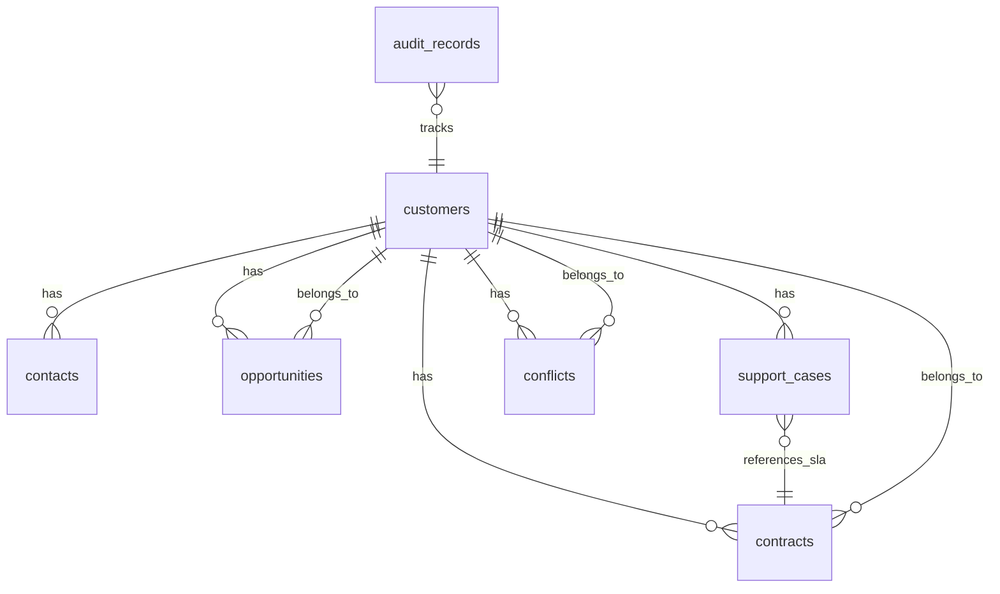

# PRD — CRM pro korporát
## Project Requirements Document v1

---

## 1. FUNCTIONAL REQUIREMENTS

### FR-01: Zobrazení Customer 360
- **Zdroj:** UC-01 / AC-01
- **UI Screen:** SCR-02
- **Required Role:** Account Manager, Sales (readonly), Finance Controller (readonly), Support Agent (readonly), Legal (readonly), Management (readonly)
- **Popis:** Zobrazení kompletního zákaznického profilu včetně kontaktů, smluv, příležitostí, support cases, konfliktů, finance summary z ERP a auditních záznamů.
- **Vstup:** customer_id
- **Výstup:** customer_id, legal_name, vat_id, status, primary_region, regions[], contacts[], owning_account_manager, active_opportunities[], active_contracts[], open_support_cases[], open_conflicts[], finance_summary{total_receivables, overdue_amount, last_payment_date}, recent_audit_trail[20]
- **Validační pravidla:** customer_id musí existovat; finance_summary se načítá z ERP (async, cache max 1h)
- **Edge Cases:** ERP nedostupný → zobrazit varování s timestamp poslední synchronizace (KCS-08)
- **Error Handling:** Customer neexistuje → 404; ERP timeout → WarningBanner + poslední cache
- **Priorita:** MUST

### FR-02: Editace zákaznického profilu
- **Zdroj:** UC-01 / AC-02, AC-03
- **UI Screen:** SCR-03
- **Required Role:** Account Manager
- **Popis:** Editace zákaznických dat s optimistic lock ochranou. Při konfliktu zobrazit merge dialog.
- **Vstup:** customer_id, legal_name, vat_id, primary_region, owning_account_manager_id, contacts[], regions[], notes
- **Výstup:** updated customer + AuditRecord
- **Validační pravidla:** VAT ID regex dle regionu (CZ: /^\d{8,10}$/, DE: /^DE\d{9}$/, AT: /^ATU\d{8}$/); legal_name min 2 znaky; primary_region enum; owning_account_manager_id existující AM
- **Edge Cases:** Optimistic lock konflikt (KCS-01) → MergeDiffPanel; list-level merge pro kontakty (PAB_CHANGE #6)
- **Error Handling:** Validační chyba → inline error; optimistic lock → merge dialog; AuditRecord selhání → rollback (SR-10)
- **Priorita:** MUST

### FR-03: Vytvoření a správa Opportunity
- **Zdroj:** UC-02 / AC-04, AC-05, AC-06
- **UI Screen:** SCR-05
- **Required Role:** Sales (create/edit), Account Manager (readonly)
- **Popis:** CRUD operace pro Opportunity s pipeline management. Automatický Finance Gate při pokusu o uzavření.
- **Vstup:** customer_id, opportunity_name, value_eur, probability, expected_close_date, region, product_lines[], notes, qualification_reason (volitelné)
- **Výstup:** opportunity_id, status, finance_block_status, pipeline_stage_history[]
- **Validační pravidla:** value_eur > 0; probability 0-100; expected_close_date v budoucnosti; customer_id existuje; region v rámci oprávnění Sales
- **Edge Cases:** Hodnota > 2× max historický deal → varování (AC-06); ERP nedostupný při Finance Gate (KCS-08)
- **Error Handling:** Customer neexistuje → nabídnout vytvoření; Finance blokace → notifikace FC + Sales
- **Priorita:** MUST

### FR-04: Finance Gate — kontrola pohledávek a rozhodnutí
- **Zdroj:** UC-03 / AC-07, AC-08, AC-D01, AC-D02
- **UI Screen:** SCR-06 (queue), SCR-07 (decision)
- **Required Role:** Finance Controller
- **Popis:** Zobrazení queue dealů ve finance_review. FC rozhoduje: uvolnit nebo udržet blokaci s povinným odůvodněním. Atomická operace (KCS-07).
- **Vstup:** opportunity_id, decision ("release" | "maintain_block"), justification (min 10 znaků)
- **Výstup:** opportunity_id, new_status, finance_block_details, AuditRecord
- **Validační pravidla:** justification povinné, min 10 znaků; decision enum; four-eyes principle — FC nesmí rozhodovat o vlastním dealu (AC-19)
- **Edge Cases:** ERP stale data → WarningBanner (KCS-08); SLA timeout 72h → automatická eskalace (KCS-02)
- **Error Handling:** Timeout → eskalace FM → VP; Atomicita selhání → retry 3× → Conflict (KCS-07)
- **Priorita:** MUST

### FR-05: Správa smluv
- **Zdroj:** UC-04 / AC-09, AC-10
- **UI Screen:** SCR-09
- **Required Role:** Account Manager (create/edit draft), Legal (approve/reject)
- **Popis:** CRUD smluv s verzováním a Legal approval workflow. Amendment vytváří novou verzi.
- **Vstup:** customer_id, contract_type, sla_response_hours, sla_resolution_hours, start_date, end_date, terms_description, region, services[], special_conditions, parent_contract_id
- **Výstup:** contract_id, version, status, approval_status, version_history[]
- **Validační pravidla:** end_date > start_date; sla_hours > 0; region enum; parent_contract_id existuje a je active (pro amendment)
- **Edge Cases:** Legal timeout 120h → eskalace na Management; Data finality po exportu (KCS-06)
- **Error Handling:** Legal zamítne → draft + komentář; Legal timeout → eskalace
- **Priorita:** MUST

### FR-06: Support Case Management
- **Zdroj:** UC-05 / AC-11, AC-12, AC-13
- **UI Screen:** SCR-11
- **Required Role:** Support Agent (create/manage), Account Manager (readonly), Legal (SLA výjimky)
- **Popis:** CRUD support cases s automatickým SLA countdown a eskalačním workflow.
- **Vstup:** customer_id, contract_id, subject, description (min 20 znaků), priority, contact_person, category
- **Výstup:** case_id, status, sla_deadline, assigned_agent, customer_context, escalation_status
- **Validační pravidla:** description min 20 znaků; priority enum; customer_id existuje; SLA z Contract (nebo default)
- **Edge Cases:** Zákazník bez smlouvy → default SLA (AC-13); SLA breach → auto-eskalace (AC-12); Ústní příslib dispute (KCS-04); SLA výjimka (KCS-05)
- **Error Handling:** Bez smlouvy → varování + default; SLA breach → eskalace + notifikace
- **Priorita:** MUST

### FR-07: Conflict Resolution
- **Zdroj:** UC-06 / AC-14, AC-15
- **UI Screen:** SCR-12a
- **Required Role:** Account Manager (L2), Management (L3)
- **Popis:** Detekce, klasifikace a řešení mezioddělových konfliktů s povinným odůvodněním a audit trail.
- **Vstup:** conflict_type (enum 5 typů), customer_id, trigger_source_id, parties[], description, resolution.decision, resolution.justification (min 20 znaků)
- **Výstup:** conflict_id, status, context, decision_options[], resolution, audit_trail[]
- **Validační pravidla:** justification min 20 znaků; parties min 2; conflict_type enum
- **Edge Cases:** SLA timeout → eskalace L2→L3; Protichůdná rozhodnutí → L3
- **Error Handling:** Justification prázdné → blokace; Timeout → automatická eskalace
- **Priorita:** MUST

### FR-08: Audit Log
- **Zdroj:** UC-07 / AC-16, AC-17, AC-20
- **UI Screen:** SCR-13
- **Required Role:** Management, Legal/Compliance
- **Popis:** Prohlížení a export auditních záznamů. Čistě read-only (kromě záznamu o exportu). AuditRecord append-only (INV-01).
- **Vstup:** filter_entity_type, filter_entity_id, filter_actor, filter_date_from, filter_date_to, filter_action
- **Výstup:** audit_records[], summary, compliance_flags[], export (CSV/PDF)
- **Validační pravidla:** Min 1 filtr nastaven; date_from < date_to; max 10000 záznamů per query
- **Edge Cases:** Příliš široký filtr → blokace (AC-17); Pokus o mazání/editaci → odmítnutí (AC-20)
- **Error Handling:** Příliš široký filtr → požadavek na zúžení; Export selhání → retry
- **Priorita:** MUST

---

## 2. DATA MODEL

### Entity: customers
| Sloupec | Typ | Nullable | Default | PII | Popis |
|---------|-----|----------|---------|-----|-------|
| id | uuid | NO | gen_random_uuid() | Ne | PK |
| legal_name | varchar(255) | NO | — | Ne | Název firmy |
| vat_id | varchar(20) | NO | — | Ne | IČO/VAT ID (unikátní) |
| status | varchar(20) | NO | 'active' | Ne | active/inactive |
| primary_region | varchar(10) | NO | — | Ne | ISO region code |
| owning_account_manager_id | uuid | NO | — | Ne | FK → users |
| notes | text | YES | NULL | Ne | Poznámky |
| version | integer | NO | 1 | Ne | Optimistic lock |
| created_at | timestamptz | NO | now() | Ne | UTC |
| updated_at | timestamptz | NO | now() | Ne | UTC |
| updated_by | uuid | NO | — | Ne | FK → users |

### Entity: contacts
| Sloupec | Typ | Nullable | Default | PII | Popis |
|---------|-----|----------|---------|-----|-------|
| id | uuid | NO | gen_random_uuid() | Ne | PK |
| customer_id | uuid | NO | — | Ne | FK → customers |
| name | varchar(255) | NO | — | Ano | Jméno kontaktu |
| email | varchar(255) | YES | NULL | Ano | E-mail |
| phone | varchar(50) | YES | NULL | Ano | Telefon |
| role | varchar(100) | YES | NULL | Ne | Pozice/role |
| is_primary | boolean | NO | false | Ne | Hlavní kontakt |
| region | varchar(10) | YES | NULL | Ne | Region kontaktu |
| created_at | timestamptz | NO | now() | Ne | UTC |

### Entity: opportunities
| Sloupec | Typ | Nullable | Default | PII | Popis |
|---------|-----|----------|---------|-----|-------|
| id | uuid | NO | gen_random_uuid() | Ne | PK |
| customer_id | uuid | NO | — | Ne | FK → customers |
| opportunity_name | varchar(255) | NO | — | Ne | Název |
| status | varchar(30) | NO | 'lead' | Ne | Pipeline stav |
| value_cents | integer | NO | — | Ne | Hodnota v EUR centech |
| probability | smallint | NO | — | Ne | 0-100 % |
| expected_close_date | date | NO | — | Ne | Očekávané uzavření |
| region | varchar(10) | NO | — | Ne | Region |
| owner_sales_id | uuid | NO | — | Ne | FK → users |
| finance_block_status | varchar(20) | NO | 'none' | Ne | none/blocked/released |
| finance_review_entered_at | timestamptz | YES | NULL | Ne | Pro SLA tracking |
| qualification_reason | text | YES | NULL | Ne | Důvod kvalifikace |
| created_at | timestamptz | NO | now() | Ne | UTC |
| updated_at | timestamptz | NO | now() | Ne | UTC |

### Entity: contracts
| Sloupec | Typ | Nullable | Default | PII | Popis |
|---------|-----|----------|---------|-----|-------|
| id | uuid | NO | gen_random_uuid() | Ne | PK |
| customer_id | uuid | NO | — | Ne | FK → customers |
| contract_type | varchar(20) | NO | — | Ne | master/amendment/addendum |
| version | integer | NO | 1 | Ne | Verze smlouvy |
| status | varchar(30) | NO | 'draft' | Ne | Lifecycle stav |
| sla_response_hours | integer | NO | — | Ne | SLA první reakce |
| sla_resolution_hours | integer | NO | — | Ne | SLA vyřešení |
| start_date | date | NO | — | Ne | Platnost od |
| end_date | date | NO | — | Ne | Platnost do |
| terms_description | text | NO | — | Ne | Podmínky |
| region | varchar(10) | NO | — | Ne | Region |
| approved_by_legal_id | uuid | YES | NULL | Ne | FK → users |
| approved_at | timestamptz | YES | NULL | Ne | UTC |
| parent_contract_id | uuid | YES | NULL | Ne | FK → contracts (amendment) |
| created_at | timestamptz | NO | now() | Ne | UTC |
| updated_at | timestamptz | NO | now() | Ne | UTC |

### Entity: support_cases
| Sloupec | Typ | Nullable | Default | PII | Popis |
|---------|-----|----------|---------|-----|-------|
| id | uuid | NO | gen_random_uuid() | Ne | PK |
| customer_id | uuid | NO | — | Ne | FK → customers |
| contract_id | uuid | YES | NULL | Ne | FK → contracts |
| subject | varchar(255) | NO | — | Ne | Předmět |
| description | text | NO | — | Ne | Popis (min 20 znaků) |
| status | varchar(30) | NO | 'open' | Ne | Lifecycle stav |
| priority | varchar(10) | NO | — | Ne | critical/high/medium/low |
| sla_deadline | timestamptz | YES | NULL | Ne | Vypočteno z Contract SLA |
| assigned_agent_id | uuid | YES | NULL | Ne | FK → users |
| escalation_level | smallint | NO | 0 | Ne | 0/1/2/3 |
| contact_person | varchar(255) | YES | NULL | Ano | Kdo nahlásil |
| created_at | timestamptz | NO | now() | Ne | UTC |
| updated_at | timestamptz | NO | now() | Ne | UTC |

### Entity: conflicts
| Sloupec | Typ | Nullable | Default | PII | Popis |
|---------|-----|----------|---------|-----|-------|
| id | uuid | NO | gen_random_uuid() | Ne | PK |
| type | varchar(30) | NO | — | Ne | Enum: 5 typů |
| status | varchar(30) | NO | 'detected' | Ne | Lifecycle stav |
| customer_id | uuid | NO | — | Ne | FK → customers |
| trigger_source_type | varchar(30) | NO | — | Ne | opportunity/contract/support_case |
| trigger_source_id | uuid | NO | — | Ne | FK polymorfní |
| description | text | YES | NULL | Ne | Popis konfliktu |
| resolution_decision | text | YES | NULL | Ne | Zvolená varianta |
| resolution_justification | text | YES | NULL | Ne | Odůvodnění (min 20 znaků) |
| resolved_by_id | uuid | YES | NULL | Ne | FK → users |
| resolved_at | timestamptz | YES | NULL | Ne | UTC |
| sla_deadline | timestamptz | YES | NULL | Ne | Dle decision strategy |
| created_at | timestamptz | NO | now() | Ne | UTC |

### Entity: audit_records
| Sloupec | Typ | Nullable | Default | PII | Popis |
|---------|-----|----------|---------|-----|-------|
| id | uuid | NO | gen_random_uuid() | Ne | PK |
| entity_type | varchar(30) | NO | — | Ne | Typ entity |
| entity_id | uuid | NO | — | Ne | ID entity |
| action | varchar(50) | NO | — | Ne | Typ akce |
| actor_id | uuid | NO | — | Ne | FK → users |
| actor_role | varchar(30) | NO | — | Ne | Role aktéra |
| old_value | jsonb | YES | NULL | Ne | Předchozí hodnota |
| new_value | jsonb | YES | NULL | Ne | Nová hodnota |
| justification | text | YES | NULL | Ne | Zdůvodnění |
| created_at | timestamptz | NO | now() | Ne | UTC, append-only |

**Indexy:**
- customers: UNIQUE(vat_id), idx_customers_region, idx_customers_am
- opportunities: idx_opps_customer, idx_opps_status, idx_opps_region, idx_opps_finance_review
- contracts: idx_contracts_customer, idx_contracts_status, idx_contracts_region
- support_cases: idx_cases_customer, idx_cases_status, idx_cases_sla_deadline
- conflicts: idx_conflicts_customer, idx_conflicts_status, idx_conflicts_type
- audit_records: idx_audit_entity, idx_audit_actor, idx_audit_created_at



---

## 3. API SPECIFICATION

```yaml
openapi: 3.0.3
info:
  title: CRM Korporát API
  version: v1
paths:
  /api/v1/customers/{id}:
    get:
      summary: Customer 360
      operationId: getCustomer360
      tags: [Customers]
      parameters:
        - name: id
          in: path
          required: true
          schema: { type: string, format: uuid }
      responses:
        200: { description: Customer 360 data }
        404: { description: Customer not found }
      security: [{ sso: [AM, Sales, FC, Support, Legal, Management] }]
      x-fr-id: FR-01
      x-rbac: [Account Manager, Sales, Finance Controller, Support Agent, Legal, Management]
      x-pagination: false
  /api/v1/customers/{id}:
    put:
      summary: Update Customer
      operationId: updateCustomer
      tags: [Customers]
      requestBody:
        content:
          application/json:
            schema:
              type: object
              properties:
                legal_name: { type: string, minLength: 2 }
                vat_id: { type: string }
                primary_region: { type: string }
                owning_account_manager_id: { type: string, format: uuid }
                contacts: { type: array }
                notes: { type: string, maxLength: 2000 }
                version: { type: integer, description: "Optimistic lock version" }
              required: [version]
      responses:
        200: { description: Updated customer }
        409: { description: Optimistic lock conflict - merge required }
        422: { description: Validation error }
      security: [{ sso: [AM] }]
      x-fr-id: FR-02
      x-rbac: [Account Manager]
      x-idempotency: true
  /api/v1/opportunities:
    get:
      summary: List Opportunities (Pipeline)
      operationId: listOpportunities
      tags: [Opportunities]
      parameters:
        - name: status
          in: query
          schema: { type: string, enum: [lead, qualified, proposal, negotiation, finance_review, closed_won, closed_lost] }
        - name: region
          in: query
          schema: { type: string }
        - name: page
          in: query
          schema: { type: integer, default: 1 }
        - name: per_page
          in: query
          schema: { type: integer, default: 20, maximum: 100 }
        - name: sort
          in: query
          schema: { type: string, default: "-created_at" }
      responses:
        200: { description: Paginated list }
      security: [{ sso: [Sales, AM, Management] }]
      x-fr-id: FR-03
      x-rbac: [Sales, Account Manager, Management]
      x-pagination: true
    post:
      summary: Create Opportunity
      operationId: createOpportunity
      tags: [Opportunities]
      requestBody:
        content:
          application/json:
            schema:
              type: object
              properties:
                customer_id: { type: string, format: uuid }
                opportunity_name: { type: string }
                value_eur: { type: number, minimum: 0.01 }
                probability: { type: integer, minimum: 0, maximum: 100 }
                expected_close_date: { type: string, format: date }
                region: { type: string }
              required: [customer_id, opportunity_name, value_eur, probability, expected_close_date, region]
      responses:
        201: { description: Created }
        422: { description: Validation error }
      security: [{ sso: [Sales] }]
      x-fr-id: FR-03
      x-rbac: [Sales]
  /api/v1/opportunities/{id}/close:
    post:
      summary: Close Opportunity (triggers Finance Gate)
      operationId: closeOpportunity
      tags: [Opportunities]
      responses:
        200: { description: "closed_won (no receivables)" }
        202: { description: "finance_review (receivables detected)" }
        503: { description: "ERP unavailable - warning returned" }
      security: [{ sso: [Sales] }]
      x-fr-id: FR-03
      x-rbac: [Sales]
  /api/v1/finance-reviews:
    get:
      summary: Finance Review Queue
      operationId: listFinanceReviews
      tags: [Finance]
      parameters:
        - { name: page, in: query, schema: { type: integer, default: 1 } }
        - { name: per_page, in: query, schema: { type: integer, default: 20 } }
      responses:
        200: { description: Queue of opportunities in finance_review }
      security: [{ sso: [FC] }]
      x-fr-id: FR-04
      x-rbac: [Finance Controller]
      x-pagination: true
  /api/v1/finance-reviews/{opportunity_id}/decide:
    post:
      summary: Finance Gate Decision
      operationId: financeDecision
      tags: [Finance]
      requestBody:
        content:
          application/json:
            schema:
              type: object
              properties:
                decision: { type: string, enum: [release, maintain_block] }
                justification: { type: string, minLength: 10 }
              required: [decision, justification]
      responses:
        200: { description: Decision recorded }
        403: { description: "Four-eyes violation" }
        422: { description: Validation error }
      security: [{ sso: [FC] }]
      x-fr-id: FR-04
      x-rbac: [Finance Controller]
      x-idempotency: true
  /api/v1/contracts:
    get:
      summary: List Contracts
      operationId: listContracts
      tags: [Contracts]
      parameters:
        - { name: customer_id, in: query, schema: { type: string, format: uuid } }
        - { name: status, in: query, schema: { type: string } }
        - { name: page, in: query, schema: { type: integer, default: 1 } }
        - { name: per_page, in: query, schema: { type: integer, default: 20 } }
      responses:
        200: { description: Paginated list }
      security: [{ sso: [AM, Legal, Management] }]
      x-fr-id: FR-05
      x-pagination: true
    post:
      summary: Create Contract
      operationId: createContract
      tags: [Contracts]
      responses:
        201: { description: Draft created }
      security: [{ sso: [AM] }]
      x-fr-id: FR-05
  /api/v1/contracts/{id}/submit-legal:
    post:
      summary: Submit to Legal
      operationId: submitToLegal
      tags: [Contracts]
      responses:
        200: { description: Pending legal }
      security: [{ sso: [AM] }]
      x-fr-id: FR-05
  /api/v1/contracts/{id}/approve:
    post:
      summary: Legal Approve
      operationId: approveContract
      tags: [Contracts]
      responses:
        200: { description: Contract active }
      security: [{ sso: [Legal] }]
      x-fr-id: FR-05
  /api/v1/support-cases:
    get:
      summary: List Support Cases
      operationId: listSupportCases
      tags: [Support]
      parameters:
        - { name: status, in: query, schema: { type: string } }
        - { name: page, in: query, schema: { type: integer, default: 1 } }
        - { name: per_page, in: query, schema: { type: integer, default: 20 } }
      responses:
        200: { description: Paginated list }
      security: [{ sso: [Support, AM] }]
      x-fr-id: FR-06
      x-pagination: true
    post:
      summary: Create Support Case
      operationId: createSupportCase
      tags: [Support]
      responses:
        201: { description: Case created with SLA }
      security: [{ sso: [Support] }]
      x-fr-id: FR-06
  /api/v1/conflicts:
    get:
      summary: List Conflicts
      operationId: listConflicts
      tags: [Conflicts]
      parameters:
        - { name: type, in: query, schema: { type: string } }
        - { name: status, in: query, schema: { type: string } }
        - { name: page, in: query, schema: { type: integer, default: 1 } }
        - { name: per_page, in: query, schema: { type: integer, default: 20 } }
      responses:
        200: { description: Paginated list }
      security: [{ sso: [AM, Management] }]
      x-fr-id: FR-07
      x-pagination: true
  /api/v1/conflicts/{id}/resolve:
    post:
      summary: Resolve Conflict
      operationId: resolveConflict
      tags: [Conflicts]
      requestBody:
        content:
          application/json:
            schema:
              type: object
              properties:
                decision: { type: string }
                justification: { type: string, minLength: 20 }
              required: [decision, justification]
      responses:
        200: { description: Conflict resolved }
        422: { description: Validation error }
      security: [{ sso: [AM, Management] }]
      x-fr-id: FR-07
      x-idempotency: true
  /api/v1/audit-records:
    get:
      summary: Query Audit Log
      operationId: queryAuditLog
      tags: [Audit]
      parameters:
        - { name: entity_type, in: query, schema: { type: string } }
        - { name: entity_id, in: query, schema: { type: string, format: uuid } }
        - { name: actor_id, in: query, schema: { type: string, format: uuid } }
        - { name: date_from, in: query, schema: { type: string, format: date } }
        - { name: date_to, in: query, schema: { type: string, format: date } }
        - { name: page, in: query, schema: { type: integer, default: 1 } }
        - { name: per_page, in: query, schema: { type: integer, default: 50, maximum: 200 } }
      responses:
        200: { description: Paginated audit records }
        422: { description: "No filter provided" }
      security: [{ sso: [Management, Legal] }]
      x-fr-id: FR-08
      x-pagination: true
  /api/v1/audit-records/export:
    post:
      summary: Export Audit Log (CSV)
      operationId: exportAuditLog
      tags: [Audit]
      responses:
        200: { description: CSV file download }
      security: [{ sso: [Management, Legal] }]
      x-fr-id: FR-08
  /api/v1/webhooks/erp-sync:
    post:
      summary: ERP Receivables Sync (webhook)
      operationId: erpSync
      tags: [Integration]
      description: "Příjem dat o pohledávkách z ERP (push model)"
      responses:
        200: { description: Sync accepted }
        401: { description: Invalid API key }
      security: [{ apiKey: [] }]
```

**Auth Transport:** HttpOnly Cookie + CSRF Token pro UI; API Key pro webhook.
**Rate Limiting:** 100 req/min per user (UI), 1000 req/min per integration (webhook).

---

## 4. STATE MACHINE

*(Převzato z PA MACHINE_DATA — viz Kap. 2 PA dokumentu)*

Opportunity: lead → qualified → proposal → negotiation → finance_review → closed_won/lost
Contract: draft → pending_legal → active → amendment_pending → correction_pending → expired/terminated
SupportCase: open → in_progress → waiting_customer → escalated → dispute_pending → sla_exception_pending → resolved → closed
Conflict: detected → under_review → awaiting_decision → resolved/escalated_l3
Customer: active → merge_required → active

---

## 5. BUSINESS RULES

| ID | Pravidlo | Zdroj |
|----|---------|-------|
| BR-01 | Oprávnění = průnik ROLE × REGION | SR-03 |
| BR-02 | AuditRecord se zapisuje synchronně se změnou entity | SR-10 |
| BR-03 | Opportunity v finance_review nelze uzavřít bez Finance rozhodnutí | INV-02 |
| BR-04 | Four-eyes principle na Finance Gate | DL-15 |
| BR-05 | Contract je verzovaný — každá změna vytváří novou verzi | INV-06 |
| BR-06 | SLA se počítá v business hours regionu zákazníka | A-08 |
| BR-07 | Při nesouladu mezi systémy upřednostnit SoT a zobrazit varování | SR-04 |
| BR-08 | Session timeout 30 min nečinnosti | SR-02 |
| BR-09 | Retry pro externí systémy: max 3×, 30s interval, exponential backoff | SR-07 |
| BR-10 | Globální pravidla nelze obejít bez L3 Governance | INV-03 |

## 5b. DECISION HANDLING

### DH-01 (KCS-01): Souběžná editace zákaznických dat
- **Resolution type:** preventive_guard
- **Detekce:** customers.version != request.version při PUT
- **Transient state:** merge_required
- **Rozhodovací flow:** L1 (automatická detekce) → uživatel rozhodne merge
- **Fallback:** Změny uloženy jako draft
- **Guardrails:** INV-01
- **Audit:** Obě verze zaznamenány
- **Vazba na FR:** FR-02

### DH-02 (KCS-02): Finance blokace nesynchronizované pohledávky
- **Resolution type:** manual_escalation
- **Detekce:** ERP vrátí overdue_amount > 0 při close_opportunity
- **Transient state:** finance_review
- **Rozhodovací flow:** L2 (Finance Controller, SLA 4h) → L2 (Finance Manager) → L3 (VP Operations)
- **SLA:** 240 min FC, 72h total, 24h VP
- **Fallback:** Zůstává ve finance_review s notifikací
- **Guardrails:** INV-02
- **Audit:** Rozhodnutí + odůvodnění
- **Vazba na FR:** FR-04

### DH-03 (KCS-03): Lokální vs. globální pravidla
- **Resolution type:** manual_escalation
- **Detekce:** Uživatel požádá o výjimku
- **Transient state:** exception_pending
- **Rozhodovací flow:** L2 (Regional Director, 48h) → L3 (VP Operations, 7d)
- **Fallback:** Žádost zamítnuta po 7d
- **Guardrails:** INV-03
- **Vazba na FR:** FR-07

### DH-04 (KCS-04): Ústní příslib vs. smlouva
- **Resolution type:** manual_escalation
- **Detekce:** Support nahlásí dispute
- **Transient state:** dispute_pending
- **Rozhodovací flow:** L2 (AM, 8h) → L2 (Sales Manager) → L3 (VP)
- **Fallback:** Platí smlouva po 48h
- **Guardrails:** INV-04
- **Vazba na FR:** FR-06

### DH-05 (KCS-05): SLA výjimka
- **Resolution type:** manual_escalation
- **Detekce:** Support požádá o výjimku
- **Transient state:** sla_exception_pending
- **Rozhodovací flow:** L2 (Support Lead) → L2 (Legal) → L3 (VP)
- **Fallback:** Výjimka zamítnuta po 48h
- **Guardrails:** INV-05
- **Vazba na FR:** FR-06

### DH-06 (KCS-06): Data finality Contract
- **Resolution type:** correction_record
- **Detekce:** Pokus o změnu active/exported Contract
- **Transient state:** correction_pending
- **Guardrails:** INV-06
- **Vazba na FR:** FR-05

### DH-07 (KCS-07): Částečné selhání Finance Gate
- **Resolution type:** automatic
- **Detekce:** Krok 2 Finance Gate selže po úspěšném kroku 1
- **Fallback:** Rollback + retry 3× → Conflict system_failure
- **Guardrails:** INV-07
- **Vazba na FR:** FR-04

### DH-08 (KCS-08): Nedostupnost ERP
- **Resolution type:** manual_escalation
- **Detekce:** ERP API timeout/error
- **Fallback:** WarningBanner + manuální rozhodnutí FC
- **Guardrails:** INV-08
- **Vazba na FR:** FR-04

---

## 6. ERROR HANDLING & RESILIENCE

| Chyba | Detekce | Reakce | Recovery |
|-------|---------|--------|---------|
| ERP timeout | HTTP 504 / connection timeout | WarningBanner + cache fallback | Retry async, notifikace |
| SSO výpadek | Auth endpoint nedostupný | Login blocked, čekání | Žádný fallback (security) |
| DB deadlock | PostgreSQL error 40P01 | Automatic retry (3×) | Log + alert |
| Optimistic lock | Version mismatch | Merge dialog | Uživatel rozhodne |
| Rate limit exceeded | 429 Too Many Requests | Throttle + retry-after header | Exponential backoff |

---

## 7. INTEGRATION MAP

| Systém | Protokol | Směr | Frekvence | Fallback |
|--------|----------|------|-----------|----------|
| ERP | REST API / Webhook | CRM ← ERP | Real-time (webhook) + denní batch | Cache + WarningBanner |
| Billing | REST API | CRM ← Billing | Denní batch | Zobrazit N/A |
| SSO/IAM | OIDC/SAML | CRM ↔ SSO | Real-time | Žádný (security) |

---

## 8. SECURITY ARCHITECTURE

- **Autentizace:** SSO (OIDC/SAML), HttpOnly Cookies, CSRF protection
- **Autorizace:** RBAC matice (role × region), middleware level check
- **IDOR/BOLA ochrana:** Každý endpoint ověřuje ownership/region
- **Four-eyes:** Finance Controller nesmí rozhodovat o vlastním dealu
- **Encryption:** TLS 1.2+ in transit, AES-256 at rest
- **PII:** Flagováno per sloupec, maskování v logech, GDPR compliance per region
- **Audit:** Append-only, synchronní se změnou, nelze mazat

---

## 9. CONCURRENCY & DATA CONSISTENCY

- **Optimistic locking:** Customer entity (version field), Opportunity (status transitions)
- **Atomicita:** Finance Gate (check ERP + update status = 1 transaction)
- **Idempotence:** POST endpoints s idempotency key
- **SLA countdown:** Server-side cron (15 min interval), nezávislý na session
- **Race condition mitigation:** Unique constraints (vat_id), DB-level locking pro kritické přechody

---

## 10. DEPLOYMENT & INFRASTRUCTURE

- **Rollout:** Canary deployment (5% → 25% → 100%)
- **Rollback:** Automatický při error rate > 5% (P5M)
- **Migrace:** Flyway/Liquibase, forward-only, zero-downtime
- **Seed data:** 100 zákazníků (pilot), aktivní smlouvy, enums (regions, conflict_types, priorities)
- **Infrastructure:** Kubernetes, PostgreSQL (primary + read replica), Redis (cache + session)

---

## 11. OBSERVABILITY

- **Logging:** Structured JSON, PII masking (contact names, emails, phones)
- **Monitoring:** RED metriky (Rate, Errors, Duration) per endpoint
- **Alerting:** P95 latency > 2s, error rate > 1%, ERP sync failure, SLA breach
- **Tracing:** Distributed tracing (OpenTelemetry) per request
- **Telemetry hooks:** Všechny telemetry_events z UX MACHINE_DATA (dashboard_nav_*, customer_save, opp_close_attempt, finance_decision, conflict_resolve, audit_export_csv...)

---

## 12. TESTING STRATEGY

| Typ | Scope | Nástroj |
|-----|-------|---------|
| Unit | Business logic, validace, state transitions | Jest/Vitest |
| Integration | API endpoints, DB queries, ERP mock | Supertest + Testcontainers |
| E2E | BDD scénáře z UAT (AC-01 až AC-20, AC-D01 až AC-D08) | Playwright/Cypress |
| Performance | Load test 2000+ users, P95 < 2s | k6/Artillery |
| Security | RBAC bypass, IDOR, injection, PII leakage | OWASP ZAP + manual pentest |

**Z UAT "Delegováno na Technické QA":**
- ERP synchronizace webhook: Integration Test (mock ERP, verify data consistency)
- AuditRecord synchronní zápis: Unit Test (transaction rollback on audit failure)
- Session timeout: Automated Functional Test (verify 30min expiry)
- SLA countdown cron: Integration Test (verify escalation triggers)
- Contract expiry batch: Integration Test (verify status transition)
- SSO integrace: Integration Test (mock OIDC provider)

---

## 13. ARCHITECTURE DECISION RECORDS (ADR)

### ADR-01: Optimistic locking pro Customer entity
- **Kontext:** 2000+ uživatelů, souběžné editace
- **Rozhodnutí:** Optimistic locking s version field místo pesimistického locku
- **Alternativy:** Pessimistic lock (příliš blokující), Last-write-wins (ztráta dat)
- **Důsledky:** Merge dialog při konfliktu, mírně složitější UX

### ADR-02: Synchronní AuditRecord zápis
- **Kontext:** 100 % auditovatelnost je požadavek
- **Rozhodnutí:** Audit zápis ve stejné transakci jako hlavní operace
- **Alternativy:** Async queue (risk ztráty auditních záznamů)
- **Důsledky:** Mírně pomalejší zápisy (~5-10ms), ale garantovaná konzistence

### ADR-03: ERP synchronizace přes webhook + denní batch
- **Kontext:** Real-time data potřeba pro Finance Gate
- **Rozhodnutí:** Webhook (push) pro real-time + denní batch jako fallback
- **Alternativy:** Polling (wasteful), pouze batch (příliš stará data)
- **Důsledky:** Závislost na ERP webhook capability; cache + WarningBanner jako fallback

### ADR-04: Finanční částky jako integer (centy)
- **Kontext:** Přesnost finančních výpočtů
- **Rozhodnutí:** Integer v centech (1 EUR = 100 centů) místo float
- **Alternativy:** DECIMAL (přijatelné ale méně performantní), FLOAT (nepřijatelné — rounding errors)
- **Důsledky:** UI musí konvertovat centy na EUR pro zobrazení

### ADR-05: Append-only audit log
- **Kontext:** Compliance, legal požadavek na auditovatelnost
- **Rozhodnutí:** Audit záznamy nelze mazat ani editovat — pouze přidávat
- **Alternativy:** Soft delete (nedostatečné pro compliance)
- **Důsledky:** Rostoucí tabulka — partitioning po měsících

---

## MACHINE_DATA
```json
{
  "_meta": {
    "project_id": "CRM_Korporat",
    "agent": "prd_tech_blueprint",
    "version": "v1",
    "iteration": 1
  },
  "functional_requirements": [
    {"fr_id": "FR-01", "source_use_case_id": "UC-01", "source_ui_screen_id": "SCR-02", "source_scenario_ids": ["AC-01"], "required_role": "AM, Sales, FC, Support, Legal, Management", "description": "Zobrazení Customer 360", "inputs": ["customer_id"], "outputs": ["customer_360_data"], "api_endpoint": "GET /api/v1/customers/{id}", "db_tables": ["customers", "contacts", "opportunities", "contracts", "support_cases", "conflicts", "audit_records"], "priority": "MUST"},
    {"fr_id": "FR-02", "source_use_case_id": "UC-01", "source_ui_screen_id": "SCR-03", "source_scenario_ids": ["AC-02", "AC-03"], "required_role": "Account Manager", "description": "Editace zákaznického profilu s optimistic lock", "inputs": ["customer_id", "legal_name", "vat_id", "primary_region", "owning_account_manager_id", "contacts[]", "version"], "outputs": ["updated_customer", "audit_record"], "api_endpoint": "PUT /api/v1/customers/{id}", "db_tables": ["customers", "contacts", "audit_records"], "priority": "MUST"},
    {"fr_id": "FR-03", "source_use_case_id": "UC-02", "source_ui_screen_id": "SCR-05", "source_scenario_ids": ["AC-04", "AC-05", "AC-06"], "required_role": "Sales", "description": "Vytvoření a správa Opportunity s Finance Gate", "inputs": ["customer_id", "opportunity_name", "value_eur", "probability", "expected_close_date", "region"], "outputs": ["opportunity_id", "status", "finance_block_status"], "api_endpoint": "POST /api/v1/opportunities + POST /api/v1/opportunities/{id}/close", "db_tables": ["opportunities", "audit_records"], "priority": "MUST"},
    {"fr_id": "FR-04", "source_use_case_id": "UC-03", "source_ui_screen_id": "SCR-07", "source_scenario_ids": ["AC-07", "AC-08", "AC-D01", "AC-D02"], "required_role": "Finance Controller", "description": "Finance Gate rozhodnutí — uvolnění nebo blokace", "inputs": ["opportunity_id", "decision", "justification"], "outputs": ["new_status", "finance_block_details", "audit_record"], "api_endpoint": "POST /api/v1/finance-reviews/{opportunity_id}/decide", "db_tables": ["opportunities", "conflicts", "audit_records"], "priority": "MUST"},
    {"fr_id": "FR-05", "source_use_case_id": "UC-04", "source_ui_screen_id": "SCR-09", "source_scenario_ids": ["AC-09", "AC-10"], "required_role": "AM (create), Legal (approve)", "description": "Správa smluv s Legal approval workflow", "inputs": ["customer_id", "contract_type", "sla_hours", "dates", "terms", "region"], "outputs": ["contract_id", "version", "status", "approval_status"], "api_endpoint": "POST /api/v1/contracts + POST /api/v1/contracts/{id}/submit-legal + POST /api/v1/contracts/{id}/approve", "db_tables": ["contracts", "audit_records"], "priority": "MUST"},
    {"fr_id": "FR-06", "source_use_case_id": "UC-05", "source_ui_screen_id": "SCR-11", "source_scenario_ids": ["AC-11", "AC-12", "AC-13"], "required_role": "Support Agent", "description": "Support Case management s SLA countdown a eskalací", "inputs": ["customer_id", "contract_id", "subject", "description", "priority", "contact_person"], "outputs": ["case_id", "status", "sla_deadline", "escalation_status"], "api_endpoint": "POST /api/v1/support-cases", "db_tables": ["support_cases", "contracts", "audit_records"], "priority": "MUST"},
    {"fr_id": "FR-07", "source_use_case_id": "UC-06", "source_ui_screen_id": "SCR-12a", "source_scenario_ids": ["AC-14", "AC-15"], "required_role": "AM (L2), Management (L3)", "description": "Conflict Resolution s eskalačním workflow", "inputs": ["conflict_type", "customer_id", "trigger_source_id", "parties[]", "resolution", "justification"], "outputs": ["conflict_id", "status", "resolution", "audit_trail"], "api_endpoint": "POST /api/v1/conflicts/{id}/resolve", "db_tables": ["conflicts", "audit_records"], "priority": "MUST"},
    {"fr_id": "FR-08", "source_use_case_id": "UC-07", "source_ui_screen_id": "SCR-13", "source_scenario_ids": ["AC-16", "AC-17", "AC-20"], "required_role": "Management, Legal", "description": "Audit Log — prohlížení a export", "inputs": ["filters"], "outputs": ["audit_records[]", "summary", "csv_export"], "api_endpoint": "GET /api/v1/audit-records + POST /api/v1/audit-records/export", "db_tables": ["audit_records"], "priority": "MUST"}
  ],
  "database_model": {
    "entities": [
      {"table_name": "customers", "columns": [{"name": "id", "type": "uuid", "is_primary": true, "is_pii": false}, {"name": "legal_name", "type": "varchar(255)", "is_pii": false}, {"name": "vat_id", "type": "varchar(20)", "is_pii": false}, {"name": "status", "type": "varchar(20)", "is_pii": false}, {"name": "primary_region", "type": "varchar(10)", "is_pii": false}, {"name": "owning_account_manager_id", "type": "uuid", "is_foreign_key": true, "ref_table": "users", "is_pii": false}, {"name": "version", "type": "integer", "is_pii": false}, {"name": "created_at", "type": "timestamptz", "is_pii": false}, {"name": "updated_at", "type": "timestamptz", "is_pii": false}], "indexes": ["UNIQUE(vat_id)", "idx_customers_region"]},
      {"table_name": "contacts", "columns": [{"name": "id", "type": "uuid", "is_primary": true, "is_pii": false}, {"name": "customer_id", "type": "uuid", "is_foreign_key": true, "ref_table": "customers", "is_pii": false}, {"name": "name", "type": "varchar(255)", "is_pii": true}, {"name": "email", "type": "varchar(255)", "is_pii": true}, {"name": "phone", "type": "varchar(50)", "is_pii": true}], "indexes": ["idx_contacts_customer"]},
      {"table_name": "opportunities", "columns": [{"name": "id", "type": "uuid", "is_primary": true, "is_pii": false}, {"name": "customer_id", "type": "uuid", "is_foreign_key": true, "ref_table": "customers", "is_pii": false}, {"name": "status", "type": "varchar(30)", "is_pii": false}, {"name": "value_cents", "type": "integer", "is_pii": false}, {"name": "region", "type": "varchar(10)", "is_pii": false}, {"name": "owner_sales_id", "type": "uuid", "is_pii": false}, {"name": "finance_review_entered_at", "type": "timestamptz", "is_pii": false}], "indexes": ["idx_opps_customer", "idx_opps_status"]},
      {"table_name": "contracts", "columns": [{"name": "id", "type": "uuid", "is_primary": true, "is_pii": false}, {"name": "customer_id", "type": "uuid", "is_foreign_key": true, "ref_table": "customers", "is_pii": false}, {"name": "version", "type": "integer", "is_pii": false}, {"name": "status", "type": "varchar(30)", "is_pii": false}, {"name": "sla_response_hours", "type": "integer", "is_pii": false}, {"name": "sla_resolution_hours", "type": "integer", "is_pii": false}], "indexes": ["idx_contracts_customer", "idx_contracts_status"]},
      {"table_name": "support_cases", "columns": [{"name": "id", "type": "uuid", "is_primary": true, "is_pii": false}, {"name": "customer_id", "type": "uuid", "is_foreign_key": true, "ref_table": "customers", "is_pii": false}, {"name": "contract_id", "type": "uuid", "is_foreign_key": true, "ref_table": "contracts", "is_pii": false}, {"name": "status", "type": "varchar(30)", "is_pii": false}, {"name": "priority", "type": "varchar(10)", "is_pii": false}, {"name": "sla_deadline", "type": "timestamptz", "is_pii": false}, {"name": "contact_person", "type": "varchar(255)", "is_pii": true}], "indexes": ["idx_cases_customer", "idx_cases_sla"]},
      {"table_name": "conflicts", "columns": [{"name": "id", "type": "uuid", "is_primary": true, "is_pii": false}, {"name": "type", "type": "varchar(30)", "is_pii": false}, {"name": "status", "type": "varchar(30)", "is_pii": false}, {"name": "customer_id", "type": "uuid", "is_foreign_key": true, "ref_table": "customers", "is_pii": false}, {"name": "sla_deadline", "type": "timestamptz", "is_pii": false}], "indexes": ["idx_conflicts_customer", "idx_conflicts_status"]},
      {"table_name": "audit_records", "columns": [{"name": "id", "type": "uuid", "is_primary": true, "is_pii": false}, {"name": "entity_type", "type": "varchar(30)", "is_pii": false}, {"name": "entity_id", "type": "uuid", "is_pii": false}, {"name": "action", "type": "varchar(50)", "is_pii": false}, {"name": "actor_id", "type": "uuid", "is_pii": false}, {"name": "old_value", "type": "jsonb", "is_pii": false}, {"name": "new_value", "type": "jsonb", "is_pii": false}, {"name": "created_at", "type": "timestamptz", "is_pii": false}], "indexes": ["idx_audit_entity", "idx_audit_created_at"]}
    ]
  },
  "api_specification": {
    "endpoints": [
      {"method": "GET", "path": "/api/v1/customers/{id}", "fr_id": "FR-01", "auth_transport": "HttpOnly Cookie", "rbac_required": ["AM", "Sales", "FC", "Support", "Legal", "Management"], "pagination_required": false},
      {"method": "PUT", "path": "/api/v1/customers/{id}", "fr_id": "FR-02", "auth_transport": "HttpOnly Cookie + CSRF", "rbac_required": ["Account Manager"], "pagination_required": false, "idempotency_key": true},
      {"method": "GET", "path": "/api/v1/opportunities", "fr_id": "FR-03", "auth_transport": "HttpOnly Cookie", "rbac_required": ["Sales", "AM", "Management"], "pagination_required": true},
      {"method": "POST", "path": "/api/v1/opportunities", "fr_id": "FR-03", "auth_transport": "HttpOnly Cookie + CSRF", "rbac_required": ["Sales"], "pagination_required": false},
      {"method": "POST", "path": "/api/v1/opportunities/{id}/close", "fr_id": "FR-03", "auth_transport": "HttpOnly Cookie + CSRF", "rbac_required": ["Sales"], "pagination_required": false},
      {"method": "GET", "path": "/api/v1/finance-reviews", "fr_id": "FR-04", "auth_transport": "HttpOnly Cookie", "rbac_required": ["Finance Controller"], "pagination_required": true},
      {"method": "POST", "path": "/api/v1/finance-reviews/{id}/decide", "fr_id": "FR-04", "auth_transport": "HttpOnly Cookie + CSRF", "rbac_required": ["Finance Controller"], "pagination_required": false, "idempotency_key": true},
      {"method": "GET", "path": "/api/v1/contracts", "fr_id": "FR-05", "auth_transport": "HttpOnly Cookie", "rbac_required": ["AM", "Legal", "Management"], "pagination_required": true},
      {"method": "POST", "path": "/api/v1/contracts", "fr_id": "FR-05", "auth_transport": "HttpOnly Cookie + CSRF", "rbac_required": ["Account Manager"], "pagination_required": false},
      {"method": "GET", "path": "/api/v1/support-cases", "fr_id": "FR-06", "auth_transport": "HttpOnly Cookie", "rbac_required": ["Support", "AM"], "pagination_required": true},
      {"method": "POST", "path": "/api/v1/support-cases", "fr_id": "FR-06", "auth_transport": "HttpOnly Cookie + CSRF", "rbac_required": ["Support Agent"], "pagination_required": false},
      {"method": "GET", "path": "/api/v1/conflicts", "fr_id": "FR-07", "auth_transport": "HttpOnly Cookie", "rbac_required": ["AM", "Management"], "pagination_required": true},
      {"method": "POST", "path": "/api/v1/conflicts/{id}/resolve", "fr_id": "FR-07", "auth_transport": "HttpOnly Cookie + CSRF", "rbac_required": ["AM", "Management"], "pagination_required": false, "idempotency_key": true},
      {"method": "GET", "path": "/api/v1/audit-records", "fr_id": "FR-08", "auth_transport": "HttpOnly Cookie", "rbac_required": ["Management", "Legal"], "pagination_required": true},
      {"method": "POST", "path": "/api/v1/audit-records/export", "fr_id": "FR-08", "auth_transport": "HttpOnly Cookie + CSRF", "rbac_required": ["Management", "Legal"], "pagination_required": false},
      {"method": "POST", "path": "/api/v1/webhooks/erp-sync", "fr_id": "N/A", "auth_transport": "API Key", "rbac_required": [], "pagination_required": false}
    ]
  },
  "non_functional_requirements": {
    "performance": {"p95_latency_ms": 2000, "search_latency_ms": 1000, "expected_concurrent_users": 2000},
    "security": ["SSO (OIDC/SAML)", "HttpOnly Cookies + CSRF", "RBAC matrix", "AES-256 at rest", "TLS 1.2+"],
    "observability": {"pii_masking": true, "telemetry_hooks": ["customer_save", "opp_close_attempt", "finance_decision", "conflict_resolve", "audit_export_csv"]}
  },
  "architecture_decisions": [
    {"adr_id": "ADR-01", "title": "Optimistic locking pro Customer", "decision": "Version field s merge dialog při konfliktu", "rationale": "2000+ uživatelů, pesimistický lock příliš blokující"},
    {"adr_id": "ADR-02", "title": "Synchronní AuditRecord zápis", "decision": "Audit ve stejné transakci jako hlavní operace", "rationale": "100 % auditovatelnost, compliance požadavek"},
    {"adr_id": "ADR-03", "title": "ERP webhook + denní batch", "decision": "Push model pro real-time + batch jako fallback", "rationale": "Finance Gate potřebuje aktuální data"},
    {"adr_id": "ADR-04", "title": "Finanční částky jako integer (centy)", "decision": "Integer místo float pro přesnost", "rationale": "Eliminace rounding errors"},
    {"adr_id": "ADR-05", "title": "Append-only audit log", "decision": "Audit záznamy nelze mazat ani editovat", "rationale": "Compliance, legal požadavek"}
  ]
}
```
